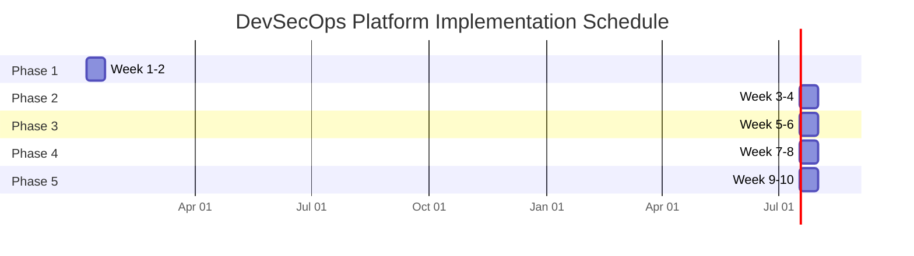

# 10-Week Implementation Roadmap
## Gitea DevSecOps Platform - Enterprise Deployment

### EXECUTIVE TIMELINE

---

## PHASE 1: SECURITY FOUNDATION (Weeks 1-2)
**Start Date**: January 6, 2025
**End Date**: January 19, 2025

### Week 1: Core Infrastructure & SAST

#### Monday-Tuesday (Jan 6-7)
**Task**: Infrastructure Provisioning
- [ ] Deploy Gitea cluster (HA configuration)
- [ ] Configure GCP project structure
- [ ] Set up VPC networks and firewall rules
- [ ] Deploy CI/CD runner pools
- **Deliverable**: Base infrastructure operational
- **Risk**: GCP quota limits (Mitigation: Pre-request quota increases)

#### Wednesday-Thursday (Jan 8-9)
**Task**: SonarQube Integration
- [ ] Install SonarQube Community Edition
- [ ] Configure quality gates and profiles
- [ ] Integrate with Gitea webhooks
- [ ] Create scanning pipelines
- **Deliverable**: SAST operational with first scans
- **Risk**: License limitations (Mitigation: Use community edition initially)

#### Friday (Jan 10)
**Task**: Additional SAST Tools
- [ ] Deploy Semgrep with custom rules
- [ ] Configure Bandit for Python projects
- [ ] Set up git-secrets pre-commit hooks
- [ ] Create unified reporting dashboard
- **Deliverable**: Multi-tool SAST coverage
- **Risk**: Tool conflicts (Mitigation: Containerize each tool)

### Week 2: Container Security & DAST

#### Monday-Tuesday (Jan 13-14)
**Task**: Container Scanning
- [ ] Deploy Trivy scanner
- [ ] Configure Grype integration
- [ ] Set up Cosign for image signing
- [ ] Implement SBOM generation with Syft
- **Deliverable**: Container security pipeline
- **Risk**: Registry compatibility (Mitigation: Test with multiple registries)

#### Wednesday-Thursday (Jan 15-16)
**Task**: DAST Implementation
- [ ] Deploy OWASP ZAP
- [ ] Configure Nuclei scanner
- [ ] Create dynamic testing workflows
- [ ] Integrate with staging environments
- **Deliverable**: Dynamic security testing capability
- **Risk**: False positive rate (Mitigation: Tune detection rules)

#### Friday (Jan 17)
**Task**: Phase 1 Validation
- [ ] End-to-end security pipeline test
- [ ] Generate first compliance reports
- [ ] Document lessons learned
- [ ] Prepare Phase 2 prerequisites
- **Deliverable**: Phase 1 completion report
- **Risk**: Integration issues (Mitigation: Rollback procedures ready)

**Phase 1 Success Metrics**:
- 100% of repositories have SAST enabled
- Container scanning achieving <5% false positive rate
- DAST covering top 10 OWASP vulnerabilities
- Mean time to scan <10 minutes

---

## PHASE 2: IaC SECURITY (Weeks 3-4)
**Start Date**: January 20, 2025
**End Date**: February 2, 2025

### Week 3: Terraform Security

#### Monday-Tuesday (Jan 20-21)
**Task**: IaC Scanners
- [ ] Deploy Checkov with custom policies
- [ ] Configure tfsec rules
- [ ] Implement Terrascan policies
- [ ] Create policy exception workflows
- **Deliverable**: IaC security scanning operational
- **Risk**: Policy too restrictive (Mitigation: Gradual enforcement)

#### Wednesday-Thursday (Jan 22-23)
**Task**: Cost Management
- [ ] Deploy Infracost
- [ ] Configure budget alerts
- [ ] Create cost optimization reports
- [ ] Implement approval gates for high-cost changes
- **Deliverable**: Cost visibility and control
- **Risk**: Incomplete cost data (Mitigation: Manual cost reviews)

#### Friday (Jan 24)
**Task**: Terraform Automation
- [ ] Deploy Atlantis for PR automation
- [ ] Configure Terragrunt wrappers
- [ ] Set up state management
- [ ] Create drift detection jobs
- **Deliverable**: GitOps for Terraform
- **Risk**: State corruption (Mitigation: State backups every hour)

### Week 4: Packer & Image Security

#### Monday-Tuesday (Jan 27-28)
**Task**: Packer Integration
- [ ] Create base image templates
- [ ] Implement CIS hardening
- [ ] Configure image scanning pipeline
- [ ] Set up image registry
- **Deliverable**: Hardened image pipeline
- **Risk**: Image build failures (Mitigation: Parallel build paths)

#### Wednesday-Thursday (Jan 29-30)
**Task**: Configuration Management
- [ ] Deploy Ansible for config management
- [ ] Implement ansible-lint checks
- [ ] Create compliance playbooks
- [ ] Set up configuration drift detection
- **Deliverable**: Automated configuration enforcement
- **Risk**: Playbook errors (Mitigation: Extensive testing)

#### Friday (Jan 31)
**Task**: Phase 2 Validation
- [ ] IaC security gate testing
- [ ] Image hardening verification
- [ ] Compliance baseline assessment
- [ ] Phase 3 preparation
- **Deliverable**: Phase 2 completion report
- **Risk**: Hardening breaks applications (Mitigation: Gradual hardening)

**Phase 2 Success Metrics**:
- 100% of Terraform changes scanned
- Zero critical IaC vulnerabilities in production
- Image hardening achieving CIS Level 1 compliance
- Cost predictions within 5% accuracy

---

## PHASE 3: MONITORING & CLOUD INTEGRATION (Weeks 5-6)
**Start Date**: February 3, 2025
**End Date**: February 16, 2025

### Week 5: Observability Stack

#### Monday-Tuesday (Feb 3-4)
**Task**: Metrics Collection
- [ ] Deploy Prometheus with HA
- [ ] Configure node/container exporters
- [ ] Set up custom metrics
- [ ] Implement long-term storage
- **Deliverable**: Metrics platform operational
- **Risk**: Storage capacity (Mitigation: Retention policies)

#### Wednesday-Thursday (Feb 5-6)
**Task**: Visualization & Alerting
- [ ] Deploy Grafana with dashboards
- [ ] Configure AlertManager
- [ ] Create SLO/SLI tracking
- [ ] Implement escalation policies
- **Deliverable**: Monitoring dashboards live
- **Risk**: Alert fatigue (Mitigation: Alert tuning)

#### Friday (Feb 7)
**Task**: Log Management
- [ ] Deploy Loki for log aggregation
- [ ] Configure Tempo for tracing
- [ ] Set up log correlation
- [ ] Create forensics capabilities
- **Deliverable**: Centralized logging operational
- **Risk**: Log volume overwhelming (Mitigation: Sampling strategies)

### Week 6: GCP Integration

#### Monday-Tuesday (Feb 10-11)
**Task**: Security Command Center
- [ ] Enable Security Command Center
- [ ] Configure finding sources
- [ ] Create custom detectors
- [ ] Set up compliance scanning
- **Deliverable**: Cloud security posture management
- **Risk**: API limitations (Mitigation: Batch API calls)

#### Wednesday-Thursday (Feb 12-13)
**Task**: Asset & Identity Management
- [ ] Configure Cloud Asset Inventory
- [ ] Implement Workload Identity
- [ ] Set up Binary Authorization
- [ ] Deploy VPC Service Controls
- **Deliverable**: Cloud governance framework
- **Risk**: Permission conflicts (Mitigation: Gradual rollout)

#### Friday (Feb 14)
**Task**: Phase 3 Validation
- [ ] Monitoring coverage assessment
- [ ] Cloud integration testing
- [ ] Security posture evaluation
- [ ] Phase 4 preparation
- **Deliverable**: Phase 3 completion report
- **Risk**: Monitoring blind spots (Mitigation: Coverage analysis)

**Phase 3 Success Metrics**:
- 99.9% metrics collection uptime
- <1 minute alert detection time
- 100% asset inventory coverage
- Security findings processed within 15 minutes

---

## PHASE 4: GITOPS AUTOMATION (Weeks 7-8)
**Start Date**: February 17, 2025
**End Date**: March 2, 2025

### Week 7: Workflow Automation

#### Monday-Tuesday (Feb 17-18)
**Task**: n8n Deployment
- [ ] Deploy n8n with HA
- [ ] Create security workflows
- [ ] Implement compliance automation
- [ ] Configure integrations
- **Deliverable**: Workflow automation platform
- **Risk**: Workflow complexity (Mitigation: Start simple)

#### Wednesday-Thursday (Feb 19-20)
**Task**: Incident Response Automation
- [ ] Create IR workflows
- [ ] Implement auto-remediation
- [ ] Configure escalation chains
- [ ] Set up evidence collection
- **Deliverable**: Automated incident response
- **Risk**: Auto-remediation failures (Mitigation: Manual overrides)

#### Friday (Feb 21)
**Task**: Project Management Integration
- [ ] Deploy Taiga for project tracking
- [ ] Integrate with CI/CD pipelines
- [ ] Create compliance dashboards
- [ ] Set up reporting automation
- **Deliverable**: Unified project visibility
- **Risk**: Data synchronization (Mitigation: Event-driven updates)

### Week 8: Advanced GitOps

#### Monday-Tuesday (Feb 24-25)
**Task**: Policy as Code
- [ ] Implement OPA policies
- [ ] Create admission controllers
- [ ] Configure policy exceptions
- [ ] Set up policy testing
- **Deliverable**: Policy enforcement framework
- **Risk**: Policy conflicts (Mitigation: Policy hierarchy)

#### Wednesday-Thursday (Feb 26-27)
**Task**: Advanced Automation
- [ ] Implement ChatOps
- [ ] Create self-service portals
- [ ] Configure automated rollbacks
- [ ] Set up canary deployments
- **Deliverable**: Advanced deployment strategies
- **Risk**: Automation cascades (Mitigation: Circuit breakers)

#### Friday (Feb 28)
**Task**: Phase 4 Validation
- [ ] Automation coverage assessment
- [ ] Policy effectiveness review
- [ ] Integration testing
- [ ] Phase 5 preparation
- **Deliverable**: Phase 4 completion report
- **Risk**: Over-automation (Mitigation: Human approval gates)

**Phase 4 Success Metrics**:
- 80% of incidents auto-remediated
- 100% policy coverage for deployments
- <5 minute mean time to detection
- 95% automation success rate

---

## PHASE 5: OPTIMIZATION & COMPLIANCE (Weeks 9-10)
**Start Date**: March 3, 2025
**End Date**: March 16, 2025

### Week 9: Performance Optimization

#### Monday-Tuesday (Mar 3-4)
**Task**: Performance Tuning
- [ ] Pipeline optimization
- [ ] Resource right-sizing
- [ ] Cache implementation
- [ ] Database optimization
- **Deliverable**: Optimized platform performance
- **Risk**: Performance regression (Mitigation: Baseline metrics)

#### Wednesday-Thursday (Mar 5-6)
**Task**: Cost Optimization
- [ ] Implement auto-scaling
- [ ] Configure spot instances
- [ ] Optimize storage tiers
- [ ] Review license usage
- **Deliverable**: Reduced operational costs
- **Risk**: Availability impact (Mitigation: Gradual optimization)

#### Friday (Mar 7)
**Task**: Security Hardening
- [ ] Final security review
- [ ] Penetration testing
- [ ] Vulnerability remediation
- [ ] Security baseline update
- **Deliverable**: Hardened platform
- **Risk**: Breaking changes (Mitigation: Staged rollout)

### Week 10: Compliance Validation

#### Monday-Tuesday (Mar 10-11)
**Task**: Compliance Assessment
- [ ] CMMC 2.0 control validation
- [ ] NIST SP 800-171 Rev. 2 mapping
- [ ] Evidence collection verification
- [ ] Generate compliance reports
- **Deliverable**: Compliance attestation package
- **Risk**: Control gaps (Mitigation: Compensating controls)

#### Wednesday-Thursday (Mar 12-13)
**Task**: Documentation Finalization
- [ ] Update SSP
- [ ] Complete runbooks
- [ ] Finalize architecture docs
- [ ] Create training materials
- **Deliverable**: Complete documentation set
- **Risk**: Documentation drift (Mitigation: Automated doc generation)

#### Friday (Mar 14)
**Task**: Project Closure
- [ ] Final testing and validation
- [ ] Handover to operations
- [ ] Lessons learned session
- [ ] Success celebration
- **Deliverable**: Project completion report
- **Risk**: Incomplete handover (Mitigation: Shadowing period)

**Phase 5 Success Metrics**:
- 30% performance improvement
- 40% cost reduction achieved
- 100% compliance control coverage
- Zero critical vulnerabilities

---

## RISK ASSESSMENT MATRIX

| Risk Category | Probability | Impact | Risk Score | Mitigation Strategy |
|--------------|-------------|--------|------------|-------------------|
| **Technical Risks** |
| Tool integration failures | Medium | High | 6 | Containerization, API versioning |
| Performance degradation | Low | Medium | 3 | Baseline metrics, gradual rollout |
| Data loss | Low | Critical | 5 | Backup strategy, replication |
| Security breaches | Low | Critical | 5 | Defense in depth, monitoring |
| **Operational Risks** |
| Staff availability | Medium | Medium | 4 | Cross-training, documentation |
| Skill gaps | High | Medium | 6 | Training plan, vendor support |
| Change resistance | Medium | Low | 3 | Change management, demos |
| **Compliance Risks** |
| Control gaps | Low | High | 4 | Compensating controls, POA&M |
| Evidence insufficiency | Medium | High | 6 | Automated collection, validation |
| Audit findings | Low | Medium | 3 | Pre-audit assessment |
| **Project Risks** |
| Scope creep | High | Medium | 6 | Change control board |
| Budget overrun | Medium | Medium | 4 | Cost monitoring, reserves |
| Timeline slippage | Medium | High | 6 | Critical path monitoring |

## RESOURCE ALLOCATION

### Human Resources (FTE)

| Role | Phase 1 | Phase 2 | Phase 3 | Phase 4 | Phase 5 | Total |
|------|---------|---------|---------|---------|---------|-------|
| Project Manager | 1.0 | 1.0 | 1.0 | 1.0 | 1.0 | 10 weeks |
| DevOps Engineers | 2.0 | 2.0 | 2.0 | 2.0 | 1.0 | 18 weeks |
| Security Engineers | 2.0 | 2.0 | 1.0 | 1.0 | 2.0 | 16 weeks |
| Cloud Architects | 1.0 | 1.0 | 2.0 | 1.0 | 0.5 | 11 weeks |
| Compliance Analyst | 0.5 | 0.5 | 0.5 | 1.0 | 2.0 | 9 weeks |
| Technical Writer | 0 | 0 | 0.5 | 0.5 | 1.0 | 4 weeks |

### Infrastructure Resources

| Resource | Phase 1 | Phase 2 | Phase 3 | Phase 4 | Phase 5 |
|----------|---------|---------|---------|---------|---------|
| Compute (vCPU) | 32 | 48 | 64 | 64 | 80 |
| Memory (GB) | 128 | 192 | 256 | 256 | 320 |
| Storage (TB) | 1 | 2 | 5 | 5 | 10 |
| Network (Gbps) | 1 | 1 | 2 | 2 | 2 |

## CRITICAL SUCCESS FACTORS

1. **Executive Sponsorship**: Active C-level support and visibility
2. **Team Expertise**: Skilled resources with DevSecOps experience
3. **Tool Integration**: Seamless integration between 34 tools
4. **Change Management**: User adoption and training
5. **Compliance Focus**: Continuous alignment with CMMC/NIST
6. **Automation First**: Maximize automation to reduce manual effort
7. **Security by Design**: Security integrated at every phase
8. **Continuous Improvement**: Regular retrospectives and optimization

## COMMUNICATION PLAN

| Stakeholder | Frequency | Method | Content |
|-------------|-----------|--------|---------|
| Executive Team | Weekly | Email report | Progress, risks, decisions needed |
| Project Team | Daily | Stand-up | Tasks, blockers, updates |
| Security Team | Bi-weekly | Meeting | Security findings, remediations |
| Compliance Team | Weekly | Report | Control implementation status |
| End Users | Bi-weekly | Demo | New features, training |
| Auditors | Monthly | Package | Evidence, documentation |

## POST-IMPLEMENTATION SUPPORT

### Weeks 11-12: Stabilization
- 24/7 on-call support
- Performance monitoring
- Bug fixes and patches
- Knowledge transfer sessions

### Ongoing Operations
- Monthly security updates
- Quarterly compliance reviews
- Annual architecture review
- Continuous training program