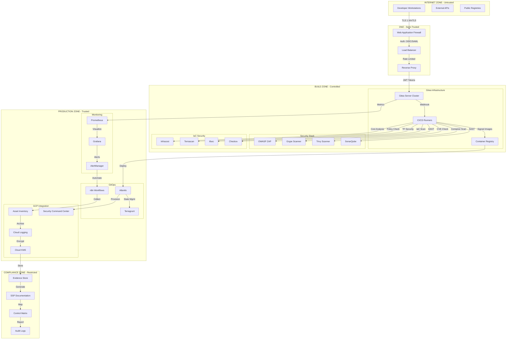
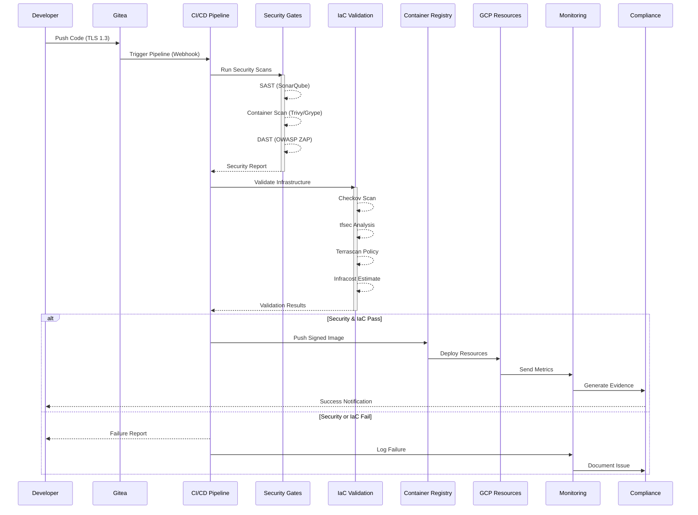
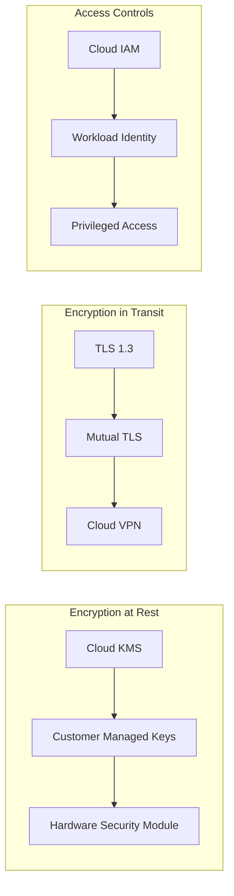

# DevSecOps Platform Architecture & Authorization Boundary

## AUTHORIZATION BOUNDARY DIAGRAM (ABD)



## DATA FLOW DIAGRAM (DFD)



## NETWORK SEGMENTATION & TRUST ZONES

### Zone Definitions

| Zone | Trust Level | Access Controls | Data Classification |
|------|-------------|-----------------|-------------------|
| Internet | Untrusted | WAF, DDoS Protection | Public |
| DMZ | Semi-Trusted | Rate Limiting, IP Whitelisting | Public/Internal |
| Build | Controlled | RBAC, Service Accounts | Internal/Confidential |
| Production | Trusted | mTLS, Zero Trust | Confidential/Secret |
| Compliance | Restricted | MFA, Audit Logging | Secret/Regulatory |

### Security Controls by Zone

#### Internet Zone
- **Ingress**: CloudFlare/Akamai DDoS protection
- **Authentication**: None (public access)
- **Encryption**: TLS 1.3 minimum
- **Monitoring**: Traffic analysis, anomaly detection

#### DMZ Zone
- **Ingress**: Web Application Firewall (ModSecurity)
- **Authentication**: Basic auth for admin interfaces
- **Encryption**: TLS termination and re-encryption
- **Monitoring**: Request logging, rate monitoring

#### Build Zone
- **Ingress**: Authenticated webhooks only
- **Authentication**: OIDC/SAML SSO required
- **Encryption**: mTLS between services
- **Monitoring**: Pipeline metrics, security events

#### Production Zone
- **Ingress**: Service mesh (Istio) controlled
- **Authentication**: Service account tokens
- **Encryption**: In-transit and at-rest (AES-256)
- **Monitoring**: Full observability stack

#### Compliance Zone
- **Ingress**: Jump host required
- **Authentication**: MFA + privileged access management
- **Encryption**: Hardware security module (HSM) backed
- **Monitoring**: Complete audit trail, tamper detection

## TOOL INTEGRATION ARCHITECTURE

### Security Tool Pipeline

```yaml
pipeline:
  stages:
    - name: Source
      tools:
        - gitea: Repository management
        - git-secrets: Credential scanning

    - name: Build
      tools:
        - sonarqube: Static analysis
        - semgrep: Pattern matching
        - bandit: Python security

    - name: Package
      tools:
        - trivy: Container scanning
        - grype: Vulnerability detection
        - cosign: Image signing

    - name: Deploy
      tools:
        - checkov: IaC scanning
        - tfsec: Terraform security
        - terrascan: Policy as code

    - name: Runtime
      tools:
        - falco: Runtime security
        - osquery: Endpoint monitoring
        - wazuh: HIDS/SIEM
```

### Monitoring Stack Architecture

```yaml
monitoring:
  collection:
    - prometheus: Metrics aggregation
    - node_exporter: System metrics
    - cadvisor: Container metrics
    - blackbox_exporter: Endpoint monitoring

  storage:
    - victoria_metrics: Long-term storage
    - loki: Log aggregation
    - tempo: Distributed tracing

  visualization:
    - grafana: Dashboards
    - alertmanager: Alert routing
    - karma: Alert dashboard

  automation:
    - n8n: Workflow orchestration
    - ansible: Remediation playbooks
```

## GCP INTEGRATION POINTS

### Service Integrations

| GCP Service | Integration Purpose | Security Controls |
|-------------|-------------------|-------------------|
| Cloud IAM | Identity federation | Workload identity, least privilege |
| Cloud KMS | Encryption keys | HSM-backed, rotation policy |
| Cloud Storage | Artifact storage | Signed URLs, retention policies |
| Cloud Build | Native CI/CD | Private pools, VPC-SC |
| Cloud Run | Serverless compute | Binary authorization, min TLS |
| Security Command Center | Vulnerability management | Real-time findings, compliance |
| Cloud Asset Inventory | Resource tracking | Change detection, exports |
| Cloud Logging | Centralized logs | Log sinks, BigQuery analysis |
| Cloud Armor | DDoS protection | Rate limiting, geo-blocking |
| VPC Service Controls | Network security | Perimeter protection, access levels |

### Data Flow Security



## DISASTER RECOVERY ARCHITECTURE

### Backup Strategy

```yaml
backup:
  gitea:
    frequency: Every 6 hours
    retention: 30 days
    location: Multi-region Cloud Storage
    encryption: CMEK with Cloud KMS

  databases:
    frequency: Daily full, hourly incremental
    retention: 90 days
    location: Cross-region replicated
    encryption: AES-256-GCM

  configurations:
    frequency: On change
    retention: Unlimited
    location: Version controlled in Git
    encryption: GPG signed commits

  secrets:
    frequency: On rotation
    retention: 3 versions
    location: Secret Manager
    encryption: Envelope encryption
```

### Recovery Objectives

| Component | RTO | RPO | Backup Method | Recovery Method |
|-----------|-----|-----|---------------|-----------------|
| Gitea | 1 hour | 6 hours | Snapshot + WAL | Restore from snapshot |
| CI/CD | 30 minutes | 1 hour | Config as code | Redeploy from Git |
| Security Tools | 2 hours | 24 hours | Container images | Pull and redeploy |
| Monitoring | 4 hours | 1 hour | Persistent volumes | Volume restore |
| Compliance Data | 15 minutes | 5 minutes | Real-time replication | Failover to replica |