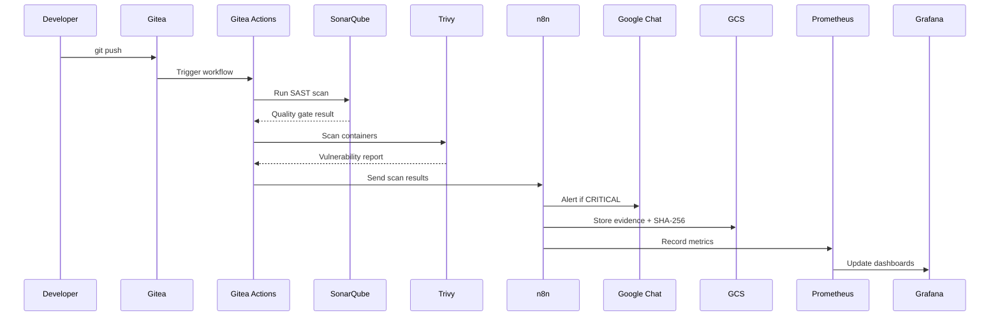
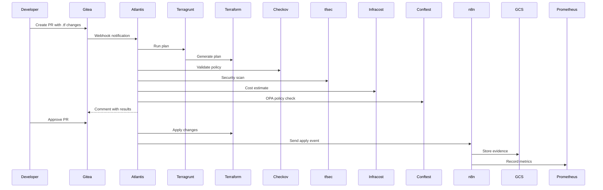
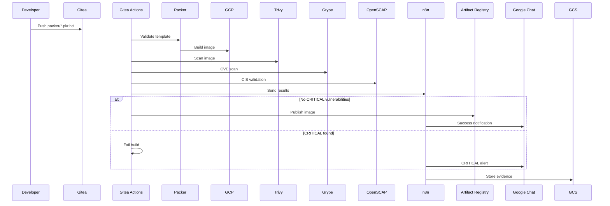
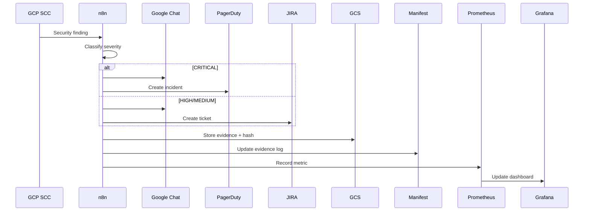

# DevSecOps Platform Integration Guide

## Overview

This guide explains how all components of the Gitea DevSecOps platform integrate together to provide comprehensive security, compliance, and operational visibility.

## Architecture Overview

```
┌─────────────────────────────────────────────────────────────────────┐
│                        Gitea Git Repository                          │
│                    (CUI Storage & Version Control)                   │
└────────┬─────────────────────────────────────────────────┬──────────┘
         │                                                   │
         │ Webhooks                                          │ Pull Requests
         ▼                                                   ▼
┌─────────────────────┐                          ┌──────────────────────┐
│   Gitea Actions     │                          │      Atlantis        │
│  (CI/CD Pipelines)  │                          │   (GitOps for IaC)   │
└──────────┬──────────┘                          └──────────┬───────────┘
           │                                                  │
           │ Trigger Scans                                    │ Terraform Apply
           ▼                                                  ▼
┌──────────────────────────────────────────────────────────────────────┐
│                      Security Scanning Layer                          │
├───────────────┬──────────────┬──────────────┬─────────────┬──────────┤
│  SonarQube    │ Trivy/Grype  │ Checkov/     │   Packer    │ Semgrep  │
│  (SAST)       │ (Container)  │ tfsec        │   (Image)   │ (SAST)   │
└───────┬───────┴──────┬───────┴──────┬───────┴─────┬───────┴─────┬────┘
        │              │              │             │             │
        │ Results      │ Findings     │ Violations  │ Scan Data   │ Findings
        └──────────────┴──────────────┴─────────────┴─────────────┘
                                       │
                                       ▼
                        ┌──────────────────────────┐
                        │    n8n Workflows         │
                        │  (Event Processing)      │
                        └─────────┬────────────────┘
                                  │
                   ┌──────────────┼──────────────┐
                   │              │              │
                   ▼              ▼              ▼
        ┌────────────────┐ ┌──────────┐ ┌───────────────┐
        │  Google Chat   │ │   GCS    │ │  Prometheus   │
        │ (Notifications)│ │(Evidence)│ │   (Metrics)   │
        └────────────────┘ └──────────┘ └───────┬───────┘
                                                 │
                                                 ▼
                                        ┌─────────────────┐
                                        │    Grafana      │
                                        │  (Dashboards)   │
                                        └─────────────────┘
```

## Component Integration Matrix

| Source Component | Target Component | Integration Method | Data Flow |
|-----------------|------------------|-------------------|-----------|
| Gitea | Gitea Actions | Built-in | Code changes → Pipeline triggers |
| Gitea | Atlantis | Webhooks | Pull requests → Terraform workflows |
| Gitea | n8n | Webhooks | Events → Workflow automation |
| SonarQube | n8n | REST API | Quality gate results → Events |
| Trivy/Grype | n8n | File output | Scan results → Event processing |
| Checkov/tfsec | Atlantis | CLI execution | Policy validation → PR comments |
| Packer | Gitea Actions | Workflow integration | Image builds → Security scans |
| n8n | Google Chat | Webhooks | Events → Notifications |
| n8n | GCS | API | Evidence → Storage with SHA-256 |
| n8n | Prometheus | HTTP endpoint | Workflow metrics → Time series |
| All scanners | Prometheus | Custom exporters | Metrics → Monitoring |
| Prometheus | Grafana | Data source | Metrics → Dashboards |
| GCP SCC | n8n | API polling | Security findings → Events |
| Atlantis | Prometheus | Metrics endpoint | GitOps metrics → Monitoring |

## Data Flow Examples

### 1. Code Commit → Security Scan → Evidence Collection



### 2. Terraform Change → GitOps → Policy Validation



### 3. Packer Image Build → Vulnerability Scan → Publish



### 4. Security Event → Incident Response → Evidence Chain



## Environment Variables & Secrets

### Shared Secrets (Gitea Secrets)

```bash
# Google Chat Webhooks
GCHAT_SECURITY_WEBHOOK=https://chat.googleapis.com/v1/spaces/.../messages?key=...
GCHAT_DEV_WEBHOOK=https://chat.googleapis.com/v1/spaces/.../messages?key=...

# GCP Service Account
GCP_PROJECT_ID=your-project-id
GCP_SA_KEY=<base64-encoded-service-account-json>

# SonarQube
SONARQUBE_URL=http://sonarqube:9000
SONARQUBE_TOKEN=<admin-token>

# n8n
N8N_ENCRYPTION_KEY=<32-char-random-string>
N8N_WEBHOOK_URL=https://n8n.yourdomain.com

# Atlantis
ATLANTIS_GITEA_TOKEN=<gitea-api-token>
ATLANTIS_GITEA_WEBHOOK_SECRET=<random-secret>

# Evidence Collection
GCS_EVIDENCE_BUCKET=gs://compliance-evidence-your-org
GCS_MANIFEST_BUCKET=gs://compliance-manifests-your-org
```

### Component-Specific Configuration

#### n8n Credentials
- **Google Chat Webhook** (gchat_security_webhook, gchat_dev_webhook)
- **GCP Service Account** (gcp_service_account)
- **Gitea API** (gitea_api)
- **SonarQube API** (sonarqube_api)

#### Prometheus Scrape Targets
- `gitea:3000/metrics`
- `sonarqube:9000/api/monitoring/metrics`
- `n8n:5678/metrics`
- `atlantis:4141/metrics`
- `trivy:8080/metrics`

#### Grafana Data Sources
- Prometheus: `http://prometheus:9090`
- PostgreSQL (n8n): `postgres-n8n:5432/n8n`
- PostgreSQL (Grafana): `postgres-grafana:5432/grafana`

## Integration Testing

### Quick Health Check

```bash
# Check all services
make status

# Expected output:
# ✓ Gitea: Running
# ✓ SonarQube: Running
# ✓ PostgreSQL (SonarQube): Running
# ✓ n8n: Running
# ✓ Prometheus: Running
# ✓ Grafana: Running
# ✓ Atlantis: Running
```

### End-to-End Integration Test

```bash
# 1. Test code scanning integration
cd /home/notme/Desktop/gitea
make test-integration-scanning

# 2. Test Terraform workflow
make test-integration-terraform

# 3. Test Packer pipeline
make test-integration-packer

# 4. Test monitoring stack
make test-integration-monitoring

# 5. Test evidence collection
make test-integration-evidence
```

### Manual Integration Verification

#### 1. Verify Gitea → n8n Webhook

```bash
# Send test event
curl -X POST https://n8n.yourdomain.com/webhook/security-events \
  -H "X-API-Key: your-api-key" \
  -H "Content-Type: application/json" \
  -d '{
    "event_type": "vulnerability",
    "severity": "HIGH",
    "component": "test-app",
    "cve_id": "CVE-2024-0001"
  }'

# Check Google Chat for notification
```

#### 2. Verify SonarQube → Prometheus

```bash
# Check metrics endpoint
curl http://localhost:9090/api/v1/query?query=sonarqube_project_vulnerabilities

# Should return vulnerability counts
```

#### 3. Verify Atlantis → Gitea

```bash
# Create test PR
git checkout -b test-atlantis
echo 'resource "null_resource" "test" {}' > test.tf
git add test.tf
git commit -m "Test Atlantis integration"
git push origin test-atlantis

# Create PR in Gitea UI
# Atlantis should comment with plan output
```

#### 4. Verify Evidence Collection

```bash
# Check GCS bucket
gsutil ls gs://compliance-evidence-your-org/

# Verify manifest
gsutil cat gs://compliance-manifests-your-org/latest.json

# Check SHA-256 integrity
python3 evidence-collection/validate-evidence.py \
  --bucket gs://compliance-evidence-your-org
```

## Compliance Integration

### Evidence Collection Flow

All security events generate evidence artifacts:

1. **Event Occurs** (vulnerability scan, policy violation, etc.)
2. **n8n Captures Event** via webhook or API polling
3. **Evidence Artifact Generated**:
   ```json
   {
     "evidence_id": "uuid",
     "timestamp": "ISO-8601",
     "control_framework": "CMMC_2.0",
     "control_id": "SI.L2-3.14.1",
     "source": "trivy_scan",
     "data": { /* scan results */ },
     "hash": "sha256-hex"
   }
   ```
4. **Stored in GCS** with immutable storage class
5. **Manifest Updated** for audit trail
6. **Metrics Recorded** in Prometheus
7. **Dashboard Updated** in Grafana

### Control-to-Component Mapping

| CMMC Control | Component | Evidence Type |
|-------------|-----------|--------------|
| SI.L2-3.14.1 | SonarQube, Trivy | Vulnerability scan results |
| CM.L2-3.4.2 | Atlantis, Terragrunt | Terraform plan/apply logs |
| AU.L2-3.3.1 | Prometheus, Grafana | Audit log exports |
| RA.L2-3.11.2 | Grype, OpenSCAP | Risk assessment reports |
| CA.L2-3.12.4 | All scanners | Security test results |

## Monitoring Integration

### Key Metrics Collected

```prometheus
# Security metrics
security_vulnerabilities_total{severity="CRITICAL"}
security_scan_duration_seconds
security_gates_failed_total

# Compliance metrics
compliance_control_coverage_percent{framework="CMMC_2.0"}
compliance_evidence_age_seconds
compliance_violations_total

# Operational metrics
pipeline_build_duration_seconds
atlantis_plan_duration_seconds
packer_build_success_total
n8n_workflow_execution_time_seconds

# Cost metrics
infracost_monthly_cost_usd
gcp_resource_cost_usd
```

### Grafana Dashboard Integration

Access dashboards at `http://localhost:3000`:

- **DevSecOps Overview** - Platform health and security posture
- **Security Metrics** - Vulnerability trends and remediation
- **Compliance Dashboard** - CMMC/NIST control coverage
- **GitOps Activity** - Atlantis/Terraform statistics
- **Packer Builds** - Image build and scan metrics

## Troubleshooting Integration Issues

### n8n Not Receiving Events

```bash
# Check webhook configuration
make n8n-logs

# Verify Gitea webhook
curl -X POST http://localhost:5678/webhook-test/security-events \
  -H "Content-Type: application/json" \
  -d '{"test": true}'
```

### Prometheus Not Scraping Targets

```bash
# Check Prometheus targets
curl http://localhost:9090/api/v1/targets | jq '.data.activeTargets'

# Restart Prometheus
make monitoring-restart
```

### Atlantis Not Commenting on PRs

```bash
# Check Atlantis logs
make atlantis-logs

# Verify webhook delivery
cat /var/log/gitea/gitea.log | grep webhook
```

### Evidence Not Uploading to GCS

```bash
# Check service account permissions
gcloud projects get-iam-policy $GCP_PROJECT_ID \
  --flatten="bindings[].members" \
  --filter="bindings.members:serviceAccount:*"

# Test GCS access
gsutil ls gs://compliance-evidence-your-org
```

## Best Practices

1. **Use Shared Secrets** - Store all API keys and tokens in Gitea Secrets
2. **Monitor Integration Health** - Set up alerts for failed webhooks
3. **Validate Evidence Chain** - Regularly verify SHA-256 hashes
4. **Test After Updates** - Run integration tests after component updates
5. **Document Changes** - Update this guide when adding integrations
6. **Review Dashboards** - Check Grafana daily for anomalies
7. **Backup Configurations** - Run `make backup` before major changes

## Next Steps

1. Configure all environment variables in component `.env` files
2. Set up Google Chat webhooks for your spaces
3. Run `make integration-test` to verify all connections
4. Review Grafana dashboards for initial metrics
5. Test a complete workflow: commit → scan → evidence → notification
6. Set up alerting thresholds in Prometheus
7. Schedule regular compliance evidence reviews

## Support

For integration issues:
- Check component logs: `make logs SERVICE=component-name`
- Review troubleshooting section above
- Verify environment variables are set correctly
- Test each integration independently before end-to-end testing
