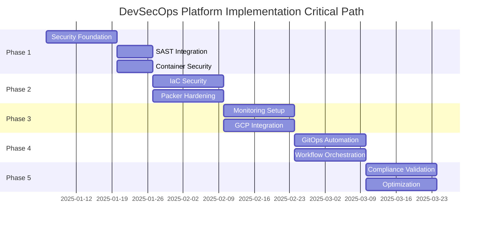

# Gitea DevSecOps Platform - Master Orchestration Plan
## Enterprise-Grade Security & Compliance Integration

### EXECUTIVE SUMMARY
- **Project**: Gitea + Terraform + Packer + GCP DevSecOps Platform
- **Duration**: 10 weeks (5 phases)
- **Tools**: 34 integrated security, monitoring, and automation tools
- **Compliance**: CMMC 2.0, NIST SP 800-171 Rev. 2, NIST SP 800-53 Rev. 5
- **Cost Savings**: 94-96% vs commercial alternatives
- **Risk Level**: Medium (mitigated through phased approach)

### AGENT COORDINATION MATRIX

| Agent | Primary Responsibilities | Dependencies | Output Artifacts |
|-------|-------------------------|--------------|------------------|
| **devsecops-automator** | CI/CD pipelines, security gates, Terraform/Packer baselines | boundary-diagram-architect | Pipeline templates, security configs |
| **compliance-copilot** | Control mappings, gap analysis, audit preparation | nist-docs-specialist | Control matrix, evidence requirements |
| **boundary-diagram-architect** | Network diagrams, trust zones, data flows | - | ABD/DFD diagrams, security zones |
| **workflow-creator** | n8n automation, alerting, incident response | devsecops-automator | Workflow JSON, integration specs |
| **gws-evidence-collector** | Evidence collection, audit logs, asset inventory | compliance-copilot | Evidence framework, retention policies |
| **nist-docs-specialist** | SSP structure, control statements, documentation | compliance-copilot | SSP outline, control narratives |

### CRITICAL PATH ANALYSIS

### RISK REGISTER

| Risk ID | Description | Probability | Impact | Mitigation Strategy | Owner |
|---------|-------------|------------|--------|-------------------|-------|
| R001 | GCP API compatibility issues | Medium | High | Pre-validate all API versions, maintain fallback configs | devsecops-automator |
| R002 | Tool integration conflicts | High | Medium | Containerize tools, use network segmentation | boundary-diagram-architect |
| R003 | Compliance drift | Medium | High | Automated compliance scanning, daily reports | compliance-copilot |
| R004 | Resource constraints | Low | High | Auto-scaling, resource quotas, cost alerts | workflow-creator |
| R005 | Security vulnerabilities | Medium | Critical | Daily scanning, automated patching, CVE monitoring | devsecops-automator |
| R006 | Documentation gaps | Low | Medium | Template-driven docs, automated generation | nist-docs-specialist |

### RESOURCE REQUIREMENTS

#### Human Resources
- **Lead Architect**: 1 FTE (10 weeks)
- **Security Engineers**: 2 FTE (8 weeks)
- **DevOps Engineers**: 2 FTE (10 weeks)
- **Compliance Analyst**: 1 FTE (6 weeks)
- **Technical Writer**: 0.5 FTE (4 weeks)

#### Infrastructure Resources
- **Development Environment**:
  - Gitea Server: 4 vCPU, 8GB RAM, 100GB SSD
  - Build Agents: 8 vCPU, 16GB RAM, 500GB SSD (x3)
  - Monitoring Stack: 4 vCPU, 16GB RAM, 1TB SSD

- **Production Environment**:
  - Gitea Cluster: 8 vCPU, 32GB RAM, 500GB SSD (x2)
  - Build Farm: 16 vCPU, 64GB RAM, 2TB SSD (x5)
  - Security Stack: 8 vCPU, 32GB RAM, 1TB SSD (x2)

### PHASE 1A WEEKEND IMPLEMENTATION PLAN

#### Friday Evening (6 PM - 11 PM)
1. **Infrastructure Provisioning** (2 hours)
   - Deploy base Gitea instance
   - Configure GCP project structure
   - Set up networking and firewall rules

2. **Security Baseline** (3 hours)
   - Install and configure SonarQube
   - Deploy Trivy/Grype containers
   - Initialize OWASP ZAP

#### Saturday (9 AM - 9 PM)
1. **Morning Block** (9 AM - 1 PM)
   - Configure CI/CD runners
   - Implement first security gates
   - Test SAST integration

2. **Afternoon Block** (2 PM - 6 PM)
   - Deploy container scanning pipeline
   - Configure vulnerability thresholds
   - Set up alerting channels

3. **Evening Block** (6 PM - 9 PM)
   - Initial compliance mappings
   - Documentation templates
   - Backup configuration

#### Sunday (10 AM - 6 PM)
1. **Testing & Validation** (10 AM - 2 PM)
   - End-to-end pipeline tests
   - Security gate validation
   - Performance benchmarks

2. **Documentation & Handoff** (2 PM - 6 PM)
   - Update runbooks
   - Create operator guides
   - Prepare Monday briefing

### SUCCESS METRICS

| Metric | Target | Measurement Method |
|--------|--------|-------------------|
| Security Gate Coverage | 100% | Pipeline audit logs |
| Vulnerability Detection Rate | >95% | CVE correlation analysis |
| Compliance Control Coverage | >90% | Control mapping matrix |
| Pipeline Performance | <10 min | Build time metrics |
| Cost Efficiency | 94-96% savings | Monthly cost reports |
| Uptime | 99.9% | Monitoring dashboards |

### NEXT STEPS

1. **Immediate Actions** (This Week)
   - [ ] Secure GCP project and billing
   - [ ] Provision development environment
   - [ ] Recruit/assign team members
   - [ ] Schedule stakeholder kickoff

2. **Phase 1A Preparation** (By Friday)
   - [ ] Validate all tool licenses
   - [ ] Create IAM structure
   - [ ] Prepare network architecture
   - [ ] Draft initial runbooks

3. **Risk Mitigation** (Ongoing)
   - [ ] Establish daily standup cadence
   - [ ] Configure monitoring alerts
   - [ ] Create rollback procedures
   - [ ] Document break-glass processes