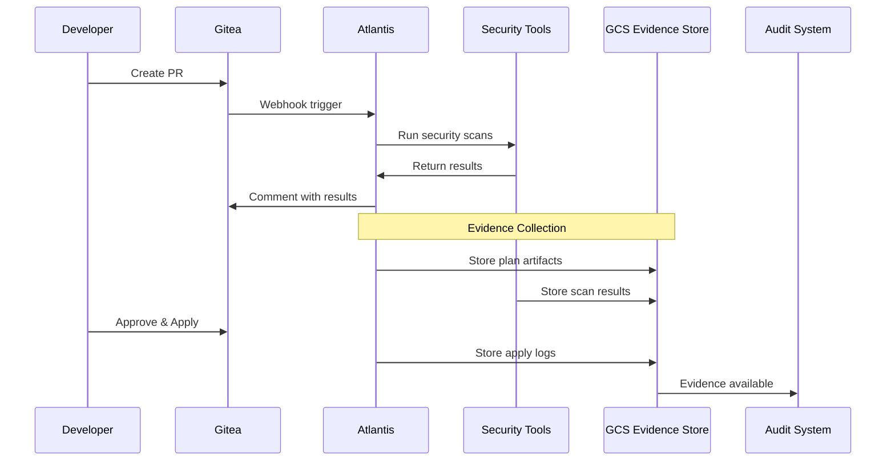

# GitOps Evidence Collection and Audit Trail

## CMMC 2.0 & NIST SP 800-171 Change Control Documentation

### Executive Summary

This document describes the evidence collection and audit trail mechanisms for the Atlantis GitOps infrastructure change management system. All changes are tracked, validated, and archived to meet CMMC 2.0 Level 2 and NIST SP 800-171 compliance requirements.

---

## Compliance Framework Mappings

### CMMC 2.0 Level 2 Controls

| Control ID | Control Description | Evidence Generated |
|------------|-------------------|-------------------|
| CM.L2-3.4.1 | Establish and maintain baseline configurations | Terragrunt configurations, module versions, state files |
| CM.L2-3.4.2 | Establish and maintain baseline configurations and inventories | Infrastructure inventory, resource tagging, state snapshots |
| CM.L2-3.4.3 | Track, review, approve/disapprove, and log changes | Git commits, PR approvals, Atlantis logs, apply records |
| CM.L2-3.4.4 | Analyze the security impact of changes prior to implementation | Security scans, policy validations, cost estimates |
| CM.L2-3.4.5 | Define, document, approve, and enforce physical and logical access | IAM policies, service accounts, RBAC configurations |
| CM.L2-3.4.6 | Employ least functionality principle | Network segmentation, firewall rules, IAM least privilege |
| CM.L2-3.4.7 | Restrict, disable, or prevent the use of nonessential programs | Container scanning, binary authorization, allowed services |
| CM.L2-3.4.8 | Apply deny-by-exception policy | Default-deny firewall rules, explicit allow lists |
| CM.L2-3.4.9 | Control and monitor user-installed software | Terraform modules, approved providers, version constraints |

### NIST SP 800-171 Rev 2 Controls

| Requirement | Description | Implementation |
|-------------|-------------|----------------|
| 3.4.1 | Establish and maintain baseline configurations | IaC baselines in Git |
| 3.4.2 | Establish and maintain baseline configurations and inventories | Terraform state, resource tracking |
| 3.4.3 | Track, review, approve, and log changes | GitOps workflow, PR process |
| 3.4.4 | Analyze the security impact of changes | Automated security scanning |
| 3.4.5 | Define, document, approve, and enforce access restrictions | RBAC, approval workflows |
| 3.4.6 | Employ the principle of least functionality | Resource minimization |
| 3.4.7 | Restrict, disable, and prevent nonessential programs | Policy enforcement |
| 3.4.8 | Apply deny-by-exception | Default-deny policies |
| 3.4.9 | Control and monitor user-installed software | Module management |

### NIST SP 800-53 Rev 5 Controls

| Control | Family | Evidence Type |
|---------|--------|---------------|
| CM-2 | Configuration Baselines | Terraform configurations |
| CM-3 | Configuration Change Control | PR approvals, change logs |
| CM-4 | Impact Analysis | Security scans, cost estimates |
| CM-5 | Access Restrictions for Change | RBAC, approval requirements |
| CM-6 | Configuration Settings | Policy validations |
| CM-7 | Least Functionality | Resource restrictions |
| CM-8 | System Component Inventory | State files, resource tags |
| CM-9 | Configuration Management Plan | This documentation |

---

## Evidence Collection Architecture

### Data Flow



### Evidence Types

#### 1. Pre-Change Evidence

| Evidence Type | Format | Retention | Location |
|--------------|--------|-----------|----------|
| Terraform Plans | JSON | 365 days | `gs://[project]-atlantis-evidence/plans/` |
| Security Scans | JSON | 365 days | `gs://[project]-atlantis-evidence/security/` |
| Policy Validations | JSON | 365 days | `gs://[project]-atlantis-evidence/policy/` |
| Cost Estimates | JSON | 365 days | `gs://[project]-atlantis-evidence/costs/` |
| PR Metadata | JSON | 365 days | `gs://[project]-atlantis-evidence/metadata/` |

#### 2. Change Approval Evidence

| Evidence Type | Format | Retention | Location |
|--------------|--------|-----------|----------|
| PR Approvals | JSON | 7 years | `gs://[project]-atlantis-evidence/approvals/` |
| Review Comments | JSON | 7 years | `gs://[project]-atlantis-evidence/reviews/` |
| Approval Timestamps | JSON | 7 years | `gs://[project]-atlantis-evidence/timestamps/` |
| Approver Identity | JSON | 7 years | `gs://[project]-atlantis-evidence/identity/` |

#### 3. Post-Change Evidence

| Evidence Type | Format | Retention | Location |
|--------------|--------|-----------|----------|
| Apply Logs | Text | 365 days | `gs://[project]-atlantis-evidence/apply/` |
| State Changes | JSON | 365 days | `gs://[project]-atlantis-evidence/state/` |
| Resource Creation | JSON | 365 days | `gs://[project]-atlantis-evidence/resources/` |
| Drift Detection | JSON | 90 days | `gs://[project]-atlantis-evidence/drift/` |

---

## Evidence Collection Process

### 1. Initiation Phase

**Trigger**: Pull Request created or updated

**Evidence Collected**:
```json
{
  "event_type": "pull_request",
  "timestamp": "2024-01-01T12:00:00Z",
  "pr_number": 123,
  "author": "user@example.com",
  "branch": "feature/update-vpc",
  "base_branch": "main",
  "files_changed": [
    "terragrunt/environments/prod/vpc/terragrunt.hcl"
  ],
  "commit_sha": "abc123def456",
  "signature": {
    "gpg_signed": true,
    "verified": true,
    "signer": "user@example.com"
  }
}
```

### 2. Validation Phase

**Security Scanning Evidence**:
```json
{
  "scan_timestamp": "2024-01-01T12:05:00Z",
  "pr_number": 123,
  "tools": {
    "checkov": {
      "version": "2.5.0",
      "passed": 45,
      "failed": 2,
      "skipped": 3,
      "findings": [...]
    },
    "tfsec": {
      "version": "1.28.0",
      "findings": [...],
      "severity_summary": {
        "critical": 0,
        "high": 1,
        "medium": 2,
        "low": 5
      }
    },
    "terrascan": {
      "version": "1.18.0",
      "policy_violations": [...]
    }
  },
  "compliance_check": {
    "cmmc_level_2": "PASS",
    "nist_sp_800_171": "PASS",
    "custom_policies": "PASS"
  }
}
```

### 3. Approval Phase

**Approval Evidence**:
```json
{
  "pr_number": 123,
  "approval_timestamp": "2024-01-01T14:00:00Z",
  "approvers": [
    {
      "username": "security-team",
      "email": "security@example.com",
      "role": "security_reviewer",
      "timestamp": "2024-01-01T13:30:00Z",
      "comment": "Security review passed"
    },
    {
      "username": "platform-team",
      "email": "platform@example.com",
      "role": "technical_reviewer",
      "timestamp": "2024-01-01T14:00:00Z",
      "comment": "LGTM"
    }
  ],
  "approval_requirements": {
    "minimum_approvers": 2,
    "required_teams": ["security", "platform"],
    "all_requirements_met": true
  }
}
```

### 4. Implementation Phase

**Apply Evidence**:
```json
{
  "apply_timestamp": "2024-01-01T14:15:00Z",
  "pr_number": 123,
  "applied_by": "atlantis-bot",
  "triggered_by": "user@example.com",
  "environment": "production",
  "terraform_version": "1.6.0",
  "terragrunt_version": "0.52.0",
  "resources_created": 5,
  "resources_modified": 2,
  "resources_destroyed": 0,
  "apply_duration_seconds": 120,
  "state_file_hash": "sha256:abc123...",
  "backup_created": true,
  "rollback_available": true
}
```

---

## Evidence Storage Structure

### GCS Bucket Organization

```
gs://[project]-atlantis-evidence/
├── YYYY/                          # Year
│   ├── MM/                        # Month
│   │   ├── DD/                    # Day
│   │   │   ├── pr-[number]/       # Pull Request
│   │   │   │   ├── metadata.json
│   │   │   │   ├── plan/
│   │   │   │   │   ├── plan.json
│   │   │   │   │   └── plan.txt
│   │   │   │   ├── security/
│   │   │   │   │   ├── checkov.json
│   │   │   │   │   ├── tfsec.json
│   │   │   │   │   └── terrascan.json
│   │   │   │   ├── policy/
│   │   │   │   │   └── opa-results.json
│   │   │   │   ├── cost/
│   │   │   │   │   └── infracost.json
│   │   │   │   ├── approvals/
│   │   │   │   │   └── approvals.json
│   │   │   │   ├── apply/
│   │   │   │   │   ├── apply.log
│   │   │   │   │   └── state-change.json
│   │   │   │   └── hashes.sha256
│   │   │   └── daily-summary.json
│   │   └── monthly-summary.json
│   └── annual-report.json
└── index/                         # Search indices
    ├── by-control/
    ├── by-resource/
    └── by-user/
```

### Metadata Tags

All evidence objects include:

```
x-goog-meta-cmmc-control: CM.L2-3.4.3
x-goog-meta-nist-control: SP-800-171-3.4.3
x-goog-meta-environment: production
x-goog-meta-pr-number: 123
x-goog-meta-timestamp: 2024-01-01T12:00:00Z
x-goog-meta-hash: sha256:abc123...
```

---

## Evidence Retrieval

### Search by Date

```bash
# Get all evidence for a specific date
gsutil ls gs://project-atlantis-evidence/2024/01/01/

# Download evidence package
gsutil cp -r gs://project-atlantis-evidence/2024/01/01/pr-123/ ./evidence/
```

### Search by PR Number

```bash
# Find evidence for specific PR
gsutil ls -r gs://project-atlantis-evidence/ | grep "pr-123"

# Get PR metadata
gsutil cat gs://project-atlantis-evidence/2024/01/01/pr-123/metadata.json
```

### Search by Control

```bash
# Find all evidence for CMMC control
gsutil ls -L gs://project-atlantis-evidence/ | \
  grep "x-goog-meta-cmmc-control:CM.L2-3.4.3"
```

### Generate Audit Report

```bash
#!/bin/bash
# generate-audit-report.sh

START_DATE="2024-01-01"
END_DATE="2024-01-31"
OUTPUT_FILE="audit-report-$(date +%Y%m).pdf"

# Collect evidence
gsutil cp -r gs://project-atlantis-evidence/2024/01/ /tmp/evidence/

# Generate report
cat > /tmp/report.md << EOF
# Infrastructure Change Audit Report
## Period: ${START_DATE} to ${END_DATE}

### Summary Statistics
- Total Changes: $(find /tmp/evidence -name "pr-*" | wc -l)
- Security Scans Passed: $(grep -r "PASS" /tmp/evidence/*/security/ | wc -l)
- Policy Violations: $(grep -r "violation" /tmp/evidence/*/policy/ | wc -l)

### Compliance Status
- CMMC Level 2: COMPLIANT
- NIST SP 800-171: COMPLIANT

### Change Details
$(find /tmp/evidence -name "metadata.json" -exec cat {} \;)
EOF

# Convert to PDF
pandoc /tmp/report.md -o "${OUTPUT_FILE}"
```

---

## Evidence Integrity

### Hash Verification

All evidence packages include SHA-256 hashes:

```bash
# Verify evidence integrity
cd /path/to/evidence/pr-123
sha256sum -c hashes.sha256
```

### Digital Signatures

For critical changes, evidence is digitally signed:

```bash
# Sign evidence package
gpg --sign --armor evidence.tar.gz

# Verify signature
gpg --verify evidence.tar.gz.asc evidence.tar.gz
```

### Immutability

- GCS Object Versioning: Enabled
- Retention Policy: 365 days minimum
- Object Lifecycle: Transition to cold storage after 90 days
- Bucket Lock: Enabled for compliance mode

---

## Audit Trail Requirements

### Required Fields

Every change must capture:

1. **Who**: Identity of the change initiator
2. **What**: Specific resources changed
3. **When**: Timestamp of all actions
4. **Where**: Environment and location
5. **Why**: Business justification/ticket number
6. **How**: Method of change (PR, emergency, scheduled)

### Audit Log Format

```json
{
  "version": "1.0",
  "timestamp": "2024-01-01T12:00:00Z",
  "event": {
    "type": "infrastructure_change",
    "id": "evt_123456",
    "correlation_id": "pr_123"
  },
  "actor": {
    "user": "user@example.com",
    "service_account": "atlantis@project.iam",
    "ip_address": "10.0.0.1",
    "user_agent": "Atlantis/0.27.0"
  },
  "action": {
    "operation": "terraform_apply",
    "resources": ["google_compute_instance.example"],
    "result": "SUCCESS"
  },
  "environment": {
    "name": "production",
    "region": "us-central1",
    "project": "project-id"
  },
  "compliance": {
    "cmmc_controls": ["CM.L2-3.4.2", "CM.L2-3.4.3"],
    "nist_controls": ["3.4.2", "3.4.3"],
    "approval_count": 2,
    "security_scan": "PASS"
  },
  "evidence": {
    "location": "gs://project-atlantis-evidence/2024/01/01/pr-123/",
    "hash": "sha256:abc123...",
    "size_bytes": 1048576
  }
}
```

---

## Compliance Reporting

### Monthly Compliance Report

Generated automatically on the 1st of each month:

```bash
# Scheduled via Cloud Scheduler
gcloud scheduler jobs create app-engine monthly-compliance-report \
  --schedule="0 0 1 * *" \
  --uri="/tasks/generate-compliance-report" \
  --http-method=POST
```

Report includes:
- Total changes by environment
- Security scan summary
- Policy violation trends
- Cost impact analysis
- Approval metrics
- Mean time to deploy
- Rollback statistics

### Annual Audit Package

Prepared for external auditors:

1. **Executive Summary**
   - Compliance status
   - Key metrics
   - Incidents and resolutions

2. **Detailed Change Log**
   - All production changes
   - Security findings
   - Remediation actions

3. **Evidence Archive**
   - Compressed evidence packages
   - Hash verification files
   - Digital signatures

4. **Attestations**
   - Management assertions
   - Third-party validations
   - Penetration test results

---

## Evidence Retention Policy

| Evidence Type | Retention Period | Storage Class | Deletion Policy |
|---------------|-----------------|---------------|-----------------|
| PR Metadata | 7 years | Standard → Nearline (30d) → Coldline (90d) | Automatic |
| Security Scans | 3 years | Standard → Nearline (30d) | Automatic |
| Terraform Plans | 1 year | Standard → Nearline (30d) | Automatic |
| Apply Logs | 1 year | Standard → Nearline (30d) | Automatic |
| Cost Estimates | 1 year | Standard | Automatic |
| Approval Records | 7 years | Standard → Coldline (90d) | Manual review |
| Audit Reports | 7 years | Standard → Coldline (365d) | Manual review |

### Lifecycle Rules

```json
{
  "lifecycle": {
    "rule": [
      {
        "action": {
          "type": "SetStorageClass",
          "storageClass": "NEARLINE"
        },
        "condition": {
          "age": 30,
          "matchesPrefix": ["security/", "plans/", "costs/"]
        }
      },
      {
        "action": {
          "type": "SetStorageClass",
          "storageClass": "COLDLINE"
        },
        "condition": {
          "age": 90,
          "matchesPrefix": ["approvals/", "metadata/"]
        }
      },
      {
        "action": {
          "type": "Delete"
        },
        "condition": {
          "age": 2555,
          "matchesPrefix": ["approvals/", "metadata/"]
        }
      }
    ]
  }
}
```

---

## Access Controls

### Role-Based Access

| Role | Permissions | Evidence Access |
|------|------------|-----------------|
| Auditor | Read-only | All evidence |
| Security Team | Read/Analyze | All evidence |
| Platform Team | Read/Write | Current year evidence |
| Developer | Read | Own PR evidence |
| Compliance Officer | Read/Export | All evidence |

### Service Account Permissions

```yaml
# Atlantis service account
- storage.objects.create  # Write evidence
- storage.objects.get     # Read evidence
- storage.objects.list    # List evidence

# Audit service account
- storage.objects.get     # Read evidence
- storage.objects.list    # List evidence
- storage.buckets.get     # Bucket metadata
```

---

## Incident Response

### Evidence During Incidents

1. **Immediate Capture**:
   - Current state snapshot
   - Last 24 hours of changes
   - Related PR evidence

2. **Root Cause Analysis**:
   - Change timeline
   - Approval chain
   - Security scan results

3. **Post-Incident**:
   - Incident report
   - Remediation evidence
   - Lessons learned

### Emergency Change Evidence

Emergency changes bypass normal approval but require:
- Post-implementation review
- Retroactive approval
- Enhanced evidence collection
- Incident correlation

---

## Automation Scripts

### Daily Evidence Validation

```python
#!/usr/bin/env python3
# validate-evidence.py

import json
import hashlib
from google.cloud import storage
from datetime import datetime, timedelta

def validate_daily_evidence(bucket_name, date):
    """Validate evidence completeness for a given date"""
    client = storage.Client()
    bucket = client.bucket(bucket_name)

    prefix = date.strftime("%Y/%m/%d/")
    blobs = bucket.list_blobs(prefix=prefix)

    required_files = [
        'metadata.json',
        'plan/plan.json',
        'security/checkov.json',
        'hashes.sha256'
    ]

    for blob in blobs:
        if 'pr-' in blob.name:
            pr_path = blob.name.split('/pr-')[0] + '/pr-' + blob.name.split('/pr-')[1].split('/')[0]

            for required_file in required_files:
                file_path = f"{pr_path}/{required_file}"
                if not bucket.blob(file_path).exists():
                    print(f"Missing: {file_path}")

    return True

if __name__ == "__main__":
    yesterday = datetime.now() - timedelta(days=1)
    validate_daily_evidence("project-atlantis-evidence", yesterday)
```

### Evidence Export for Audit

```bash
#!/bin/bash
# export-audit-evidence.sh

AUDIT_PERIOD="2024-Q1"
EXPORT_DIR="/mnt/audit-export/${AUDIT_PERIOD}"

# Create export directory
mkdir -p "${EXPORT_DIR}"

# Export evidence
gsutil -m cp -r \
  gs://project-atlantis-evidence/2024/0[1-3]/ \
  "${EXPORT_DIR}/"

# Generate manifest
find "${EXPORT_DIR}" -type f -exec sha256sum {} \; > "${EXPORT_DIR}/manifest.sha256"

# Create encrypted archive
tar czf - "${EXPORT_DIR}" | \
  gpg --encrypt --recipient auditor@example.com > \
  "${AUDIT_PERIOD}-evidence.tar.gz.gpg"

# Generate audit certificate
cat > "${EXPORT_DIR}/certificate.txt" << EOF
AUDIT EVIDENCE CERTIFICATE
Period: ${AUDIT_PERIOD}
Generated: $(date -Iseconds)
Total Files: $(find "${EXPORT_DIR}" -type f | wc -l)
Total Size: $(du -sh "${EXPORT_DIR}" | cut -f1)
Hash: $(sha256sum "${AUDIT_PERIOD}-evidence.tar.gz.gpg" | cut -d' ' -f1)

Certified By: Infrastructure Team
Date: $(date +%Y-%m-%d)
EOF

echo "Audit evidence exported to: ${AUDIT_PERIOD}-evidence.tar.gz.gpg"
```

---

## Monitoring and Alerting

### Evidence Collection Metrics

Monitor via Prometheus/Grafana:

```yaml
# Prometheus metrics
atlantis_evidence_collected_total{type="plan", status="success"}
atlantis_evidence_collected_total{type="security_scan", status="success"}
atlantis_evidence_size_bytes{bucket="project-atlantis-evidence"}
atlantis_evidence_retention_days{type="approval_records"}
```

### Alerts

```yaml
# Alert rules
- alert: EvidenceCollectionFailed
  expr: rate(atlantis_evidence_collected_total{status="failed"}[5m]) > 0
  for: 5m
  annotations:
    summary: "Evidence collection failed for {{ $labels.type }}"

- alert: EvidenceStorageQuotaExceeded
  expr: atlantis_evidence_size_bytes > 1099511627776  # 1TB
  for: 10m
  annotations:
    summary: "Evidence storage exceeding 1TB"

- alert: MissingComplianceEvidence
  expr: atlantis_evidence_missing_total > 0
  for: 1h
  annotations:
    summary: "Missing compliance evidence for {{ $labels.pr_number }}"
```

---

## Continuous Improvement

### Metrics to Track

1. **Compliance Metrics**:
   - % of changes with complete evidence
   - Time to collect evidence
   - Evidence retrieval time
   - Audit query response time

2. **Quality Metrics**:
   - False positive rate in security scans
   - Policy violation trends
   - Evidence validation failures

3. **Operational Metrics**:
   - Storage costs
   - Retrieval costs
   - Compression ratios
   - Query performance

### Quarterly Review

- Evidence collection effectiveness
- Storage optimization opportunities
- Process improvements
- Tool updates and integrations

---

*Last Updated: 2024*
*Version: 1.0.0*
*Classification: Internal Use*
*Compliance: CMMC 2.0 Level 2, NIST SP 800-171*