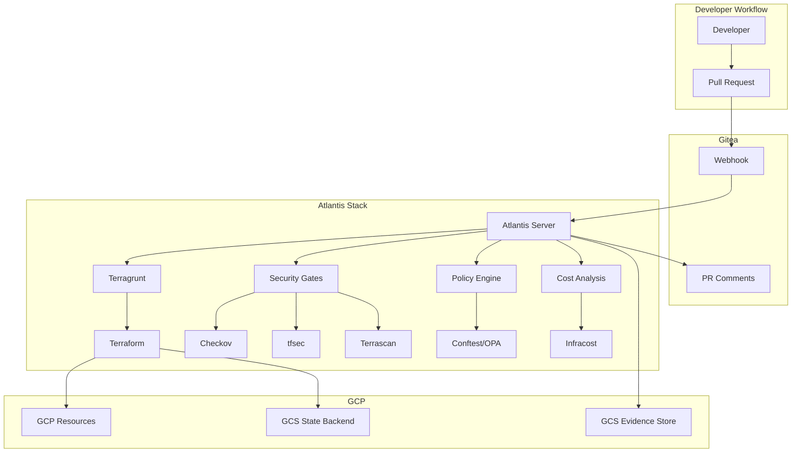

# Atlantis GitOps Workflow Guide

## CMMC 2.0 & NIST SP 800-171 Compliant Infrastructure as Code

### Table of Contents

1. [Overview](#overview)
2. [Architecture](#architecture)
3. [Setup Instructions](#setup-instructions)
4. [GitOps Workflow](#gitops-workflow)
5. [Security Gates](#security-gates)
6. [Compliance Mappings](#compliance-mappings)
7. [Troubleshooting](#troubleshooting)
8. [Evidence Collection](#evidence-collection)

---

## Overview

This guide documents the Atlantis + Terragrunt GitOps workflow for managing GCP infrastructure with full CMMC 2.0 Level 2 and NIST SP 800-171 compliance.

### Key Features

- **Automated Infrastructure Deployment**: Pull request-driven infrastructure changes
- **Security Scanning**: Integrated Checkov, tfsec, and Terrascan
- **Policy Enforcement**: OPA/Conftest policies for compliance
- **Cost Management**: Infracost integration for cost estimation
- **Evidence Collection**: Automated audit trail with SHA-256 hashing
- **Multi-Environment**: Support for dev, staging, and production
- **DRY Configuration**: Terragrunt for configuration reuse

### Components

| Component | Purpose | Version |
|-----------|---------|---------|
| Atlantis | GitOps automation | v0.27.0 |
| Terragrunt | DRY Terraform configurations | v0.52.0 |
| Terraform | Infrastructure provisioning | v1.6.0 |
| Conftest | Policy validation | v0.46.0 |
| Checkov | Security scanning | Latest |
| tfsec | Terraform security scanner | Latest |
| Infracost | Cost estimation | Latest |

---

## Architecture

### High-Level Architecture



### Directory Structure

```
gitea/
├── atlantis/
│   ├── docker-compose-atlantis.yml  # Atlantis deployment
│   ├── atlantis.yaml                # Server configuration
│   ├── repos.yaml                   # Repository settings
│   └── policies/                    # OPA/Conftest policies
│       └── cmmc-nist.rego          # Compliance policies
├── terragrunt/
│   ├── terragrunt.hcl              # Root configuration
│   ├── environments/
│   │   ├── dev/                    # Development environment
│   │   ├── staging/                # Staging environment
│   │   └── prod/                   # Production environment
│   └── _envcommon/                 # Shared configurations
├── terraform/
│   └── modules/                    # Terraform modules
│       ├── vpc/                    # Network module
│       ├── compute/                # Compute module
│       ├── security/               # Security module
│       └── monitoring/             # Monitoring module
└── scripts/
    └── setup-atlantis.sh           # Automated setup
```

---

## Setup Instructions

### Prerequisites

- Docker and Docker Compose installed
- GCP Project with billing enabled
- Gitea instance running
- gcloud CLI configured
- Terraform and Terragrunt installed

### Quick Start

1. **Clone the repository**:
   ```bash
   git clone https://gitea.local/infrastructure/terraform-gcp
   cd terraform-gcp
   ```

2. **Run the setup script**:
   ```bash
   chmod +x scripts/setup-atlantis.sh
   ./scripts/setup-atlantis.sh
   ```

3. **Configure environment variables**:
   ```bash
   cd atlantis
   cp .env.example .env
   # Edit .env with your values
   vim .env
   ```

4. **Start Atlantis**:
   ```bash
   docker-compose up -d
   ```

5. **Configure Gitea webhook**:
   - Go to Repository Settings → Webhooks
   - Add webhook URL: `https://atlantis.gitea.local/events`
   - Set secret from setup script output
   - Select events: Pull Request, Pull Request Comment, Pull Request Review

### Manual Setup

#### 1. Create GCP Service Account

```bash
PROJECT_ID="your-project-id"
SA_NAME="atlantis-terraform"

# Create service account
gcloud iam service-accounts create ${SA_NAME} \
    --display-name="Atlantis Terraform SA" \
    --project="${PROJECT_ID}"

# Grant roles (least privilege)
for ROLE in \
    roles/compute.admin \
    roles/container.admin \
    roles/storage.admin \
    roles/iam.serviceAccountUser
do
    gcloud projects add-iam-policy-binding "${PROJECT_ID}" \
        --member="serviceAccount:${SA_NAME}@${PROJECT_ID}.iam.gserviceaccount.com" \
        --role="${ROLE}"
done

# Create and download key
gcloud iam service-accounts keys create atlantis/gcp-sa.json \
    --iam-account="${SA_NAME}@${PROJECT_ID}.iam.gserviceaccount.com"
```

#### 2. Create GCS Buckets

```bash
# State bucket
gsutil mb -p "${PROJECT_ID}" -c STANDARD -l us-central1 \
    -b on --retention 365d \
    gs://${PROJECT_ID}-terraform-state

# Evidence bucket
gsutil mb -p "${PROJECT_ID}" -c STANDARD -l us-central1 \
    -b on --retention 365d \
    gs://${PROJECT_ID}-atlantis-evidence

# Enable versioning
gsutil versioning set on gs://${PROJECT_ID}-terraform-state
gsutil versioning set on gs://${PROJECT_ID}-atlantis-evidence
```

#### 3. Generate TLS Certificates

```bash
# Self-signed for development
openssl req -x509 -nodes -days 365 -newkey rsa:2048 \
    -keyout atlantis/tls/key.pem \
    -out atlantis/tls/cert.pem \
    -subj "/CN=atlantis.gitea.local"

# For production, use Let's Encrypt or valid certificates
```

---

## GitOps Workflow

### Developer Workflow

1. **Create feature branch**:
   ```bash
   git checkout -b feature/add-compute-instance
   ```

2. **Make infrastructure changes**:
   ```bash
   cd terragrunt/environments/dev/compute
   vim terragrunt.hcl
   ```

3. **Test locally**:
   ```bash
   terragrunt validate
   terragrunt plan
   ```

4. **Commit and push**:
   ```bash
   git add .
   git commit -m "feat: add compute instance for app deployment"
   git push origin feature/add-compute-instance
   ```

5. **Create pull request** in Gitea

### Atlantis Workflow

#### Automatic Plan

When a PR is created or updated, Atlantis automatically:

1. Runs `terragrunt validate`
2. Runs `terraform fmt` check
3. Generates `terraform plan`
4. Runs security scanners
5. Validates OPA policies
6. Estimates costs
7. Comments on PR with results

#### Manual Commands

Available PR comments:

- `atlantis plan` - Re-run plan
- `atlantis plan -p project-name` - Plan specific project
- `atlantis apply` - Apply changes (requires approval)
- `atlantis apply -p project-name` - Apply specific project
- `atlantis unlock` - Unlock state if locked
- `atlantis approve_policies` - Approve policy violations

### Production Workflow

Production changes require:

1. **Two approvals minimum**
2. **All security gates passing**
3. **Cost threshold validation** (<$1000/month increase)
4. **Manual approval command**
5. **Maintenance window compliance**

Example production workflow:

```bash
# Developer creates PR
git checkout -b prod/update-firewall-rules
# Make changes
git push origin prod/update-firewall-rules

# In PR:
# 1. Atlantis runs plan
# 2. Security team reviews
# 3. Two approvers approve PR
# 4. Comment: atlantis approve
# 5. Comment: atlantis apply
```

---

## Security Gates

### Pre-Plan Checks

1. **Format Validation**:
   ```bash
   terraform fmt -check=true -diff=true
   ```

2. **Configuration Validation**:
   ```bash
   terragrunt validate
   ```

### Post-Plan Checks

#### 1. Checkov Security Scanning

Checks for:
- Encryption at rest
- Network security
- IAM least privilege
- Logging enabled
- Backup configuration

Example output:
```
       _               _
   ___| |__   ___  ___| | _______   __
  / __| '_ \ / _ \/ __| |/ / _ \ \ / /
 | (__| | | |  __/ (__|   < (_) \ V /
  \___|_| |_|\___|\___|_|\_\___/ \_/

Passed checks: 45, Failed checks: 2, Skipped checks: 0
```

#### 2. tfsec Analysis

Validates:
- Sensitive data exposure
- Encryption configuration
- Network restrictions
- Access controls

#### 3. Terrascan Compliance

Checks against:
- CIS Benchmarks
- NIST guidelines
- PCI-DSS requirements
- HIPAA controls

#### 4. OPA/Conftest Policies

Custom policies for:
- CMMC 2.0 Level 2 compliance
- NIST SP 800-171 requirements
- Organization-specific rules

Example policy:
```rego
# Deny unencrypted storage
deny[msg] {
    resource := input.resource_changes[_]
    resource.type == "google_storage_bucket"
    not resource.change.after.encryption
    msg := sprintf("Storage bucket '%s' must use encryption", [resource.address])
}
```

#### 5. Infracost Estimation

Provides:
- Monthly cost estimate
- Cost breakdown by resource
- Diff from current costs
- Threshold validation

Example output:
```
Project: vpc-dev

 Name                                         Monthly Qty  Unit    Monthly Cost

 google_compute_network.vpc
 └─ Regional network                                   1  months         $36.50

 google_compute_router_nat.nat[0]
 └─ NAT gateway                                      730  hours          $45.26

 Monthly cost change for vpc-dev
 Amount:  +$81.76 ($0.00 → $81.76)
```

---

## Compliance Mappings

### CMMC 2.0 Level 2 Controls

| Control | Description | Implementation |
|---------|-------------|----------------|
| CM.L2-3.4.2 | Establish baseline configurations | Terragrunt configurations, version control |
| CM.L2-3.4.3 | Track security configuration changes | Git history, audit logs, evidence collection |
| CM.L2-3.4.9 | Configure for essential capabilities | Least privilege, network segmentation |

### NIST SP 800-171 Controls

| Control | Description | Implementation |
|---------|-------------|----------------|
| 3.4.2 | Establish and maintain baseline configurations | Infrastructure as Code, GitOps |
| 3.4.3 | Track, review, approve changes | PR workflow, approval requirements |
| 3.4.9 | Control and monitor user-installed software | Binary Authorization, container scanning |

### NIST SP 800-53 Controls

| Control | Description | Implementation |
|---------|-------------|----------------|
| CM-3 | Configuration Change Control | Atlantis workflow, approval process |
| CM-5 | Access Restrictions for Change | RBAC, PR permissions, branch protection |
| CM-6 | Configuration Settings | OPA policies, security baselines |

---

## Troubleshooting

### Common Issues

#### 1. Atlantis Not Responding to Webhooks

**Check webhook configuration**:
```bash
# Verify webhook secret
docker-compose logs atlantis | grep webhook

# Test webhook manually
curl -X POST https://atlantis.gitea.local/events \
  -H "X-Gitea-Event: pull_request" \
  -H "X-Hub-Signature: sha256=..." \
  -d @test-webhook.json
```

#### 2. State Lock Issues

**Unlock state**:
```bash
# In PR comment
atlantis unlock

# Or manually
terragrunt force-unlock <lock-id>
```

#### 3. Policy Failures

**Debug OPA policies**:
```bash
# Test policy locally
conftest verify --policy atlantis/policies \
  --namespace terraform.cmmc \
  plan.json

# View policy violations
cat /tmp/conftest-results.json | jq '.failures'
```

#### 4. Cost Threshold Exceeded

**Review cost breakdown**:
```bash
# Generate detailed report
infracost breakdown --path terragrunt/environments/prod \
  --format table \
  --show-skipped

# Check specific resources
infracost breakdown --path . \
  --terraform-plan-flags "-target=google_compute_instance.example"
```

### Logs and Monitoring

#### View Atlantis Logs

```bash
# All logs
docker-compose logs -f atlantis

# Specific time range
docker-compose logs --since 1h atlantis

# Filter errors
docker-compose logs atlantis 2>&1 | grep ERROR
```

#### Monitor Resource Usage

```bash
# Container stats
docker stats atlantis

# Disk usage
du -sh atlantis/data/

# State size
gsutil du -sh gs://project-terraform-state/
```

---

## Evidence Collection

### Automatic Evidence

Every infrastructure change generates:

1. **Plan artifacts**: JSON plans with resource changes
2. **Security scan results**: JSON reports from all scanners
3. **Policy validation**: OPA decision logs
4. **Cost estimates**: Infracost reports
5. **Approval records**: PR approval audit trail
6. **Apply logs**: Terraform apply output

### Evidence Storage

Evidence is stored in GCS with:

- **Retention**: 365 days minimum
- **Versioning**: Enabled for all artifacts
- **Encryption**: Customer-managed encryption keys
- **Metadata**: CMMC/NIST control mappings
- **Hashing**: SHA-256 for integrity

### Access Evidence

```bash
# List evidence for date
gsutil ls gs://project-atlantis-evidence/$(date +%Y%m%d)/

# Download evidence package
gsutil cp -r gs://project-atlantis-evidence/20240101/ /tmp/evidence/

# Verify hashes
sha256sum -c /tmp/evidence/hashes.txt
```

### Evidence Structure

```
evidence/
├── YYYYMMDD/
│   ├── plan/
│   │   ├── planfile.json
│   │   └── plan.txt
│   ├── security/
│   │   ├── checkov-results.json
│   │   ├── tfsec-results.json
│   │   └── terrascan-results.json
│   ├── policy/
│   │   └── conftest-results.json
│   ├── cost/
│   │   └── infracost.json
│   ├── apply/
│   │   └── apply.log
│   └── hashes.txt
```

---

## Best Practices

### 1. Branch Strategy

- `main` - Production-ready code
- `staging` - Staging environment
- `feature/*` - Feature development
- `hotfix/*` - Emergency fixes

### 2. Commit Messages

Follow conventional commits:
```
feat: add new compute instance
fix: correct firewall rule priority
docs: update runbook for deployment
refactor: simplify VPC module
```

### 3. PR Guidelines

- Keep changes focused and small
- Include clear description
- Link to relevant issues
- Add testing evidence
- Request appropriate reviewers

### 4. Security Practices

- Never commit secrets
- Use service accounts with least privilege
- Enable MFA for approvals
- Rotate credentials regularly
- Review security scan results

### 5. Cost Management

- Set cost thresholds
- Review estimates before apply
- Use preemptible instances for dev
- Implement auto-shutdown for non-prod
- Regular cost optimization reviews

---

## Appendices

### A. Environment Variables

| Variable | Description | Required |
|----------|-------------|----------|
| `ATLANTIS_GITEA_USER` | Gitea username | Yes |
| `ATLANTIS_GITEA_TOKEN` | Gitea API token | Yes |
| `ATLANTIS_WEBHOOK_SECRET` | Webhook secret | Yes |
| `GCP_PROJECT_ID` | GCP project ID | Yes |
| `INFRACOST_API_KEY` | Infracost API key | No |
| `CHAT_WEBHOOK_URL` | Chat notification URL | No |

### B. Useful Commands

```bash
# Validate all Terragrunt configurations
find . -name "terragrunt.hcl" -exec dirname {} \; | \
  xargs -I {} sh -c 'cd {} && terragrunt validate'

# Run security scan locally
checkov -d terragrunt/ --framework terraform

# Test OPA policies
conftest verify --policy atlantis/policies plan.json

# Generate cost report
infracost breakdown --path terragrunt/environments/prod

# Check state lock
terragrunt state list
```

### C. References

- [Atlantis Documentation](https://www.runatlantis.io/)
- [Terragrunt Documentation](https://terragrunt.gruntwork.io/)
- [CMMC 2.0 Framework](https://www.acq.osd.mil/cmmc/)
- [NIST SP 800-171](https://csrc.nist.gov/publications/detail/sp/800-171/rev-2/final)
- [GCP Security Best Practices](https://cloud.google.com/security/best-practices)

---

*Last Updated: 2024*
*Version: 1.0.0*
*Compliance: CMMC 2.0 Level 2, NIST SP 800-171*