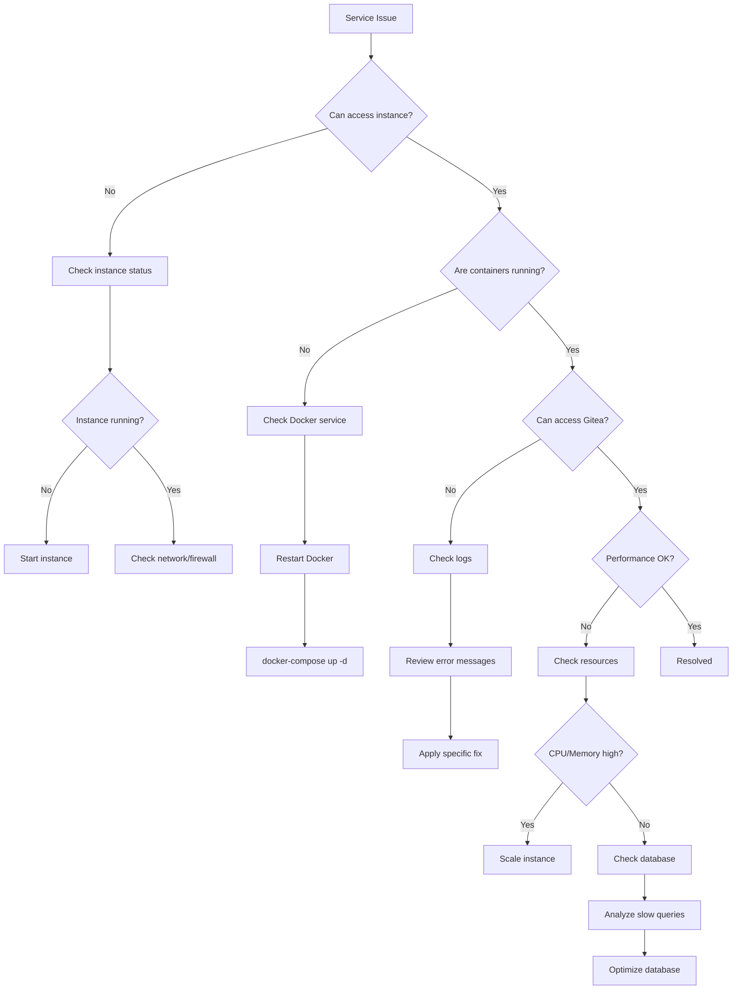

# GCP Gitea Operations Runbook

## Table of Contents
1. [Safety First - Before You Begin](#safety-first---before-you-begin)
2. [Health Monitoring Procedures](#health-monitoring-procedures)
3. [Backup and Restore Procedures](#backup-and-restore-procedures)
4. [Scaling Guidelines](#scaling-guidelines)
5. [Update Procedures](#update-procedures)
6. [Incident Response](#incident-response)
7. [Log Analysis](#log-analysis)
8. [Performance Tuning](#performance-tuning)
9. [Standard Operating Procedures](#standard-operating-procedures)

## Safety First - Before You Begin

**⚠️ MANDATORY SAFETY CHECKLIST ⚠️**

Before performing ANY infrastructure operations, complete this checklist:

- [ ] Read [SAFE_OPERATIONS_GUIDE.md](SAFE_OPERATIONS_GUIDE.md) if you haven't already
- [ ] Verify current environment: `make show-environment`
- [ ] Verify GCP project context: `gcloud config get-value project`
- [ ] Ensure project matches your intent (dev/staging/prod)
- [ ] Use explicit `-var-file` parameter (NEVER rely on auto-loaded terraform.tfvars)
- [ ] Review [ENVIRONMENT_MANAGEMENT.md](ENVIRONMENT_MANAGEMENT.md) for environment switching

**Recent Incident:** On 2025-10-13, the dcg-gitea-stage environment was accidentally destroyed instead of cui-gitea-prod due to terraform.tfvars auto-loading with the wrong project_id. All safety controls in this runbook are designed to prevent similar incidents.

**Related Documentation:**
- [SAFE_OPERATIONS_GUIDE.md](SAFE_OPERATIONS_GUIDE.md) - Mandatory safety procedures
- [ENVIRONMENT_MANAGEMENT.md](ENVIRONMENT_MANAGEMENT.md) - Environment isolation strategy
- [SAFETY_TRAINING.md](SAFETY_TRAINING.md) - Team training and incident case study

---

## Health Monitoring Procedures

### Daily Health Checks

**⚠️ Safety Check:** Before running any health checks, verify your environment context:
```bash
# Verify project and environment
make show-environment
make validate-project

# Confirm GCP project matches your intent
gcloud config get-value project
```

#### Automated Monitoring
```bash
# Check uptime monitoring status
gcloud monitoring uptime-check-configs list \
  --project=$PROJECT_ID \
  --format="table(displayName,state,isInternal)"

# View recent alerts
gcloud monitoring alert-policies list \
  --project=$PROJECT_ID \
  --filter="enabled=true" \
  --format="table(displayName,conditions[0].displayName)"
```

#### Manual Health Verification
```bash
#!/bin/bash
# health-check.sh

PROJECT_ID="your-project-id"
ENVIRONMENT="prod"
ZONE="us-central1-a"

echo "=== Gitea Health Check ==="
echo "Date: $(date)"
echo "Environment: $ENVIRONMENT"

# 1. Instance Status
echo -e "\n[Instance Status]"
STATUS=$(gcloud compute instances describe gitea-$ENVIRONMENT-server \
  --zone=$ZONE \
  --format="value(status)")
echo "VM Status: $STATUS"

# 2. External Connectivity
echo -e "\n[External Connectivity]"
EXTERNAL_IP=$(gcloud compute instances describe gitea-$ENVIRONMENT-server \
  --zone=$ZONE \
  --format="value(networkInterfaces[0].accessConfigs[0].natIP)")
curl -s -o /dev/null -w "HTTP Response: %{http_code}\n" https://$EXTERNAL_IP/api/v1/version

# 3. Docker Services
echo -e "\n[Docker Services]"
gcloud compute ssh gitea-$ENVIRONMENT-server \
  --zone=$ZONE \
  --tunnel-through-iap \
  --command="sudo docker ps --format 'table {{.Names}}\t{{.Status}}'"

# 4. Disk Usage
echo -e "\n[Disk Usage]"
gcloud compute ssh gitea-$ENVIRONMENT-server \
  --zone=$ZONE \
  --tunnel-through-iap \
  --command="df -h | grep -E '(Filesystem|/dev/sd)'"

# 5. Memory Usage
echo -e "\n[Memory Usage]"
gcloud compute ssh gitea-$ENVIRONMENT-server \
  --zone=$ZONE \
  --tunnel-through-iap \
  --command="free -h"

echo -e "\n=== Health Check Complete ==="
```

### Monitoring Dashboards

#### Create Custom Dashboard
```json
{
  "displayName": "Gitea Operations Dashboard",
  "mosaicLayout": {
    "columns": 12,
    "tiles": [
      {
        "width": 6,
        "height": 4,
        "widget": {
          "title": "CPU Utilization",
          "xyChart": {
            "dataSets": [{
              "timeSeriesQuery": {
                "timeSeriesFilter": {
                  "filter": "metric.type=\"compute.googleapis.com/instance/cpu/utilization\" resource.type=\"gce_instance\"",
                  "aggregation": {
                    "alignmentPeriod": "60s",
                    "perSeriesAligner": "ALIGN_MEAN"
                  }
                }
              }
            }]
          }
        }
      },
      {
        "xPos": 6,
        "width": 6,
        "height": 4,
        "widget": {
          "title": "Memory Utilization",
          "xyChart": {
            "dataSets": [{
              "timeSeriesQuery": {
                "timeSeriesFilter": {
                  "filter": "metric.type=\"agent.googleapis.com/memory/percent_used\" resource.type=\"gce_instance\"",
                  "aggregation": {
                    "alignmentPeriod": "60s",
                    "perSeriesAligner": "ALIGN_MEAN"
                  }
                }
              }
            }]
          }
        }
      },
      {
        "yPos": 4,
        "width": 6,
        "height": 4,
        "widget": {
          "title": "Disk I/O",
          "xyChart": {
            "dataSets": [{
              "timeSeriesQuery": {
                "timeSeriesFilter": {
                  "filter": "metric.type=\"compute.googleapis.com/instance/disk/read_bytes_count\" resource.type=\"gce_instance\"",
                  "aggregation": {
                    "alignmentPeriod": "60s",
                    "perSeriesAligner": "ALIGN_RATE"
                  }
                }
              }
            }]
          }
        }
      },
      {
        "xPos": 6,
        "yPos": 4,
        "width": 6,
        "height": 4,
        "widget": {
          "title": "Network Traffic",
          "xyChart": {
            "dataSets": [{
              "timeSeriesQuery": {
                "timeSeriesFilter": {
                  "filter": "metric.type=\"compute.googleapis.com/instance/network/received_bytes_count\" resource.type=\"gce_instance\"",
                  "aggregation": {
                    "alignmentPeriod": "60s",
                    "perSeriesAligner": "ALIGN_RATE"
                  }
                }
              }
            }]
          }
        }
      }
    ]
  }
}
```

### Alert Configuration

#### Critical Alerts
```yaml
# alert-policies.yaml
displayName: "Gitea Instance Down"
conditions:
  - displayName: "Instance not running"
    conditionThreshold:
      filter: 'resource.type="gce_instance" AND metric.type="compute.googleapis.com/instance/uptime"'
      comparison: COMPARISON_LT
      thresholdValue: 1
      duration: 300s

---
displayName: "High CPU Usage"
conditions:
  - displayName: "CPU > 80%"
    conditionThreshold:
      filter: 'resource.type="gce_instance" AND metric.type="compute.googleapis.com/instance/cpu/utilization"'
      comparison: COMPARISON_GT
      thresholdValue: 0.8
      duration: 600s

---
displayName: "Disk Space Low"
conditions:
  - displayName: "Disk usage > 90%"
    conditionThreshold:
      filter: 'resource.type="gce_instance" AND metric.type="agent.googleapis.com/disk/percent_used"'
      comparison: COMPARISON_GT
      thresholdValue: 90
      duration: 300s
```

## Backup and Restore Procedures

**⚠️ Safety Check:** Backup and restore operations must target the correct environment:
```bash
# ALWAYS verify environment before backup/restore operations
make show-environment
make validate-project

# Use environment selector if needed
source scripts/environment-selector.sh
```

**Critical:** Restoring to the wrong environment can cause data loss. Double-check project_id before proceeding.

### Automated Daily Backups

#### Setup Cron Job
```bash
# SSH to instance
gcloud compute ssh gitea-$ENVIRONMENT-server \
  --zone=$ZONE \
  --tunnel-through-iap

# Create backup script
sudo tee /opt/gitea/daily-backup.sh << 'EOF'
#!/bin/bash
PROJECT_ID="your-project-id"
ENVIRONMENT="prod"
BACKUP_BUCKET="gitea-${ENVIRONMENT}-backup-${PROJECT_ID}"
TIMESTAMP=$(date +%Y%m%d_%H%M%S)

# Backup Docker volumes
docker run --rm -v gitea_data:/source:ro \
  -v /tmp:/backup alpine \
  tar czf /backup/gitea_data_${TIMESTAMP}.tar.gz -C /source .

# Backup PostgreSQL
docker exec gitea-postgres \
  pg_dumpall -U gitea > /tmp/postgres_${TIMESTAMP}.sql
gzip /tmp/postgres_${TIMESTAMP}.sql

# Upload to GCS
gsutil -m cp /tmp/*.tar.gz /tmp/*.sql.gz \
  gs://${BACKUP_BUCKET}/daily/$(date +%Y-%m-%d)/

# Cleanup
rm /tmp/*.tar.gz /tmp/*.sql.gz

# Log completion
echo "Backup completed: ${TIMESTAMP}" >> /var/log/gitea-backup.log
EOF

# Set permissions
sudo chmod +x /opt/gitea/daily-backup.sh

# Add to crontab
(crontab -l 2>/dev/null; echo "0 2 * * * /opt/gitea/daily-backup.sh") | crontab -
```

### Manual Backup Procedure

```bash
# Full backup with evidence
./scripts/gcp-backup.sh \
  -p $PROJECT_ID \
  -e $ENVIRONMENT \
  -t full \
  -v

# Verify backup
gsutil ls -l gs://gitea-$ENVIRONMENT-backup-$PROJECT_ID/full/$(date +%Y-%m-%d)/
```

### Restore Procedures

#### Quick Restore (Last Known Good)
```bash
# List recent backups
./scripts/gcp-restore.sh \
  -p $PROJECT_ID \
  -e $ENVIRONMENT \
  -l

# Restore latest
./scripts/gcp-restore.sh \
  -p $PROJECT_ID \
  -e $ENVIRONMENT
```

#### Point-in-Time Restore
```bash
# Restore from specific date
./scripts/gcp-restore.sh \
  -p $PROJECT_ID \
  -e $ENVIRONMENT \
  -d 2024-01-15

# Restore specific backup
./scripts/gcp-restore.sh \
  -p $PROJECT_ID \
  -e $ENVIRONMENT \
  -b backup_prod_full_20240115_020000
```

### Backup Verification

```bash
#!/bin/bash
# verify-backup.sh

BACKUP_ID=$1
TEMP_DIR="/tmp/verify_$$"

echo "Verifying backup: $BACKUP_ID"

# Download backup
mkdir -p $TEMP_DIR
gsutil -m cp -r gs://gitea-$ENVIRONMENT-backup-$PROJECT_ID/**/$BACKUP_ID/* $TEMP_DIR/

# Check manifest
if [ -f "$TEMP_DIR/manifest.json" ]; then
    echo "Manifest found:"
    jq '.' $TEMP_DIR/manifest.json
else
    echo "ERROR: Manifest missing"
    exit 1
fi

# Verify archives
for file in $TEMP_DIR/*.tar.gz; do
    if tar -tzf $file > /dev/null 2>&1; then
        echo "✓ Archive valid: $(basename $file)"
    else
        echo "✗ Archive corrupt: $(basename $file)"
    fi
done

# Verify SQL dump
if gunzip -t $TEMP_DIR/*.sql.gz 2>/dev/null; then
    echo "✓ SQL dump valid"
else
    echo "✗ SQL dump corrupt"
fi

# Cleanup
rm -rf $TEMP_DIR

echo "Verification complete"
```

## Scaling Guidelines

**⚠️ Safety Check:** Before scaling operations:
```bash
# Verify you're targeting the correct environment
make show-environment
gcloud config get-value project

# Use environment selector if switching environments
source scripts/environment-selector.sh
```

### Vertical Scaling (Resize Instance)

```bash
# ALWAYS verify project and environment first
make validate-project

# Stop instance
gcloud compute instances stop gitea-$ENVIRONMENT-server --zone=$ZONE

# Change machine type
gcloud compute instances set-machine-type gitea-$ENVIRONMENT-server \
  --machine-type=e2-standard-16 \
  --zone=$ZONE

# Start instance
gcloud compute instances start gitea-$ENVIRONMENT-server --zone=$ZONE
```

### Horizontal Scaling (Read Replicas)

```yaml
# docker-compose.replica.yml
version: '3.8'

services:
  postgres-replica:
    image: postgres:14-alpine
    environment:
      - POSTGRES_REPLICATION_MODE=slave
      - POSTGRES_MASTER_HOST=postgres
      - POSTGRES_REPLICATION_USER=replicator
      - POSTGRES_REPLICATION_PASSWORD=${REPLICATION_PASSWORD}
    volumes:
      - postgres_replica:/var/lib/postgresql/data
    networks:
      - gitea_network

  gitea-readonly:
    image: gitea/gitea:latest
    environment:
      - GITEA__database__DB_TYPE=postgres
      - GITEA__database__HOST=postgres-replica:5432
      - GITEA__server__OFFLINE_MODE=true
    volumes:
      - gitea_data:/data
    networks:
      - gitea_network
    read_only: true

volumes:
  postgres_replica:

networks:
  gitea_network:
    external: true
```

### Storage Scaling

```bash
# Resize data disk
gcloud compute disks resize gitea-$ENVIRONMENT-server-data \
  --size=1000 \
  --zone=$ZONE

# SSH to instance and resize filesystem
gcloud compute ssh gitea-$ENVIRONMENT-server \
  --zone=$ZONE \
  --tunnel-through-iap

# On instance
sudo growpart /dev/sdb 1
sudo resize2fs /dev/sdb1
```

### Performance Benchmarking

```bash
# Load testing with k6
cat > gitea-load-test.js << 'EOF'
import http from 'k6/http';
import { check } from 'k6';

export let options = {
  stages: [
    { duration: '2m', target: 100 },
    { duration: '5m', target: 100 },
    { duration: '2m', target: 0 },
  ],
  thresholds: {
    http_req_duration: ['p(95)<500'],
  },
};

export default function() {
  let response = http.get('https://git.example.com/api/v1/version');
  check(response, {
    'status is 200': (r) => r.status === 200,
    'response time < 500ms': (r) => r.timings.duration < 500,
  });
}
EOF

k6 run gitea-load-test.js
```

## Update Procedures

**⚠️ Safety Check:** Before ANY update operations:
```bash
# Verify environment and project
make show-environment
make validate-project
gcloud config get-value project

# Use environment selector if switching
source scripts/environment-selector.sh
```

**Critical:** Updates to production must follow change control procedures. See [SAFE_OPERATIONS_GUIDE.md](SAFE_OPERATIONS_GUIDE.md).

### Gitea Version Update

```bash
#!/bin/bash
# update-gitea.sh

set -e

# MANDATORY: Verify environment before proceeding
echo "Verifying environment..."
gcloud config get-value project || { echo "No GCP project set!"; exit 1; }

ENVIRONMENT=$1
NEW_VERSION=$2

echo "Updating Gitea to version $NEW_VERSION"

# 1. Create backup
./scripts/gcp-backup.sh -p $PROJECT_ID -e $ENVIRONMENT -t full

# 2. Update docker-compose.yml
ssh gitea-$ENVIRONMENT-server << EOF
  cd /opt/gitea
  sudo sed -i "s|gitea/gitea:.*|gitea/gitea:$NEW_VERSION|" docker-compose.yml

  # 3. Pull new image
  sudo docker-compose pull gitea

  # 4. Stop services
  sudo docker-compose stop gitea

  # 5. Run migrations if needed
  sudo docker-compose run --rm gitea gitea migrate

  # 6. Start services
  sudo docker-compose up -d gitea
EOF

# 7. Verify
curl -s https://git.example.com/api/v1/version | jq -r '.version'
```

### System Updates

```bash
# Monthly system updates
gcloud compute ssh gitea-$ENVIRONMENT-server \
  --zone=$ZONE \
  --tunnel-through-iap << 'EOF'

# Update package lists
sudo apt-get update

# Upgrade packages
sudo DEBIAN_FRONTEND=noninteractive apt-get upgrade -y

# Update Docker
sudo apt-get install -y docker-ce docker-ce-cli containerd.io

# Clean up
sudo apt-get autoremove -y
sudo apt-get clean

# Check if reboot required
if [ -f /var/run/reboot-required ]; then
    echo "REBOOT REQUIRED"
fi
EOF
```

### Security Patches

```bash
# Emergency security patch procedure
#!/bin/bash

# 1. Assess vulnerability
echo "Checking for CVEs..."
sudo apt list --upgradable | grep -i security

# 2. Create snapshot before patching
gcloud compute disks snapshot gitea-$ENVIRONMENT-server \
  --snapshot-names=pre-security-patch-$(date +%Y%m%d) \
  --zone=$ZONE

# 3. Apply patches
sudo apt-get update
sudo apt-get install --only-upgrade [package-name]

# 4. Restart affected services
sudo systemctl restart docker
cd /opt/gitea && sudo docker-compose restart

# 5. Verify patch applied
dpkg -l | grep [package-name]
```

## Incident Response

**⚠️ Safety Check:** Even during incidents, verify your environment context:
```bash
# During high-pressure incidents, it's CRITICAL to verify environment
make show-environment
make validate-project

# Panic changes to the wrong environment make incidents worse!
```

**Important:** See [SAFE_OPERATIONS_GUIDE.md](SAFE_OPERATIONS_GUIDE.md) Section 5 for incident response safety procedures.

### Incident Classification

| Severity | Description | Response Time | Examples |
|----------|-------------|---------------|----------|
| P1 - Critical | Complete service outage | 15 minutes | Instance down, data loss |
| P2 - High | Degraded service | 1 hour | High latency, auth failures |
| P3 - Medium | Limited impact | 4 hours | Single feature broken |
| P4 - Low | Minimal impact | Next business day | UI issues, warnings |

### Response Procedures

#### P1 - Service Down
```bash
#!/bin/bash
# p1-response.sh

echo "=== P1 INCIDENT RESPONSE ==="
echo "Time: $(date)"

# 0. MANDATORY SAFETY CHECK
echo "[0] Verifying environment (CRITICAL - even during P1)..."
CURRENT_PROJECT=$(gcloud config get-value project 2>/dev/null)
if [ -z "$CURRENT_PROJECT" ]; then
    echo "ERROR: No GCP project set. Aborting to prevent wrong-environment changes."
    exit 1
fi
echo "Current project: $CURRENT_PROJECT"
echo "Expected project: $PROJECT_ID"
if [ "$CURRENT_PROJECT" != "$PROJECT_ID" ]; then
    echo "WARNING: Project mismatch! Confirm before proceeding."
    read -p "Continue with $CURRENT_PROJECT? (yes/no): " CONFIRM
    [ "$CONFIRM" != "yes" ] && exit 1
fi

# 1. Initial Assessment
echo "[1] Checking instance status..."
gcloud compute instances describe gitea-$ENVIRONMENT-server \
  --zone=$ZONE --format="value(status)"

# 2. Attempt restart if needed
STATUS=$(gcloud compute instances describe gitea-$ENVIRONMENT-server \
  --zone=$ZONE --format="value(status)")

if [ "$STATUS" != "RUNNING" ]; then
    echo "[2] Starting instance..."
    gcloud compute instances start gitea-$ENVIRONMENT-server --zone=$ZONE
    sleep 30
fi

# 3. Check Docker services
echo "[3] Checking Docker services..."
gcloud compute ssh gitea-$ENVIRONMENT-server \
  --zone=$ZONE \
  --tunnel-through-iap \
  --command="sudo docker ps"

# 4. Restart Docker if needed
gcloud compute ssh gitea-$ENVIRONMENT-server \
  --zone=$ZONE \
  --tunnel-through-iap \
  --command="cd /opt/gitea && sudo docker-compose restart"

# 5. Verify service restoration
echo "[5] Verifying service..."
curl -s -o /dev/null -w "HTTP Status: %{http_code}\n" https://git.example.com

# 6. Send notifications
echo "[6] Sending notifications..."
# Integration with PagerDuty/Slack/Email

echo "=== Response Complete ==="
```

#### P2 - Performance Degradation
```bash
#!/bin/bash
# p2-response.sh

echo "=== P2 PERFORMANCE INVESTIGATION ==="

# 1. Check resource utilization
echo "[1] Resource utilization:"
gcloud compute ssh gitea-$ENVIRONMENT-server \
  --zone=$ZONE \
  --tunnel-through-iap << 'EOF'
  echo "CPU Usage:"
  top -bn1 | head -5

  echo -e "\nMemory Usage:"
  free -h

  echo -e "\nDisk I/O:"
  iostat -x 1 3

  echo -e "\nDocker Stats:"
  sudo docker stats --no-stream
EOF

# 2. Check for blocking queries
echo "[2] Database performance:"
gcloud compute ssh gitea-$ENVIRONMENT-server \
  --zone=$ZONE \
  --tunnel-through-iap \
  --command="sudo docker exec gitea-postgres psql -U gitea -c 'SELECT pid, usename, application_name, state, query FROM pg_stat_activity WHERE state != \"idle\" ORDER BY query_start;'"

# 3. Review recent changes
echo "[3] Recent deployments:"
gsutil ls -l gs://gitea-$ENVIRONMENT-evidence-$PROJECT_ID/deployments/ | tail -5

# 4. Check for rate limiting or attacks
echo "[4] Network analysis:"
gcloud compute ssh gitea-$ENVIRONMENT-server \
  --zone=$ZONE \
  --tunnel-through-iap \
  --command="sudo netstat -an | grep ESTABLISHED | wc -l"
```

### Incident Communication

```markdown
# Incident Template

## Incident Report

**Incident ID**: INC-YYYYMMDD-###
**Date**: YYYY-MM-DD HH:MM UTC
**Severity**: P1/P2/P3/P4
**Status**: Investigating/Identified/Monitoring/Resolved

### Impact
- Service(s) affected:
- User impact:
- Duration:

### Timeline
- HH:MM - Issue detected
- HH:MM - Investigation started
- HH:MM - Root cause identified
- HH:MM - Fix implemented
- HH:MM - Service restored
- HH:MM - Monitoring confirmed stable

### Root Cause
[Description of what caused the incident]

### Resolution
[Steps taken to resolve]

### Action Items
- [ ] Post-mortem meeting scheduled
- [ ] Documentation updated
- [ ] Monitoring improved
- [ ] Preventive measures implemented

### Lessons Learned
[What we learned and will improve]
```

## Log Analysis

### Centralized Logging

```bash
# Configure log streaming to Cloud Logging
gcloud compute ssh gitea-$ENVIRONMENT-server \
  --zone=$ZONE \
  --tunnel-through-iap << 'EOF'

# Install logging agent
curl -sSO https://dl.google.com/cloudagents/add-logging-agent-repo.sh
sudo bash add-logging-agent-repo.sh
sudo apt-get update
sudo apt-get install -y google-fluentd
sudo apt-get install -y google-fluentd-catch-all-config-structured

# Configure Gitea logs
sudo tee /etc/google-fluentd/config.d/gitea.conf << 'CONFIG'
<source>
  @type tail
  path /opt/gitea/logs/*.log
  pos_file /var/lib/google-fluentd/pos/gitea.log.pos
  tag gitea
  <parse>
    @type multiline
    format_firstline /^\d{4}\/\d{2}\/\d{2}/
    format1 /^(?<time>\d{4}\/\d{2}\/\d{2} \d{2}:\d{2}:\d{2}) \[(?<level>\w+)\] (?<message>.*)/
  </parse>
</source>
CONFIG

# Restart agent
sudo systemctl restart google-fluentd
EOF
```

### Log Queries

```bash
# Recent errors
gcloud logging read "severity>=ERROR AND resource.type=gce_instance" \
  --limit=50 \
  --format=json | jq -r '.[] | "\(.timestamp) \(.jsonPayload.message)"'

# Authentication failures
gcloud logging read 'jsonPayload.message=~"authentication failed"' \
  --limit=20

# Slow queries
gcloud logging read 'jsonPayload.duration>1000' \
  --limit=10

# Git operations
gcloud logging read 'jsonPayload.operation=~"git-"' \
  --limit=50
```

### Log Analysis Dashboard

```sql
-- BigQuery analysis queries

-- Daily active users
SELECT
  DATE(timestamp) as date,
  COUNT(DISTINCT jsonPayload.user) as daily_active_users
FROM `project.dataset.gitea_logs`
WHERE timestamp >= TIMESTAMP_SUB(CURRENT_TIMESTAMP(), INTERVAL 30 DAY)
GROUP BY date
ORDER BY date DESC;

-- Top repositories by activity
SELECT
  jsonPayload.repository as repository,
  COUNT(*) as activity_count
FROM `project.dataset.gitea_logs`
WHERE jsonPayload.operation IN ('git-clone', 'git-push', 'git-pull')
  AND timestamp >= TIMESTAMP_SUB(CURRENT_TIMESTAMP(), INTERVAL 7 DAY)
GROUP BY repository
ORDER BY activity_count DESC
LIMIT 20;

-- Error rate by hour
SELECT
  TIMESTAMP_TRUNC(timestamp, HOUR) as hour,
  COUNT(*) as total_requests,
  COUNTIF(severity = 'ERROR') as errors,
  SAFE_DIVIDE(COUNTIF(severity = 'ERROR'), COUNT(*)) * 100 as error_rate
FROM `project.dataset.gitea_logs`
WHERE timestamp >= TIMESTAMP_SUB(CURRENT_TIMESTAMP(), INTERVAL 24 HOUR)
GROUP BY hour
ORDER BY hour DESC;
```

## Performance Tuning

### Database Optimization

```sql
-- PostgreSQL tuning
ALTER SYSTEM SET shared_buffers = '2GB';
ALTER SYSTEM SET effective_cache_size = '6GB';
ALTER SYSTEM SET maintenance_work_mem = '512MB';
ALTER SYSTEM SET work_mem = '16MB';
ALTER SYSTEM SET max_connections = 200;
ALTER SYSTEM SET random_page_cost = 1.1;

-- Create indexes for common queries
CREATE INDEX idx_repository_name ON repository(name);
CREATE INDEX idx_user_email ON user(email);
CREATE INDEX idx_issue_repo_state ON issue(repo_id, state);

-- Analyze tables
ANALYZE repository;
ANALYZE user;
ANALYZE issue;

-- Check slow queries
SELECT query, calls, mean_exec_time, total_exec_time
FROM pg_stat_statements
ORDER BY mean_exec_time DESC
LIMIT 10;
```

### Application Tuning

```ini
# /opt/gitea/config/app.ini optimizations

[server]
; Enable HTTP/2
ENABLE_HTTP2 = true
; Compression
ENABLE_GZIP = true
GZIP_LEVEL = 6

[cache]
; Enable caching
ENABLED = true
ADAPTER = redis
HOST = redis:6379
ITEM_TTL = 16h

[session]
; Use Redis for sessions
PROVIDER = redis
PROVIDER_CONFIG = redis:6379

[queue]
; Optimize queue processing
TYPE = redis
CONN_STR = redis://redis:6379
BATCH_LENGTH = 20

[database]
; Connection pooling
MAX_OPEN_CONNS = 100
MAX_IDLE_CONNS = 10
CONN_MAX_LIFETIME = 3600

[git]
; Git optimizations
MAX_GIT_DIFF_LINES = 10000
MAX_GIT_DIFF_FILES = 100
GC_PERIOD = 24h
```

### Network Optimization

```bash
# Enable BBR congestion control
gcloud compute ssh gitea-$ENVIRONMENT-server \
  --zone=$ZONE \
  --tunnel-through-iap << 'EOF'

# Enable BBR
echo "net.core.default_qdisc=fq" | sudo tee -a /etc/sysctl.conf
echo "net.ipv4.tcp_congestion_control=bbr" | sudo tee -a /etc/sysctl.conf
sudo sysctl -p

# Optimize network settings
echo "net.core.rmem_max = 134217728" | sudo tee -a /etc/sysctl.conf
echo "net.core.wmem_max = 134217728" | sudo tee -a /etc/sysctl.conf
echo "net.ipv4.tcp_rmem = 4096 87380 134217728" | sudo tee -a /etc/sysctl.conf
echo "net.ipv4.tcp_wmem = 4096 65536 134217728" | sudo tee -a /etc/sysctl.conf
sudo sysctl -p
EOF
```

### Storage Optimization

```bash
# Enable SSD optimization
gcloud compute ssh gitea-$ENVIRONMENT-server \
  --zone=$ZONE \
  --tunnel-through-iap << 'EOF'

# Set scheduler to deadline for SSDs
echo deadline | sudo tee /sys/block/sdb/queue/scheduler

# Optimize mount options
sudo mount -o remount,noatime,nodiratime /data

# Update fstab
sudo sed -i 's/defaults/defaults,noatime,nodiratime/' /etc/fstab
EOF

# Repository maintenance
gcloud compute ssh gitea-$ENVIRONMENT-server \
  --zone=$ZONE \
  --tunnel-through-iap << 'EOF'

# Git garbage collection
sudo docker exec gitea-gitea gitea admin repo-gc --all

# Clean up old logs
find /opt/gitea/logs -name "*.log" -mtime +30 -delete
EOF
```

## Standard Operating Procedures

**⚠️ Safety Notice:** All operations must follow the safety procedures in [SAFE_OPERATIONS_GUIDE.md](SAFE_OPERATIONS_GUIDE.md).

### Daily Operations Checklist

```markdown
## Daily Operations - Gitea Infrastructure

Date: _____________
Operator: _____________

### Pre-Shift Safety Verification
- [ ] Run `make show-environment` and confirm correct environment
- [ ] Run `make validate-project` to verify GCP project
- [ ] Review [SAFE_OPERATIONS_GUIDE.md](SAFE_OPERATIONS_GUIDE.md) if needed
- [ ] Confirm environment selector script is available: `scripts/environment-selector.sh`

### Morning Checks (9:00 AM)
- [ ] Review overnight alerts
- [ ] Check backup completion
- [ ] Verify uptime monitoring
- [ ] Review error logs
- [ ] Check disk space
- [ ] Verify SSL certificate expiry

### Afternoon Checks (2:00 PM)
- [ ] Review performance metrics
- [ ] Check active user sessions
- [ ] Monitor repository growth
- [ ] Review security alerts
- [ ] Check update availability

### End of Day (5:00 PM)
- [ ] Document any incidents
- [ ] Update runbook if needed
- [ ] Handover notes for next shift
- [ ] Verify backup schedule
```

### Weekly Maintenance

```bash
#!/bin/bash
# weekly-maintenance.sh

echo "=== Weekly Maintenance Starting ==="
echo "Date: $(date)"

# 0. MANDATORY SAFETY CHECK
echo "[0] Verifying environment..."
CURRENT_PROJECT=$(gcloud config get-value project 2>/dev/null)
if [ -z "$CURRENT_PROJECT" ]; then
    echo "ERROR: No GCP project set. Run 'source scripts/environment-selector.sh'"
    exit 1
fi
echo "Operating on project: $CURRENT_PROJECT"
echo "Operating on environment: $ENVIRONMENT"
read -p "Confirm this is correct (yes/no): " CONFIRM
[ "$CONFIRM" != "yes" ] && exit 1

# 1. Security updates
echo "[1] Checking security updates..."
sudo apt-get update
sudo apt-get upgrade -s | grep -i security

# 2. Log rotation
echo "[2] Rotating logs..."
sudo logrotate -f /etc/logrotate.d/gitea

# 3. Database maintenance
echo "[3] Database optimization..."
sudo docker exec gitea-postgres psql -U gitea -c "VACUUM ANALYZE;"

# 4. Docker cleanup
echo "[4] Docker cleanup..."
sudo docker system prune -af --volumes

# 5. Backup verification
echo "[5] Verifying backups..."
./scripts/verify-backup.sh $(date -d "yesterday" +%Y%m%d)

# 6. Performance report
echo "[6] Generating performance report..."
gcloud monitoring dashboards list --format="table(displayName,etag)"

echo "=== Weekly Maintenance Complete ==="
```

### Monthly Tasks

```bash
# Monthly compliance report
cat > monthly-report.sh << 'EOF'
#!/bin/bash

MONTH=$(date +%B)
YEAR=$(date +%Y)

echo "=== Monthly Compliance Report ==="
echo "Month: $MONTH $YEAR"

# Evidence collection
echo "1. Evidence Files:"
gsutil ls -l gs://gitea-$ENVIRONMENT-evidence-$PROJECT_ID/ | wc -l

# Backup statistics
echo "2. Backup Statistics:"
gsutil du -s gs://gitea-$ENVIRONMENT-backup-$PROJECT_ID/

# Security patches
echo "3. Security Updates Applied:"
grep "upgrade" /var/log/apt/history.log | grep $(date +%Y-%m)

# Access reviews
echo "4. Access Reviews:"
gcloud projects get-iam-policy $PROJECT_ID --format=json | \
  jq '.bindings[] | select(.role | contains("admin"))'

# Incident summary
echo "5. Incidents This Month:"
gcloud logging read "severity>=ERROR" \
  --format="value(timestamp)" \
  --project=$PROJECT_ID \
  --limit=1000 | \
  grep $(date +%Y-%m) | wc -l

echo "=== Report Complete ==="
EOF
```

## Troubleshooting Decision Tree



## Contact Information

### Escalation Matrix

| Level | Role | Contact | When to Contact |
|-------|------|---------|-----------------|
| L1 | On-Call Engineer | PagerDuty | All incidents |
| L2 | DevOps Lead | devops-lead@example.com | P1/P2 incidents |
| L3 | Infrastructure Manager | infra-mgr@example.com | P1 incidents > 1 hour |
| L4 | CTO | cto@example.com | Data loss or breach |

### Vendor Support

- **GCP Support**: [Console](https://console.cloud.google.com/support)
- **Gitea Community**: [Forum](https://discourse.gitea.io/)
- **Docker Support**: [Documentation](https://docs.docker.com/)

### Internal Resources

- Monitoring Dashboard: `https://console.cloud.google.com/monitoring`
- Documentation Wiki: `https://wiki.example.com/gitea-ops`
- Runbook Updates: `https://git.example.com/infra/runbooks`

---

## Document Revision History

| Version | Date | Changes | Updated By |
|---------|------|---------|------------|
| 1.1 | 2025-10-13 | Added safety procedures and environment verification checks throughout | System |
| 1.0 | 2024 | Initial version | System |

## Mandatory Safety Training

All operators MUST complete safety training before using this runbook:
1. Read [SAFE_OPERATIONS_GUIDE.md](SAFE_OPERATIONS_GUIDE.md) in full
2. Review the incident case study in [SAFETY_TRAINING.md](SAFETY_TRAINING.md)
3. Understand environment management in [ENVIRONMENT_MANAGEMENT.md](ENVIRONMENT_MANAGEMENT.md)
4. Practice using `scripts/environment-selector.sh` in non-production environments
5. Always use `make show-environment` and `make validate-project` before operations

**Remember:** Taking 30 seconds to verify your environment can prevent hours of incident response and potential data loss.

---

*Last Updated: 2025-10-13*
*Version: 1.1*
*Compliance: CMMC Level 2 / NIST SP 800-171*