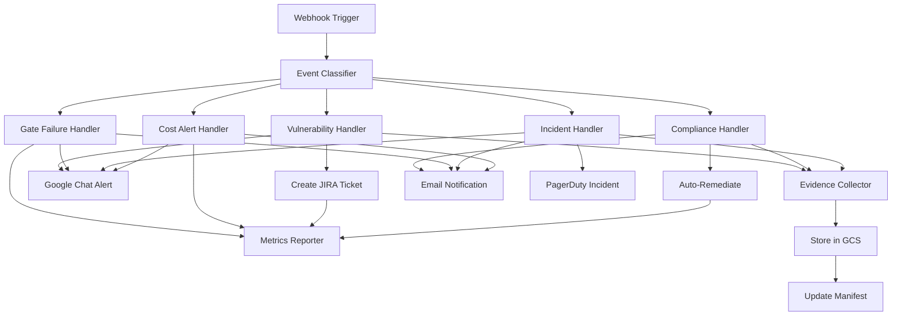

# n8n DevSecOps Workflow Documentation

## Table of Contents
- [Workflow Overview](#workflow-overview)
- [Event Types](#event-types)
- [Workflow Logic](#workflow-logic)
- [Node Configuration](#node-configuration)
- [Customization Guide](#customization-guide)
- [Integration Points](#integration-points)
- [Compliance Features](#compliance-features)
- [Performance Optimization](#performance-optimization)

## Workflow Overview

The DevSecOps Security and Compliance Automation workflow processes security events from multiple sources, applies business logic for remediation, and orchestrates notifications across various channels.

### Workflow Architecture



### Key Features

- **Multi-channel notifications**: Google Chat, Email, PagerDuty
- **Automated remediation**: For known compliance violations
- **Evidence collection**: SHA-256 hashed, stored in GCS
- **CMMC/NIST compliance**: Control mapping and reporting
- **SLA tracking**: Based on severity levels
- **Cost optimization**: Automated recommendations

## Event Types

### 1. Vulnerability Detection

**Trigger**: Security scanners (Trivy, Snyk, SonarQube)

```json
{
  "event_type": "vulnerability",
  "severity": "CRITICAL|HIGH|MEDIUM|LOW",
  "cve_id": "CVE-2024-12345",
  "cvss_score": 9.8,
  "component": "package:version",
  "scanner": "trivy|snyk|sonarqube"
}
```

**Processing Logic**:
```javascript
// Severity-based SLA
switch(severity) {
  case 'CRITICAL':
    sla_hours = has_known_exploit ? 2 : 4;
    create_jira_ticket = true;
    notify_channels = ['security', 'management'];
    break;
  case 'HIGH':
    sla_hours = 24;
    create_jira_ticket = true;
    notify_channels = ['security'];
    break;
  case 'MEDIUM':
    sla_hours = 72;
    create_jira_ticket = false;
    notify_channels = ['development'];
    break;
  case 'LOW':
    sla_hours = 168;
    auto_remediate = true;
    notify_channels = ['development'];
    break;
}
```

### 2. Compliance Violation

**Trigger**: Cloud Custodian, Compliance scanners

```json
{
  "event_type": "compliance",
  "framework": "CMMC_2.0|NIST_800-171",
  "control_id": "AC.L2-3.1.1",
  "violation_type": "missing_control|partial_implementation",
  "resource": "resource-identifier"
}
```

**Control Mapping**:
```javascript
const cmmc_controls = {
  'AC.L2-3.1.1': 'Limit system access to authorized users',
  'AU.L2-3.3.1': 'Create audit logs',
  'CM.L2-3.4.1': 'Establish baseline configurations',
  'SC.L2-3.13.8': 'Implement cryptographic mechanisms'
};

const remediation_templates = {
  'AC.L2-3.1.1': 'terraform/rbac_policy.tf',
  'AU.L2-3.3.1': 'ansible/audit_logging.yml',
  'CM.L2-3.4.1': 'puppet/baseline_config.pp',
  'SC.L2-3.13.8': 'scripts/enable_encryption.sh'
};
```

### 3. Security Gate Failure

**Trigger**: CI/CD pipeline gates

```json
{
  "event_type": "gate_failure",
  "pipeline_name": "deployment-pipeline",
  "stage": "security-scan|compliance-check|cost-threshold",
  "gate_type": "security_scan",
  "failure_reason": "Description of failure"
}
```

**Gate Logic**:
```javascript
const blocking_gates = ['security_scan', 'compliance_check'];
const override_eligible = gate_type === 'cost_threshold' ||
  (gate_type === 'security_scan' && !has_critical_findings);

if (is_blocking && !override_eligible) {
  // Force pipeline rollback
  execute_rollback();
  notify_security_team();
  create_incident();
}
```

### 4. Security Incident

**Trigger**: SIEM, IDS/IPS, Manual detection

```json
{
  "event_type": "incident",
  "incident_type": "data_breach|ransomware|ddos|insider_threat",
  "severity": "CRITICAL|HIGH|MEDIUM",
  "affected_systems": ["system1", "system2"],
  "indicators_of_compromise": ["ioc1", "ioc2"]
}
```

**NIST IR Phases**:
```javascript
const incident_response = {
  phases: {
    preparation: 'completed',      // Runbooks ready
    detection: 'completed',         // Incident detected
    analysis: 'in_progress',        // Analyzing impact
    containment: 'pending',         // Isolate affected systems
    eradication: 'pending',         // Remove threat
    recovery: 'pending',            // Restore operations
    lessons_learned: 'pending'      // Post-incident review
  },
  runbooks: {
    'data_breach': 'IR-001-DataBreach.md',
    'ransomware': 'IR-002-Ransomware.md',
    'ddos': 'IR-003-DDoS.md',
    'insider_threat': 'IR-004-Insider.md'
  }
};
```

### 5. Cost Alert

**Trigger**: Cloud billing APIs, FinOps tools

```json
{
  "event_type": "cost_alert",
  "current_monthly_cost": 45000,
  "projected_monthly_cost": 65000,
  "budget_limit": 50000,
  "top_cost_resources": []
}
```

**Optimization Logic**:
```javascript
const optimization_rules = {
  compute: {
    condition: 'utilization < 20%',
    action: 'downsize_instance',
    savings: 'cost * 0.5'
  },
  storage: {
    condition: 'last_accessed > 30 days',
    action: 'move_to_archive',
    savings: 'cost * 0.8'
  },
  network: {
    condition: 'egress_gb > 100',
    action: 'implement_cdn',
    savings: 'cost * 0.3'
  }
};
```

## Workflow Logic

### Event Classification

The Switch node routes events based on `event_type`:

```javascript
// Event Classifier Node Configuration
{
  "dataPropertyName": "event_type",
  "values": {
    "string": [
      { "name": "vulnerability_detected", "value": "vulnerability" },
      { "name": "compliance_violation", "value": "compliance" },
      { "name": "security_gate_failed", "value": "gate_failure" },
      { "name": "incident_detected", "value": "incident" },
      { "name": "cost_threshold_exceeded", "value": "cost_alert" }
    ]
  }
}
```

### Priority Calculation

```javascript
function calculatePriority(event) {
  let priority_score = 0;

  // Severity weight
  const severity_weights = {
    'CRITICAL': 100,
    'HIGH': 50,
    'MEDIUM': 25,
    'LOW': 10
  };
  priority_score += severity_weights[event.severity] || 0;

  // Environment weight
  const env_weights = {
    'production': 50,
    'staging': 20,
    'development': 10
  };
  priority_score += env_weights[event.environment] || 0;

  // Compliance impact
  if (event.compliance_controls?.length > 0) {
    priority_score += event.compliance_controls.length * 10;
  }

  // Known exploits
  if (event.has_known_exploit) {
    priority_score *= 2;
  }

  // Convert to P1-P4
  if (priority_score >= 150) return 'P1';
  if (priority_score >= 75) return 'P2';
  if (priority_score >= 30) return 'P3';
  return 'P4';
}
```

### Notification Routing

```javascript
function determineNotificationChannels(event) {
  const channels = [];

  // Severity-based routing
  if (event.severity === 'CRITICAL') {
    channels.push('gchat_security', 'email_team', 'pagerduty');
  } else if (event.severity === 'HIGH') {
    channels.push('gchat_security', 'email_team');
  } else {
    channels.push('gchat_dev');
  }

  // Type-based additions
  if (event.event_type === 'compliance') {
    channels.push('email_compliance');
  }

  if (event.event_type === 'cost_alert' && event.overrun_percentage > 20) {
    channels.push('email_management');
  }

  // Time-based routing (quiet hours)
  const hour = new Date().getHours();
  if (hour >= 22 || hour < 7) {
    // Only critical alerts during quiet hours
    if (event.severity !== 'CRITICAL') {
      return ['email_team']; // Email only, no chat
    }
  }

  return [...new Set(channels)]; // Remove duplicates
}
```

## Node Configuration

### Webhook Trigger Node

```javascript
{
  "id": "webhook_trigger",
  "type": "n8n-nodes-base.webhook",
  "parameters": {
    "path": "security-events",
    "method": "POST",
    "authentication": "headerAuth",
    "headerAuth": {
      "name": "X-API-Key",
      "value": "={{$credentials.webhookApiKey}}"
    },
    "responseMode": "onReceived",
    "responseData": "allEntries",
    "options": {
      "rawBody": false,
      "ignoreBots": true
    }
  }
}
```

### Evidence Collector Node

```javascript
{
  "id": "evidence_collector",
  "type": "n8n-nodes-base.function",
  "parameters": {
    "functionCode": `
      const crypto = require('crypto');

      // Create evidence package
      const evidence = {
        event_id: crypto.randomBytes(16).toString('hex'),
        timestamp: new Date().toISOString(),
        event_data: $input.item.json,

        // Compliance mapping
        frameworks: ['CMMC_2.0', 'NIST_800-171_Rev2'],
        controls_affected: $input.item.json.compliance_controls || [],

        // Chain of custody
        collected_by: 'n8n_automation',
        workflow_id: $workflow.id,
        execution_id: $execution.id
      };

      // Generate SHA-256 hash for integrity
      const evidence_string = JSON.stringify(evidence, null, 2);
      const hash = crypto.createHash('sha256')
        .update(evidence_string)
        .digest('hex');

      evidence.integrity_hash = hash;

      return {
        json: {
          evidence,
          hash,
          storage_class: event.severity === 'CRITICAL' ?
            'immutable' : 'standard',
          retention_days: 2555 // 7 years for compliance
        }
      };
    `
  }
}
```

### Google Chat Notification Node

```javascript
{
  "id": "google_chat_notification",
  "type": "n8n-nodes-base.httpRequest",
  "parameters": {
    "method": "POST",
    "url": "={{$json.notification_channels.includes('gchat_security') ? $credentials.gchat_security_webhook : $credentials.gchat_dev_webhook}}",
    "jsonParameters": true,
    "bodyParametersJson": {
      "cardsV2": [{
        "cardId": "alert-{{$execution.id}}",
        "card": {
          "header": {
            "title": "{{$json.icon}} {{$json.event_type}} Alert",
            "subtitle": "Severity: {{$json.severity}}",
            "imageUrl": "https://example.com/icons/{{$json.severity}}.png"
          },
          "sections": [
            // Dynamic sections based on event type
            "{{$json.sections}}"
          ]
        }
      }]
    }
  }
}
```

## Customization Guide

### Adding New Event Types

1. **Update Event Classifier**:
```javascript
// Add to Switch node
{
  "name": "new_event_type",
  "value": "new_type"
}
```

2. **Create Handler Node**:
```javascript
{
  "id": "new_type_handler",
  "type": "n8n-nodes-base.function",
  "parameters": {
    "functionCode": `
      // Custom processing logic
      const processed = processNewType($input.item.json);
      return { json: processed };
    `
  }
}
```

3. **Connect to Workflow**:
```javascript
// Add to connections
"event_classifier": {
  "main": [
    [...existing...],
    [{
      "node": "new_type_handler",
      "type": "main",
      "index": 0
    }]
  ]
}
```

### Modifying SLA Rules

```javascript
// In vulnerability_handler node
const sla_config = {
  // Modify these values
  'CRITICAL': {
    base_hours: 4,
    exploit_hours: 2,
    weekend_multiplier: 1.5
  },
  'HIGH': {
    base_hours: 24,
    exploit_hours: 12,
    weekend_multiplier: 2
  }
};

// Calculate SLA with business hours
function calculateSLA(severity, has_exploit) {
  const config = sla_config[severity];
  let hours = has_exploit ?
    config.exploit_hours : config.base_hours;

  // Adjust for weekends
  const day = new Date().getDay();
  if (day === 0 || day === 6) {
    hours *= config.weekend_multiplier;
  }

  return hours;
}
```

### Custom Notification Templates

```javascript
// Create template library
const templates = {
  vulnerability: {
    critical: {
      title: '🔴 CRITICAL Security Vulnerability',
      color: '#FF0000',
      mentions: ['@security-team', '@on-call']
    },
    high: {
      title: '🟠 High Security Vulnerability',
      color: '#FF6600',
      mentions: ['@security-team']
    }
  },
  compliance: {
    violation: {
      title: '⚖️ Compliance Violation Detected',
      color: '#FFD700',
      mentions: ['@compliance-team']
    }
  }
};

// Apply template
function applyTemplate(event) {
  const template = templates[event.event_type]?.[event.sub_type];
  if (!template) return defaultTemplate;

  return {
    ...template,
    data: event
  };
}
```

### Adding Integration Points

#### Slack Integration

```javascript
// Add Slack node after Google Chat
{
  "id": "slack_notification",
  "type": "n8n-nodes-base.slack",
  "parameters": {
    "channel": "={{$json.severity === 'CRITICAL' ? '#security-critical' : '#security-general'}}",
    "text": "Security Alert: {{$json.event_type}}",
    "attachments": [{
      "color": "{{$json.severity === 'CRITICAL' ? 'danger' : 'warning'}}",
      "fields": [
        {
          "title": "Severity",
          "value": "{{$json.severity}}",
          "short": true
        },
        {
          "title": "Component",
          "value": "{{$json.component}}",
          "short": true
        }
      ]
    }]
  }
}
```

#### ServiceNow Integration

```javascript
// Add ServiceNow incident creation
{
  "id": "servicenow_incident",
  "type": "n8n-nodes-base.servicenow",
  "parameters": {
    "operation": "create",
    "table": "incident",
    "fields": {
      "short_description": "{{$json.event_type}}: {{$json.description}}",
      "urgency": "{{$json.priority === 'P1' ? '1' : '2'}}",
      "impact": "{{$json.affected_systems.length > 5 ? '1' : '2'}}",
      "category": "Security",
      "subcategory": "{{$json.event_type}}",
      "description": "{{JSON.stringify($json, null, 2)}}",
      "assignment_group": "Security Operations"
    }
  }
}
```

## Integration Points

### Gitea Webhooks

Configure in Gitea repository settings:

```json
{
  "url": "https://n8n.example.com/webhook/security-events",
  "content_type": "application/json",
  "secret": "${WEBHOOK_API_KEY}",
  "events": [
    "push",
    "pull_request",
    "issues",
    "release"
  ],
  "active": true
}
```

### GCP Security Command Center

```javascript
// Function to process SCC findings
async function processSCCFinding(finding) {
  const event = {
    event_type: 'vulnerability',
    severity: mapSCCSeverity(finding.severity),
    cve_id: finding.vulnerability?.cve,
    component: finding.resourceName,
    scanner: 'gcp-scc',
    compliance_controls: mapToControls(finding.category),
    remediation: finding.mitigation,
    source_finding: finding
  };

  // Send to webhook
  await $http.post({
    url: 'http://localhost:5678/webhook/security-events',
    headers: {
      'X-API-Key': process.env.WEBHOOK_API_KEY
    },
    body: event
  });
}
```

### Prometheus Metrics

```javascript
// Metrics reporter configuration
{
  "id": "metrics_reporter",
  "type": "n8n-nodes-base.prometheus",
  "parameters": {
    "pushgateway_url": "http://prometheus-pushgateway:9091",
    "job": "n8n_security_automation",
    "metrics": [
      {
        "name": "security_events_total",
        "type": "counter",
        "value": "1",
        "labels": {
          "event_type": "{{$json.event_type}}",
          "severity": "{{$json.severity}}",
          "environment": "{{$json.environment}}"
        }
      },
      {
        "name": "sla_remaining_hours",
        "type": "gauge",
        "value": "{{$json.sla_hours}}",
        "labels": {
          "event_id": "{{$json.event_id}}"
        }
      },
      {
        "name": "remediation_duration_seconds",
        "type": "histogram",
        "value": "{{$json.remediation_time}}",
        "buckets": [60, 300, 900, 3600, 7200]
      }
    ]
  }
}
```

## Compliance Features

### CMMC 2.0 Control Mapping

```javascript
const cmmc_level2_controls = {
  // Access Control (AC)
  'AC.L2-3.1.1': 'Limit system access to authorized users',
  'AC.L2-3.1.2': 'Limit system access to types of transactions',
  'AC.L2-3.1.3': 'Control flow of CUI',
  'AC.L2-3.1.4': 'Separate duties of individuals',
  'AC.L2-3.1.5': 'Employ least privilege',

  // Audit and Accountability (AU)
  'AU.L2-3.3.1': 'Create and retain audit logs',
  'AU.L2-3.3.2': 'Ensure actions are traced to users',
  'AU.L2-3.3.3': 'Review and update logged events',

  // Configuration Management (CM)
  'CM.L2-3.4.1': 'Establish configuration baselines',
  'CM.L2-3.4.2': 'Establish configuration change control',

  // System and Communications Protection (SC)
  'SC.L2-3.13.1': 'Monitor and control communications',
  'SC.L2-3.13.8': 'Implement cryptographic mechanisms'
};
```

### Evidence Collection Requirements

```javascript
const evidence_requirements = {
  // Per framework
  'CMMC_2.0': {
    retention_years: 6,
    encryption_required: true,
    immutable_storage: true,
    hash_algorithm: 'SHA-256'
  },
  'NIST_800-171': {
    retention_years: 7,
    encryption_required: true,
    immutable_storage: false,
    hash_algorithm: 'SHA-256'
  },
  'PCI_DSS': {
    retention_years: 3,
    encryption_required: true,
    immutable_storage: false,
    hash_algorithm: 'SHA-256'
  }
};
```

### Automated Compliance Reporting

```javascript
// Generate compliance report
async function generateComplianceReport(timeframe) {
  const report = {
    generated: new Date().toISOString(),
    timeframe: timeframe,
    frameworks: ['CMMC_2.0', 'NIST_800-171'],
    summary: {
      total_controls: 110,
      compliant: 0,
      non_compliant: 0,
      partial: 0,
      not_assessed: 0
    },
    details: []
  };

  // Query evidence database
  for (const control of Object.keys(cmmc_level2_controls)) {
    const evidence = await queryEvidence(control, timeframe);
    const status = assessControlStatus(evidence);

    report.details.push({
      control_id: control,
      description: cmmc_level2_controls[control],
      status: status,
      evidence_count: evidence.length,
      last_assessed: evidence[0]?.timestamp
    });

    report.summary[status]++;
  }

  return report;
}
```

## Performance Optimization

### Batch Processing

```javascript
// Batch similar events
const batchProcessor = {
  queue: [],
  timeout: null,
  maxBatchSize: 10,
  maxWaitTime: 5000, // 5 seconds

  add(event) {
    this.queue.push(event);

    if (this.queue.length >= this.maxBatchSize) {
      this.process();
    } else if (!this.timeout) {
      this.timeout = setTimeout(() => this.process(), this.maxWaitTime);
    }
  },

  process() {
    if (this.queue.length === 0) return;

    const batch = this.queue.splice(0, this.maxBatchSize);
    clearTimeout(this.timeout);
    this.timeout = null;

    // Process batch
    processBatch(batch);
  }
};
```

### Caching Strategies

```javascript
// Cache frequently accessed data
const cache = {
  store: new Map(),
  ttl: 300000, // 5 minutes

  get(key) {
    const item = this.store.get(key);
    if (!item) return null;

    if (Date.now() > item.expiry) {
      this.store.delete(key);
      return null;
    }

    return item.value;
  },

  set(key, value, ttl = this.ttl) {
    this.store.set(key, {
      value: value,
      expiry: Date.now() + ttl
    });
  }
};

// Use cache for CVE lookups
async function getCVEDetails(cve_id) {
  let details = cache.get(cve_id);
  if (details) return details;

  details = await fetchCVEFromNVD(cve_id);
  cache.set(cve_id, details, 86400000); // Cache for 24 hours

  return details;
}
```

### Parallel Processing

```javascript
// Process independent operations in parallel
async function processEvent(event) {
  const operations = [];

  // Parallel operations
  if (event.create_ticket) {
    operations.push(createJiraTicket(event));
  }

  if (event.send_notification) {
    operations.push(sendNotifications(event));
  }

  if (event.collect_evidence) {
    operations.push(collectEvidence(event));
  }

  if (event.update_metrics) {
    operations.push(updateMetrics(event));
  }

  // Wait for all operations
  const results = await Promise.allSettled(operations);

  // Handle failures
  results.forEach((result, index) => {
    if (result.status === 'rejected') {
      console.error(`Operation ${index} failed:`, result.reason);
      // Implement retry logic
    }
  });

  return results;
}
```

## Monitoring and Debugging

### Workflow Health Metrics

```javascript
const health_metrics = {
  execution_count: 0,
  success_rate: 0,
  average_duration: 0,
  error_types: {},

  update(execution) {
    this.execution_count++;

    if (execution.success) {
      this.success_rate =
        (this.success_rate * (this.execution_count - 1) + 1) /
        this.execution_count;
    } else {
      this.error_types[execution.error_type] =
        (this.error_types[execution.error_type] || 0) + 1;
    }

    this.average_duration =
      (this.average_duration * (this.execution_count - 1) +
       execution.duration) / this.execution_count;
  },

  getReport() {
    return {
      total_executions: this.execution_count,
      success_rate: (this.success_rate * 100).toFixed(2) + '%',
      average_duration: this.average_duration.toFixed(2) + 'ms',
      top_errors: Object.entries(this.error_types)
        .sort((a, b) => b[1] - a[1])
        .slice(0, 5)
    };
  }
};
```

### Debug Logging

```javascript
// Enhanced logging for debugging
const logger = {
  levels: ['error', 'warn', 'info', 'debug'],
  current_level: process.env.LOG_LEVEL || 'info',

  log(level, message, data = {}) {
    if (this.levels.indexOf(level) <=
        this.levels.indexOf(this.current_level)) {
      const log_entry = {
        timestamp: new Date().toISOString(),
        level: level,
        workflow_id: $workflow.id,
        execution_id: $execution.id,
        node: $node.name,
        message: message,
        data: data
      };

      console.log(JSON.stringify(log_entry));

      // Store critical logs
      if (level === 'error') {
        storeErrorLog(log_entry);
      }
    }
  },

  error(message, data) {
    this.log('error', message, data);
  },

  warn(message, data) {
    this.log('warn', message, data);
  },

  info(message, data) {
    this.log('info', message, data);
  },

  debug(message, data) {
    this.log('debug', message, data);
  }
};
```

## Disaster Recovery

### Workflow Backup

```bash
#!/bin/bash
# Backup all workflows
curl -u admin:password \
  http://localhost:5678/api/v1/workflows \
  -o workflows_backup_$(date +%Y%m%d).json

# Backup credentials (encrypted)
curl -u admin:password \
  http://localhost:5678/api/v1/credentials \
  -o credentials_backup_$(date +%Y%m%d).json
```

### Workflow Restoration

```bash
#!/bin/bash
# Restore workflows
for workflow in $(jq -r '.[]' workflows_backup.json); do
  curl -u admin:password \
    -X POST \
    -H "Content-Type: application/json" \
    -d "$workflow" \
    http://localhost:5678/api/v1/workflows
done
```

## Resources

- [n8n Documentation](https://docs.n8n.io)
- [n8n Workflow Examples](https://n8n.io/workflows)
- [CMMC 2.0 Controls](https://www.acq.osd.mil/cmmc/)
- [NIST 800-171 Rev 2](https://csrc.nist.gov/publications/detail/sp/800-171/rev-2/final)