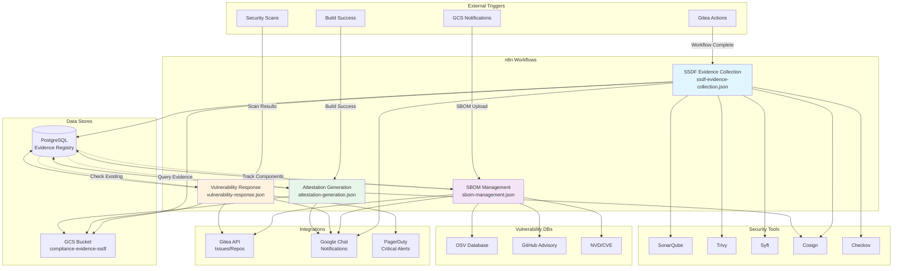

# SSDF Compliance Workflow Dependencies and Architecture

## Workflow Dependency Diagram



## Integration Points

### 1. Gitea Integration
- **Webhook Endpoints**:
  - `/api/v1/workflows/ssdf-evidence-collection` - Workflow completion events
  - `/api/v1/workflows/vulnerability-response` - Security scan results
  - `/api/v1/workflows/attestation-generation` - Build success events
- **API Operations**:
  - Create issues for vulnerabilities
  - Fetch repository content (SBOMs, configs)
  - Update issue labels and status
- **Authentication**: API Key via HTTP Header

### 2. Google Cloud Storage (GCS)
- **Bucket**: `compliance-evidence-ssdf`
- **Structure**:
  ```
  compliance-evidence-ssdf/
  ├── {repository}/
  │   ├── {date}/
  │   │   ├── {commit-sha}/
  │   │   │   ├── evidence-{id}.tar.gz
  │   │   │   ├── attestation-{id}.json
  │   │   │   └── sbom-{id}.json
  │   │   └── attestations/
  │   │       └── SSDF-Attestation-{id}.pdf
  ```
- **Storage Classes**:
  - Standard: Active evidence
  - Archive: 7-year retention attestations

### 3. PostgreSQL Database
- **Tables**:
  - `evidence_registry` - SSDF evidence tracking
  - `sbom_components` - Component inventory
  - `vulnerability_tracking` - CVE management with SLA
  - `vulnerability_evidence` - Scan results archive
  - `attestation_registry` - Attestation records

### 4. Google Chat
- **Channels/Threads**:
  - `ssdf-evidence` - Evidence collection notifications
  - `sbom-management` - SBOM analysis reports
  - `vulnerability-scans` - Scan summaries
  - `critical-security-alerts` - Critical CVE alerts
  - `sla-reminders` - Deadline notifications
  - `attestations` - Attestation confirmations

### 5. Security Tools
- **SonarQube**: `http://sonarqube:9000/api/`
- **Trivy**: `http://trivy:8080/api/v1/`
- **Syft**: Via Gitea repository files
- **Cosign**: `http://cosign-server:8080/api/v1/`
- **Checkov**: `http://checkov:8080/api/v1/`

## Trigger Conditions Summary

### Workflow: SSDF Evidence Collection
- **Trigger**: Gitea Actions workflow completion webhook
- **Conditions**:
  - Workflow status: success/failure
  - Branch: any
- **Frequency**: Per CI/CD run
- **Manual Override**: POST to webhook endpoint

### Workflow: SBOM Management
- **Trigger**: GCS notification on SBOM upload
- **Conditions**:
  - File pattern: `*.sbom.json`, `*-sbom.json`
  - Bucket: `compliance-evidence-ssdf`
- **Frequency**: Per SBOM generation
- **Manual Override**: Upload SBOM to trigger bucket

### Workflow: Vulnerability Response
- **Trigger**: Security scan completion webhook
- **Conditions**:
  - Scan type: Trivy, Grype, or custom
  - Result format: JSON
- **Frequency**: Per security scan
- **Manual Override**: POST scan results to webhook

### Workflow: Attestation Generation
- **Trigger**: Build success event webhook
- **Conditions**:
  - Build status: success
  - Branch: main/master or release/*
- **Frequency**: Per successful build
- **Manual Override**: POST build event to webhook

## Workflow Execution Evidence

Each workflow generates execution evidence including:

1. **Execution Logs**:
   - Workflow ID
   - Execution timestamp
   - Node execution times
   - Success/failure status

2. **Audit Trail**:
   - Input data hash
   - Output data hash
   - Tool versions used
   - Error details (if any)

3. **Compliance Metadata**:
   - SSDF practices covered
   - Evidence references
   - Attestation links
   - SLA tracking

## Error Handling and Retry Logic

All workflows implement:
- **Retry Attempts**: 3 attempts with exponential backoff
- **Error Notification**: Google Chat alerts on failure
- **Fallback Logic**: Continue on non-critical failures
- **Dead Letter Queue**: Failed executions logged to PostgreSQL

## Manual Trigger Overrides

Each workflow supports manual triggering via:

1. **n8n UI**: Manual execution with test data
2. **REST API**: POST to workflow webhook endpoints
3. **CLI**: `curl` commands with appropriate payloads

Example:
```bash
# Trigger evidence collection
curl -X POST http://localhost:5678/webhook/ssdf-evidence-collection \
  -H "Content-Type: application/json" \
  -d '{"repository": "org/repo", "commitSha": "abc123", "branch": "main"}'
```

## Monitoring and Observability

- **Metrics Collected**:
  - Workflow execution count
  - Success/failure rates
  - Average execution time
  - Evidence package sizes
  - Vulnerability counts by severity
  - SLA compliance rates

- **Dashboard Endpoints**:
  - `http://localhost:8080/dashboard/ssdf` - SSDF compliance overview
  - `http://localhost:8080/dashboard/vulnerabilities` - Vulnerability trends
  - `http://localhost:8080/dashboard/sbom` - SBOM inventory

## Security Considerations

1. **Credentials Management**:
   - Store in n8n credential store
   - Rotate API keys quarterly
   - Use OAuth2 where possible

2. **Data Protection**:
   - Encrypt evidence at rest (GCS)
   - TLS for all API communications
   - Hash sensitive data in logs

3. **Access Control**:
   - Webhook authentication tokens
   - IP allowlisting for critical endpoints
   - Role-based access to PostgreSQL

## Maintenance and Updates

- **Version Control**: All workflows in Git
- **Change Management**: PR review required
- **Testing**: Staging environment validation
- **Rollback**: Previous versions in GCS archive
- **Documentation**: Update this file with changes