# Attestation Generation Flow

## Overview
This flowchart visualizes the complete attestation generation workflow, from build completion through SLSA provenance creation, Cosign signing, CISA form population, and 7-year archival storage.

## Mermaid Flowchart

```mermaid
flowchart TD
    Start([Build Completed]) --> Collect

    subgraph Collection["Data Collection Phase"]
        Collect[Collect Build Data]
        Collect --> CommitData[Extract Commit Data<br/>- SHA<br/>- Author<br/>- Timestamp<br/>- Message]
        Collect --> SBOM[Generate SBOM<br/>- Syft CycloneDX<br/>- Components<br/>- Licenses]
        Collect --> Scans[Aggregate Scans<br/>- SAST results<br/>- Container scans<br/>- CVE reports<br/>- DAST findings]
        Collect --> BuildMeta[Gather Build Metadata<br/>- Build ID<br/>- Environment<br/>- Tool versions<br/>- Parameters]
    end

    CommitData --> Provenance
    SBOM --> Provenance
    Scans --> Provenance
    BuildMeta --> Provenance

    subgraph ProvenanceGen["SLSA Provenance Generation"]
        Provenance[Generate SLSA Provenance]
        Provenance --> Builder[Builder Info<br/>- Runner details<br/>- Build platform<br/>- Tool chain]
        Provenance --> Materials[Materials<br/>- Source repo<br/>- Dependencies<br/>- External inputs]
        Provenance --> Recipe[Build Recipe<br/>- Commands<br/>- Environment<br/>- Entry point]
        Provenance --> Metadata[Metadata<br/>- Build start/end<br/>- Reproducibility<br/>- Completeness]

        Builder --> SLSADoc[SLSA Provenance<br/>Document v1.0]
        Materials --> SLSADoc
        Recipe --> SLSADoc
        Metadata --> SLSADoc
    end

    SLSADoc --> AttestationStmt

    subgraph AttestationCreate["Attestation Statement Creation"]
        AttestationStmt[Create in-toto<br/>Attestation Statement]
        AttestationStmt --> Subject[Define Subject<br/>- Artifact name<br/>- SHA-256 digest]
        AttestationStmt --> PredicateType[Set Predicate Type<br/>SLSA Provenance v1.0]
        AttestationStmt --> Predicate[Embed Predicate<br/>Full SLSA document]

        Subject --> InTotoDoc[in-toto Statement<br/>JSON-LD format]
        PredicateType --> InTotoDoc
        Predicate --> InTotoDoc
    end

    InTotoDoc --> Sign

    subgraph Signing["Cosign Signing"]
        Sign[Sign with Cosign]
        Sign --> KMS[Fetch Key from<br/>Google Cloud KMS<br/>- Asymmetric key<br/>- ECDSA P-256]
        KMS --> SignOp[Signing Operation<br/>- Hash attestation<br/>- Sign with KMS<br/>- Generate signature]
        SignOp --> Cert[Attach Certificate<br/>- X.509 cert<br/>- Fulcio short-lived<br/>- Transparency log]

        Cert --> SignedBundle[Cosign Signature Bundle<br/>- Signature<br/>- Certificate<br/>- Bundle]
    end

    SignedBundle --> Store

    subgraph Storage["Storage Phase"]
        Store[Store Attestation]
        Store --> GCS[Upload to GCS<br/>- Attestation JSON<br/>- Signature bundle<br/>- SLSA provenance]
        Store --> Registry[Push to OCI Registry<br/>- Attach to image<br/>- Tag: sha256-xyz.att]
        Store --> DB[Record in PostgreSQL<br/>- Metadata<br/>- GCS path<br/>- Commit SHA]

        GCS --> Retention[Set Retention<br/>7 years immutable]
        Registry --> Verify[Verify Signature<br/>cosign verify]
        DB --> Index[Create Indexes<br/>- By commit<br/>- By timestamp<br/>- By artifact]
    end

    Retention --> CISA
    Verify --> CISA
    Index --> CISA

    subgraph CISAForm["CISA Form Population"]
        CISA[Populate CISA<br/>Attestation Form]
        CISA --> Section1[Section 1:<br/>Company Info<br/>- Name<br/>- DUNS<br/>- Contact]
        CISA --> Section2[Section 2:<br/>Product Info<br/>- Name<br/>- Version<br/>- Description]
        CISA --> Section3[Section 3:<br/>SSDF Practices<br/>- 47 practice checklist<br/>- Evidence links<br/>- Compliance status]
        CISA --> Section4[Section 4:<br/>Attestation<br/>- Signature<br/>- Date<br/>- Authority]

        Section1 --> FormDoc[CISA Form<br/>PDF + JSON]
        Section2 --> FormDoc
        Section3 --> FormDoc
        Section4 --> FormDoc
    end

    FormDoc --> Archive

    subgraph Archival["Archival & Notification"]
        Archive[Archive Complete Package]
        Archive --> Bundle[Create Evidence Bundle<br/>- Attestation<br/>- Provenance<br/>- SBOM<br/>- Scan reports<br/>- CISA form]
        Bundle --> Hash[Generate SHA-256<br/>Bundle hash]
        Hash --> ArchiveGCS[Upload to Archive<br/>7-year retention<br/>Immutable storage]
        ArchiveGCS --> Notify[Send Notification<br/>Google Chat<br/>- Attestation complete<br/>- GCS path<br/>- Signature]
        Notify --> Dashboard[Update Dashboard<br/>- Evidence view<br/>- Compliance status<br/>- Attestation history]
    end

    Dashboard --> End([Attestation Complete])

    %% Styling
    classDef collection fill:#e3f2fd,stroke:#1976d2,stroke-width:2px
    classDef provenance fill:#f3e5f5,stroke:#7b1fa2,stroke-width:2px
    classDef attestation fill:#fff3e0,stroke:#f57c00,stroke-width:2px
    classDef signing fill:#ffebee,stroke:#c62828,stroke-width:2px
    classDef storage fill:#e8f5e9,stroke:#388e3c,stroke-width:2px
    classDef cisa fill:#fff9c4,stroke:#f57f17,stroke-width:2px
    classDef archive fill:#e0f2f1,stroke:#00695c,stroke-width:2px
    classDef decision fill:#fce4ec,stroke:#c2185b,stroke-width:2px

    class Collect,CommitData,SBOM,Scans,BuildMeta collection
    class Provenance,Builder,Materials,Recipe,Metadata,SLSADoc provenance
    class AttestationStmt,Subject,PredicateType,Predicate,InTotoDoc attestation
    class Sign,KMS,SignOp,Cert,SignedBundle signing
    class Store,GCS,Registry,DB,Retention,Verify,Index storage
    class CISA,Section1,Section2,Section3,Section4,FormDoc cisa
    class Archive,Bundle,Hash,ArchiveGCS,Notify,Dashboard archive
```



## PlantUML Activity Diagram

```plantuml
@startuml Attestation_Generation_Flow
!theme plain

skinparam backgroundColor #FFFFFF
skinparam activity {
  BackgroundColor<<collection>> #E3F2FD
  BorderColor<<collection>> #1976D2
  BackgroundColor<<provenance>> #F3E5F5
  BorderColor<<provenance>> #7B1FA2
  BackgroundColor<<attestation>> #FFF3E0
  BorderColor<<attestation>> #F57C00
  BackgroundColor<<signing>> #FFEBEE
  BorderColor<<signing>> #C62828
  BackgroundColor<<storage>> #E8F5E9
  BorderColor<<storage>> #388E3C
  BackgroundColor<<cisa>> #FFF9C4
  BorderColor<<cisa>> #F57F17
  BackgroundColor<<archive>> #E0F2F1
  BorderColor<<archive>> #00695C
}

title Attestation Generation Flow\nFrom Build Completion to 7-Year Archival

start

:Build Completed;

partition "Data Collection Phase" {
  :Collect Build Data<<collection>>;

  fork
    :Extract Commit Data<<collection>>
    - SHA
    - Author
    - Timestamp
    - Message;
  fork again
    :Generate SBOM<<collection>>
    - Syft CycloneDX
    - Components
    - Dependencies
    - Licenses;
  fork again
    :Aggregate Security Scans<<collection>>
    - SAST results (SonarQube, Semgrep)
    - Container scans (Trivy, Grype)
    - CVE reports
    - DAST findings (ZAP, Nuclei);
  fork again
    :Gather Build Metadata<<collection>>
    - Build ID
    - Environment variables
    - Tool versions
    - Build parameters;
  end fork
}

partition "SLSA Provenance Generation" {
  :Generate SLSA Provenance v1.0<<provenance>>;

  :Define Builder Information<<provenance>>
  - Builder ID (Gitea Actions Runner)
  - Build platform (Linux/amd64)
  - Tool chain versions;

  :Specify Materials<<provenance>>
  - Source repository URI
  - Commit SHA
  - Dependencies from SBOM
  - External inputs;

  :Document Build Recipe<<provenance>>
  - Build commands
  - Environment setup
  - Entry point
  - Build configuration;

  :Add Metadata<<provenance>>
  - Build start time
  - Build finish time
  - Reproducibility flag
  - Completeness indicator;

  :Create SLSA Provenance Document<<provenance>>;

  note right
    SLSA Provenance v1.0 Schema:
    {
      "buildType": "https://...",
      "builder": {...},
      "invocation": {...},
      "buildConfig": {...},
      "materials": [...],
      "metadata": {...}
    }
  end note
}

partition "Attestation Statement Creation" {
  :Create in-toto Attestation<<attestation>>;

  :Define Subject<<attestation>>
  - Artifact name (OCI image)
  - SHA-256 digest;

  :Set Predicate Type<<attestation>>
  "https://slsa.dev/provenance/v1";

  :Embed SLSA as Predicate<<attestation>>
  Complete SLSA provenance document;

  :Format as JSON-LD<<attestation>>;

  note right
    in-toto Statement:
    {
      "_type": "https://in-toto.io/Statement/v1",
      "subject": [{
        "name": "...",
        "digest": {"sha256": "..."}
      }],
      "predicateType": "https://slsa.dev/provenance/v1",
      "predicate": {...}
    }
  end note
}

partition "Cosign Signing" {
  :Sign Attestation with Cosign<<signing>>;

  :Fetch Signing Key from GCP KMS<<signing>>
  - Key ring: ssdf-signing
  - Key: attestation-key
  - Algorithm: ECDSA P-256;

  :Hash Attestation JSON<<signing>>
  SHA-256 digest;

  :Sign Hash with KMS<<signing>>
  Asymmetric signing operation;

  if (Use Fulcio?) then (yes)
    :Request Short-lived Certificate<<signing>>
    From Fulcio CA;

    :Record in Transparency Log<<signing>>
    Rekor transparency log;
  else (no)
    :Use Long-lived Certificate<<signing>>;
  endif

  :Create Cosign Signature Bundle<<signing>>
  - Signature (base64)
  - Certificate (PEM)
  - Bundle metadata;
}

partition "Storage Phase" {
  :Store Attestation Artifacts<<storage>>;

  fork
    :Upload to GCS Bucket<<storage>>
    Path: gs://attestations/YYYY/MM/DD/
    - attestation.json
    - signature.sig
    - provenance.json;

    :Set Retention Policy<<storage>>
    7 years, immutable;

    :Enable Object Versioning<<storage>>;
  fork again
    :Push to OCI Registry<<storage>>
    Attach to container image;

    :Tag Attestation<<storage>>
    sha256-{digest}.att;

    :Verify Signature<<storage>>
    cosign verify;
  fork again
    :Record in PostgreSQL<<storage>>
    Table: attestations
    - commit_sha
    - attestation_hash
    - gcs_path
    - registry_path
    - timestamp;

    :Create Indexes<<storage>>
    - By commit SHA
    - By timestamp
    - By artifact digest;
  end fork
}

partition "CISA Form Population" {
  :Generate CISA Attestation Form<<cisa>>;

  :Section 1: Company Information<<cisa>>
  - Company name
  - DUNS number
  - Contact information
  - Authorized official;

  :Section 2: Product Information<<cisa>>
  - Product name
  - Version/release
  - Description
  - Customer-facing identifier;

  :Section 3: SSDF Practices<<cisa>>
  For each of 47 practices:
  - Practice ID (PO.1.1, etc.)
  - Implementation status
  - Evidence link (GCS path)
  - Tool used
  - Compliance notes;

  :Section 4: Attestation<<cisa>>
  - Digital signature
  - Attestation date
  - Authority statement
  - Next review date;

  :Export as PDF and JSON<<cisa>>;

  note right
    CISA Form Auto-populated:
    - 47 practices mapped
    - Evidence links embedded
    - Compliance score calculated
    - Gaps documented
  end note
}

partition "Archival & Notification" {
  :Create Complete Evidence Bundle<<archive>>;

  :Bundle Components<<archive>>
  - in-toto attestation
  - SLSA provenance
  - Cosign signature
  - SBOM (CycloneDX)
  - All scan reports
  - CISA form (PDF + JSON)
  - Evidence manifest;

  :Generate Bundle Hash<<archive>>
  SHA-256 of tarball;

  :Upload to Archive Bucket<<archive>>
  gs://evidence-archive/YYYY/MM/DD/
  - evidence-bundle-{commit}.tar.gz
  - bundle-manifest.json;

  :Send Notification<<archive>>
  Google Chat webhook:
  "Attestation complete for commit {sha}
  GCS: gs://attestations/...
  Signature: {sig_digest}
  CISA Form: {form_path}";

  :Update Dashboard<<archive>>
  - Evidence traceability view
  - Compliance status
  - Attestation history timeline
  - Download links;
}

:Attestation Generation Complete;

stop

@enduml
```

## ASCII Flowchart

```
┌─────────────────────────────────────────────────────────────────────────────────────────────────┐
│                              ATTESTATION GENERATION FLOW                                        │
│              From Build Completion to CISA Form and 7-Year Archival                            │
└─────────────────────────────────────────────────────────────────────────────────────────────────┘

                                    ┌─────────────────┐
                                    │ Build Completed │
                                    └────────┬────────┘
                                             │
                                             ▼
┌─────────────────────────────────────────────────────────────────────────────────────────────────┐
│ PHASE 1: DATA COLLECTION                                                                        │
├─────────────────────────────────────────────────────────────────────────────────────────────────┤
│                                                                                                 │
│  ┌──────────────────────────────────────────────────────────────────────────────────────────┐ │
│  │                          Collect Build Data                                              │ │
│  └──────────────┬────────────────────────┬────────────────────────┬──────────────────────────┘ │
│                 │                        │                        │                            │
│                 ▼                        ▼                        ▼                            │
│  ┌──────────────────────┐  ┌──────────────────────┐  ┌──────────────────────────────────────┐ │
│  │ Extract Commit Data  │  │  Generate SBOM       │  │ Aggregate Security Scans             │ │
│  │ ─────────────────── │  │  ───────────────────  │  │ ─────────────────────────────────── │ │
│  │ • Commit SHA         │  │ • Syft CycloneDX     │  │ • SAST: SonarQube, Semgrep          │ │
│  │ • Author             │  │ • Components list    │  │ • Container: Trivy, Grype            │ │
│  │ • Timestamp          │  │ • Dependencies       │  │ • CVE reports                        │ │
│  │ • Commit message     │  │ • License info       │  │ • DAST: ZAP, Nuclei                  │ │
│  │ • Branch/tag         │  │ • Vulnerability scan │  │ • IaC: Checkov, tfsec                │ │
│  └──────────┬───────────┘  └──────────┬───────────┘  └──────────┬───────────────────────────┘ │
│             │                         │                         │                              │
│             │                         │                         │                              │
│             │                         ▼                         │                              │
│             │              ┌──────────────────────┐             │                              │
│             │              │ Gather Build Metadata│             │                              │
│             │              │ ──────────────────── │             │                              │
│             │              │ • Build ID           │             │                              │
│             │              │ • Runner environment │             │                              │
│             │              │ • Tool versions      │             │                              │
│             │              │ • Build parameters   │             │                              │
│             │              └──────────┬───────────┘             │                              │
│             │                         │                         │                              │
└─────────────┼─────────────────────────┼─────────────────────────┼──────────────────────────────┘
              │                         │                         │
              └─────────────────────────┼─────────────────────────┘
                                        │
                                        ▼
┌─────────────────────────────────────────────────────────────────────────────────────────────────┐
│ PHASE 2: SLSA PROVENANCE GENERATION                                                             │
├─────────────────────────────────────────────────────────────────────────────────────────────────┤
│                                                                                                 │
│  ┌──────────────────────────────────────────────────────────────────────────────────────────┐ │
│  │                   Generate SLSA Provenance v1.0                                          │ │
│  └──────────────────────────────────────────────────────────────────────────────────────────┘ │
│                                        │                                                        │
│           ┌────────────────────────────┼────────────────────────────┐                          │
│           │                            │                            │                          │
│           ▼                            ▼                            ▼                          │
│  ┌──────────────────┐      ┌──────────────────┐        ┌──────────────────────────┐          │
│  │ Builder Info     │      │ Materials        │        │ Build Recipe             │          │
│  │ ──────────────── │      │ ──────────────── │        │ ──────────────────────── │          │
│  │ • Builder ID     │      │ • Source repo URI│        │ • Build commands         │          │
│  │ • Platform       │      │ • Commit SHA     │        │ • Environment setup      │          │
│  │ • Tool chain     │      │ • Dependencies   │        │ • Entry point            │          │
│  │   - Docker       │      │   (from SBOM)    │        │ • Build config           │          │
│  │   - Syft         │      │ • External inputs│        │ • Dockerfile             │          │
│  │   - Cosign       │      │                  │        │                          │          │
│  └────────┬─────────┘      └────────┬─────────┘        └────────┬─────────────────┘          │
│           │                         │                           │                             │
│           │                         │          ┌────────────────▼───────────────┐             │
│           │                         │          │ Metadata                       │             │
│           │                         │          │ ────────────────────────────── │             │
│           │                         │          │ • Build start: 2025-10-07 12:00│             │
│           │                         │          │ • Build end: 2025-10-07 12:15  │             │
│           │                         │          │ • Reproducible: true           │             │
│           │                         │          │ • Complete: true               │             │
│           │                         │          └────────────┬───────────────────┘             │
│           │                         │                       │                                  │
│           └─────────────────────────┼───────────────────────┘                                  │
│                                     │                                                          │
│                                     ▼                                                          │
│           ┌────────────────────────────────────────────────────────┐                          │
│           │      SLSA Provenance Document v1.0                     │                          │
│           │  {                                                     │                          │
│           │    "buildType": "https://github.com/Attestations/...",│                          │
│           │    "builder": { "id": "gitea-actions-runner" },       │                          │
│           │    "invocation": { "configSource": {...} },           │                          │
│           │    "buildConfig": {...},                              │                          │
│           │    "materials": [{...}],                              │                          │
│           │    "metadata": { "buildStartedOn": "...", ... }       │                          │
│           │  }                                                     │                          │
│           └────────────────────────────┬───────────────────────────┘                          │
│                                        │                                                       │
└────────────────────────────────────────┼───────────────────────────────────────────────────────┘
                                         │
                                         ▼
┌─────────────────────────────────────────────────────────────────────────────────────────────────┐
│ PHASE 3: ATTESTATION STATEMENT CREATION                                                         │
├─────────────────────────────────────────────────────────────────────────────────────────────────┤
│                                                                                                 │
│  ┌──────────────────────────────────────────────────────────────────────────────────────────┐ │
│  │               Create in-toto Attestation Statement                                       │ │
│  └──────────────────────────────────────────────────────────────────────────────────────────┘ │
│                                        │                                                        │
│           ┌────────────────────────────┼────────────────────────────┐                          │
│           │                            │                            │                          │
│           ▼                            ▼                            ▼                          │
│  ┌──────────────────┐      ┌──────────────────────┐    ┌──────────────────────────┐          │
│  │ Define Subject   │      │ Set Predicate Type   │    │ Embed SLSA Predicate     │          │
│  │ ──────────────── │      │ ──────────────────── │    │ ──────────────────────── │          │
│  │ • Artifact name  │      │ Type:                │    │ Embed full SLSA          │          │
│  │   (OCI image)    │      │ "https://slsa.dev/  │    │ provenance document      │          │
│  │ • SHA-256 digest │      │  provenance/v1"      │    │ as predicate             │          │
│  │                  │      │                      │    │                          │          │
│  └────────┬─────────┘      └────────┬─────────────┘    └────────┬─────────────────┘          │
│           │                         │                           │                             │
│           └─────────────────────────┼───────────────────────────┘                             │
│                                     │                                                          │
│                                     ▼                                                          │
│           ┌────────────────────────────────────────────────────────┐                          │
│           │      in-toto Attestation Statement (JSON-LD)           │                          │
│           │  {                                                     │                          │
│           │    "_type": "https://in-toto.io/Statement/v1",        │                          │
│           │    "subject": [{                                       │                          │
│           │      "name": "pkg:oci/devsecops@sha256:...",          │                          │
│           │      "digest": {"sha256": "abc123..."}                │                          │
│           │    }],                                                 │                          │
│           │    "predicateType": "https://slsa.dev/provenance/v1", │                          │
│           │    "predicate": { <SLSA provenance> }                 │                          │
│           │  }                                                     │                          │
│           └────────────────────────────┬───────────────────────────┘                          │
│                                        │                                                       │
└────────────────────────────────────────┼───────────────────────────────────────────────────────┘
                                         │
                                         ▼
┌─────────────────────────────────────────────────────────────────────────────────────────────────┐
│ PHASE 4: COSIGN SIGNING                                                                         │
├─────────────────────────────────────────────────────────────────────────────────────────────────┤
│                                                                                                 │
│  ┌──────────────────────────────────────────────────────────────────────────────────────────┐ │
│  │                      Sign Attestation with Cosign                                        │ │
│  └──────────────────────────────────────────────────────────────────────────────────────────┘ │
│                                        │                                                        │
│                                        ▼                                                        │
│           ┌────────────────────────────────────────────────────────┐                          │
│           │    Fetch Signing Key from Google Cloud KMS            │                          │
│           │    ─────────────────────────────────────────────────   │                          │
│           │    • Key ring: ssdf-signing                            │                          │
│           │    • Key name: attestation-key                         │                          │
│           │    • Algorithm: ECDSA P-256                            │                          │
│           │    • Purpose: ASYMMETRIC_SIGN                          │                          │
│           └────────────────────────────┬───────────────────────────┘                          │
│                                        │                                                       │
│                                        ▼                                                       │
│           ┌────────────────────────────────────────────────────────┐                          │
│           │    Hash Attestation JSON                               │                          │
│           │    SHA-256(attestation_json) = digest                  │                          │
│           └────────────────────────────┬───────────────────────────┘                          │
│                                        │                                                       │
│                                        ▼                                                       │
│           ┌────────────────────────────────────────────────────────┐                          │
│           │    Sign Hash with KMS                                  │                          │
│           │    signature = KMS.AsymmetricSign(digest, key)         │                          │
│           └────────────────────────────┬───────────────────────────┘                          │
│                                        │                                                       │
│                                        ▼                                                       │
│                          ┌──────────────────────────┐                                         │
│                          │ Use Fulcio CA?           │                                         │
│                          └──────┬───────────────┬───┘                                         │
│                          Yes    │               │  No                                         │
│              ┌──────────────────┘               └─────────────────┐                           │
│              ▼                                                    ▼                           │
│  ┌────────────────────────┐                          ┌────────────────────────┐              │
│  │ Request Short-lived    │                          │ Use Long-lived         │              │
│  │ Certificate from Fulcio│                          │ Certificate            │              │
│  └────────┬───────────────┘                          └────────┬───────────────┘              │
│           │                                                   │                               │
│           ▼                                                   │                               │
│  ┌────────────────────────┐                                  │                               │
│  │ Record in Transparency │                                  │                               │
│  │ Log (Rekor)            │                                  │                               │
│  └────────┬───────────────┘                                  │                               │
│           │                                                   │                               │
│           └─────────────────────┬─────────────────────────────┘                               │
│                                 │                                                             │
│                                 ▼                                                             │
│           ┌────────────────────────────────────────────────────────┐                          │
│           │      Cosign Signature Bundle                           │                          │
│           │  {                                                     │                          │
│           │    "signature": "MEUCIQD...",                          │                          │
│           │    "cert": "-----BEGIN CERTIFICATE-----...",          │                          │
│           │    "rekorBundle": {...},                              │                          │
│           │    "mediaType": "application/vnd.dev.cosign..."       │                          │
│           │  }                                                     │                          │
│           └────────────────────────────┬───────────────────────────┘                          │
│                                        │                                                       │
└────────────────────────────────────────┼───────────────────────────────────────────────────────┘
                                         │
                                         ▼
┌─────────────────────────────────────────────────────────────────────────────────────────────────┐
│ PHASE 5: STORAGE                                                                                │
├─────────────────────────────────────────────────────────────────────────────────────────────────┤
│                                                                                                 │
│  ┌──────────────────────────────────────────────────────────────────────────────────────────┐ │
│  │                       Store Attestation Artifacts                                        │ │
│  └────────────────┬──────────────────────────┬────────────────────────┬──────────────────────┘ │
│                   │                          │                        │                        │
│                   ▼                          ▼                        ▼                        │
│  ┌────────────────────────┐   ┌──────────────────────┐   ┌──────────────────────────┐        │
│  │ Upload to GCS          │   │ Push to OCI Registry │   │ Record in PostgreSQL     │        │
│  │ ────────────────────── │   │ ──────────────────── │   │ ──────────────────────── │        │
│  │ Path:                  │   │ Attach to image:     │   │ Table: attestations      │        │
│  │ gs://attestations/     │   │ registry/image:tag   │   │                          │        │
│  │   2025/10/07/          │   │                      │   │ Columns:                 │        │
│  │   abc123/              │   │ Tag attestation:     │   │ • id (UUID)              │        │
│  │   attestation.json     │   │ sha256-xyz.att       │   │ • commit_sha             │        │
│  │   signature.sig        │   │                      │   │ • attestation_hash       │        │
│  │   provenance.json      │   │ Verify signature:    │   │ • gcs_path               │        │
│  │                        │   │ cosign verify        │   │ • registry_path          │        │
│  │ Set retention: 7 years │   │                      │   │ • timestamp              │        │
│  │ Enable versioning      │   │                      │   │ • slsa_version           │        │
│  │ Immutable storage      │   │                      │   │ • signed_by              │        │
│  └────────────────────────┘   └──────────────────────┘   │                          │        │
│                                                           │ Create indexes:          │        │
│                                                           │ • commit_sha             │        │
│                                                           │ • timestamp              │        │
│                                                           │ • attestation_hash       │        │
│                                                           └──────────────────────────┘        │
│                                                                                                 │
└─────────────────────────────────────────────────────────────────────────────────────────────────┘
                                         │
                                         ▼
┌─────────────────────────────────────────────────────────────────────────────────────────────────┐
│ PHASE 6: CISA FORM POPULATION                                                                   │
├─────────────────────────────────────────────────────────────────────────────────────────────────┤
│                                                                                                 │
│  ┌──────────────────────────────────────────────────────────────────────────────────────────┐ │
│  │                    Generate CISA Attestation Form                                        │ │
│  └────────────────┬──────────────────────────┬────────────────────────┬──────────────────────┘ │
│                   │                          │                        │                        │
│                   ▼                          ▼                        ▼                        │
│  ┌────────────────────────┐   ┌──────────────────────┐   ┌──────────────────────────┐        │
│  │ Section 1:             │   │ Section 2:           │   │ Section 3:               │        │
│  │ Company Information    │   │ Product Information  │   │ SSDF Practices           │        │
│  │ ────────────────────── │   │ ──────────────────── │   │ ──────────────────────── │        │
│  │ • Company name         │   │ • Product name       │   │ For each of 47 practices:│        │
│  │ • DUNS number          │   │ • Version/release    │   │                          │        │
│  │ • Address              │   │ • Description        │   │ ✓ PO.1.1: IMPLEMENTED    │        │
│  │ • Contact info         │   │ • CPE identifier     │   │   Evidence: gs://...     │        │
│  │ • Authorized official  │   │ • Customer ID        │   │   Tool: git-secrets      │        │
│  └────────────────────────┘   │                      │   │                          │        │
│                                └──────────────────────┘   │ ✓ PO.1.2: IMPLEMENTED    │        │
│                   │                     │                 │   Evidence: gs://...     │        │
│                   │                     │                 │   Tool: Gitea RBAC       │        │
│                   │                     │                 │                          │        │
│                   │                     │                 │ ... (all 47 practices)   │        │
│                   │                     │                 │                          │        │
│                   │                     │                 │ Coverage: 28/47 (60%)    │        │
│                   │                     │                 └──────────────────────────┘        │
│                   │                     │                           │                          │
│                   │                     │                           ▼                          │
│                   │                     │                 ┌──────────────────────────┐        │
│                   │                     │                 │ Section 4:               │        │
│                   │                     │                 │ Attestation              │        │
│                   │                     │                 │ ──────────────────────── │        │
│                   │                     │                 │ • Digital signature      │        │
│                   │                     │                 │ • Attestation date       │        │
│                   │                     │                 │ • Authority statement    │        │
│                   │                     │                 │ • Review date            │        │
│                   │                     │                 └────────────┬─────────────┘        │
│                   │                     │                              │                       │
│                   └─────────────────────┼──────────────────────────────┘                       │
│                                         │                                                       │
│                                         ▼                                                       │
│           ┌────────────────────────────────────────────────────────┐                          │
│           │      CISA Attestation Form                             │                          │
│           │  • PDF format (signed)                                 │                          │
│           │  • JSON format (machine-readable)                      │                          │
│           │  • All 47 practices auto-populated                     │                          │
│           │  • Evidence links embedded                             │                          │
│           │  • Compliance score: 60%                               │                          │
│           │  • Gap analysis included                               │                          │
│           └────────────────────────────┬───────────────────────────┘                          │
│                                        │                                                       │
└────────────────────────────────────────┼───────────────────────────────────────────────────────┘
                                         │
                                         ▼
┌─────────────────────────────────────────────────────────────────────────────────────────────────┐
│ PHASE 7: ARCHIVAL & NOTIFICATION                                                                │
├─────────────────────────────────────────────────────────────────────────────────────────────────┤
│                                                                                                 │
│  ┌──────────────────────────────────────────────────────────────────────────────────────────┐ │
│  │                    Create Complete Evidence Bundle                                       │ │
│  └──────────────────────────────────────────────────────────────────────────────────────────┘ │
│                                        │                                                        │
│                                        ▼                                                        │
│           ┌────────────────────────────────────────────────────────┐                          │
│           │    Bundle Components                                   │                          │
│           │    ────────────────────────────────────────────────    │                          │
│           │    • in-toto attestation (JSON)                        │                          │
│           │    • SLSA provenance (JSON)                            │                          │
│           │    • Cosign signature bundle                           │                          │
│           │    • SBOM (CycloneDX JSON)                             │                          │
│           │    • All scan reports (JSON/SARIF/XML)                 │                          │
│           │    • CISA form (PDF + JSON)                            │                          │
│           │    • Evidence manifest (metadata)                      │                          │
│           │    • Build logs                                        │                          │
│           └────────────────────────────┬───────────────────────────┘                          │
│                                        │                                                       │
│                                        ▼                                                       │
│           ┌────────────────────────────────────────────────────────┐                          │
│           │    tar -czf evidence-bundle-abc123.tar.gz \            │                          │
│           │      attestation.json \                                │                          │
│           │      provenance.json \                                 │                          │
│           │      signature.sig \                                   │                          │
│           │      sbom.json \                                       │                          │
│           │      scan-*.json \                                     │                          │
│           │      cisa-form.pdf \                                   │                          │
│           │      manifest.json                                     │                          │
│           └────────────────────────────┬───────────────────────────┘                          │
│                                        │                                                       │
│                                        ▼                                                       │
│           ┌────────────────────────────────────────────────────────┐                          │
│           │    Generate SHA-256 Hash of Bundle                     │                          │
│           │    bundle_hash = SHA256(evidence-bundle-abc123.tar.gz) │                          │
│           │    bundle_hash = "f7fbba6e0636f890e56fbbf..."          │                          │
│           └────────────────────────────┬───────────────────────────┘                          │
│                                        │                                                       │
│                                        ▼                                                       │
│           ┌────────────────────────────────────────────────────────┐                          │
│           │    Upload to Archive Bucket                            │                          │
│           │    gs://evidence-archive/2025/10/07/                   │                          │
│           │      evidence-bundle-abc123.tar.gz                     │                          │
│           │      bundle-manifest.json                              │                          │
│           │                                                         │                          │
│           │    Retention: 7 years (immutable)                      │                          │
│           │    Versioning: enabled                                 │                          │
│           │    Encryption: Google-managed                          │                          │
│           └────────────────────────────┬───────────────────────────┘                          │
│                                        │                                                       │
│                                        ▼                                                       │
│           ┌────────────────────────────────────────────────────────┐                          │
│           │    Send Google Chat Notification                       │                          │
│           │    ─────────────────────────────────────────────────   │                          │
│           │    ✓ Attestation generation complete                   │                          │
│           │                                                         │                          │
│           │    Commit: abc123def456                                │                          │
│           │    SLSA Level: 3                                       │                          │
│           │    GCS Path: gs://attestations/2025/10/07/abc123/      │                          │
│           │    Signature: MEUCIQD...                               │                          │
│           │    CISA Form: gs://attestations/.../cisa-form.pdf      │                          │
│           │    Bundle Hash: f7fbba6e0636f890e56fbbf...             │                          │
│           │                                                         │                          │
│           │    View Dashboard: https://dashboard.example.com       │                          │
│           └────────────────────────────┬───────────────────────────┘                          │
│                                        │                                                       │
│                                        ▼                                                       │
│           ┌────────────────────────────────────────────────────────┐                          │
│           │    Update Evidence Dashboard                           │                          │
│           │    ─────────────────────────────────────────────────   │                          │
│           │    • Evidence traceability view                        │                          │
│           │    • Compliance status (60%)                           │                          │
│           │    • Attestation history timeline                      │                          │
│           │    • Download links (presigned URLs)                   │                          │
│           │    • SLSA badge display                                │                          │
│           │    • Gap analysis                                      │                          │
│           └────────────────────────────────────────────────────────┘                          │
│                                                                                                 │
└─────────────────────────────────────────────────────────────────────────────────────────────────┘
                                         │
                                         ▼
                              ┌────────────────────────┐
                              │ Attestation Complete   │
                              │ Ready for CISA         │
                              │ submission and         │
                              │ customer delivery      │
                              └────────────────────────┘
```

## Attestation Artifacts

### 1. SLSA Provenance Example

```json
{
  "buildType": "https://github.com/slsa-framework/slsa-github-generator/generic@v1",
  "builder": {
    "id": "https://github.com/gitea/actions-runner@v1"
  },
  "invocation": {
    "configSource": {
      "uri": "git+https://gitea.example.com/org/devsecops-platform",
      "digest": {
        "sha1": "abc123def456..."
      },
      "entryPoint": ".gitea/workflows/ssdf-pipeline.yml"
    },
    "parameters": {
      "workflow_ref": "feature/ssdf-cicd-pipeline",
      "event_name": "push"
    },
    "environment": {
      "RUNNER_OS": "Linux",
      "RUNNER_ARCH": "X64"
    }
  },
  "buildConfig": {
    "steps": [
      {
        "command": ["docker", "build", "-t", "devsecops:latest", "."],
        "env": ["DOCKER_BUILDKIT=1"]
      },
      {
        "command": ["syft", "packages", "devsecops:latest", "-o", "cyclonedx-json"],
        "env": []
      }
    ]
  },
  "materials": [
    {
      "uri": "git+https://gitea.example.com/org/devsecops-platform@refs/heads/main",
      "digest": {
        "sha1": "abc123def456..."
      }
    },
    {
      "uri": "pkg:docker/python@3.11-slim",
      "digest": {
        "sha256": "def456abc789..."
      }
    }
  ],
  "metadata": {
    "buildStartedOn": "2025-10-07T12:00:00Z",
    "buildFinishedOn": "2025-10-07T12:15:00Z",
    "completeness": {
      "parameters": true,
      "environment": true,
      "materials": true
    },
    "reproducible": true
  }
}
```

### 2. in-toto Attestation Example

```json
{
  "_type": "https://in-toto.io/Statement/v1",
  "subject": [
    {
      "name": "pkg:oci/devsecops@sha256:abc123...",
      "digest": {
        "sha256": "abc123def456..."
      }
    }
  ],
  "predicateType": "https://slsa.dev/provenance/v1",
  "predicate": {
    "buildType": "https://github.com/slsa-framework/slsa-github-generator/generic@v1",
    "builder": {...},
    "invocation": {...},
    "buildConfig": {...},
    "materials": [...],
    "metadata": {...}
  }
}
```

### 3. Cosign Signature Bundle

```json
{
  "signature": "MEUCIQDxvX...",
  "cert": "-----BEGIN CERTIFICATE-----\nMIICjzCCAh...\n-----END CERTIFICATE-----",
  "rekorBundle": {
    "SignedEntryTimestamp": "MEUCIQCqosu...",
    "Payload": {
      "body": "eyJhcGl...",
      "integratedTime": 1696680000,
      "logIndex": 12345678,
      "logID": "c0d23d6ad406973f9559f3ba2d1ca01f84147d8ffc5b8445c224f98b9591801d"
    }
  }
}
```

### 4. Evidence Manifest

```json
{
  "version": "1.0",
  "commit_sha": "abc123def456...",
  "timestamp": "2025-10-07T12:15:00Z",
  "attestations": [
    {
      "type": "slsa-provenance",
      "version": "v1",
      "path": "attestations/provenance.json",
      "sha256": "e3b0c44298fc..."
    },
    {
      "type": "in-toto-statement",
      "version": "v1",
      "path": "attestations/attestation.json",
      "sha256": "a591a6d40bf4..."
    },
    {
      "type": "cosign-signature",
      "version": "v2",
      "path": "attestations/signature.sig",
      "sha256": "f7fbba6e0636..."
    }
  ],
  "artifacts": [
    {
      "type": "sbom",
      "format": "cyclonedx",
      "version": "1.5",
      "path": "artifacts/sbom.json",
      "sha256": "d4735e3a265e..."
    },
    {
      "type": "scan-report",
      "tool": "trivy",
      "path": "artifacts/trivy-scan.json",
      "sha256": "4e07408562be..."
    }
  ],
  "cisa_form": {
    "path": "cisa/attestation-form.pdf",
    "sha256": "6b86b273ff34...",
    "practices_covered": 28,
    "total_practices": 47,
    "coverage_percentage": 59.6
  },
  "bundle_hash": "f7fbba6e0636f890e56fbbf3283e524c6fa3204ae298382d624741d0dc6638326"
}
```

## Storage Schema

### PostgreSQL: attestations table

```sql
CREATE TABLE attestations (
    id UUID PRIMARY KEY DEFAULT gen_random_uuid(),
    commit_sha VARCHAR(64) NOT NULL,
    branch VARCHAR(255),
    pipeline_id VARCHAR(64) NOT NULL,
    timestamp TIMESTAMP WITH TIME ZONE NOT NULL,

    -- Attestation details
    attestation_hash VARCHAR(64) NOT NULL,
    provenance_hash VARCHAR(64) NOT NULL,
    signature_hash VARCHAR(64) NOT NULL,
    slsa_version VARCHAR(10) NOT NULL DEFAULT 'v1',
    slsa_level INTEGER CHECK (slsa_level BETWEEN 0 AND 4),

    -- Storage paths
    gcs_attestation_path VARCHAR(512) NOT NULL,
    gcs_provenance_path VARCHAR(512) NOT NULL,
    gcs_signature_path VARCHAR(512) NOT NULL,
    gcs_bundle_path VARCHAR(512),
    registry_path VARCHAR(512),

    -- CISA form
    cisa_form_path VARCHAR(512),
    cisa_form_hash VARCHAR(64),
    ssdf_practices_covered JSONB,
    compliance_percentage DECIMAL(5,2),

    -- Signing details
    signed_by VARCHAR(255),
    signing_key_id VARCHAR(255),
    fulcio_cert_used BOOLEAN DEFAULT FALSE,
    rekor_log_index BIGINT,

    -- Metadata
    builder_id VARCHAR(255),
    build_start TIMESTAMP WITH TIME ZONE,
    build_end TIMESTAMP WITH TIME ZONE,
    materials JSONB,
    reproducible BOOLEAN,

    created_at TIMESTAMP WITH TIME ZONE DEFAULT NOW(),
    updated_at TIMESTAMP WITH TIME ZONE DEFAULT NOW()
);

CREATE INDEX idx_attestations_commit ON attestations(commit_sha);
CREATE INDEX idx_attestations_timestamp ON attestations(timestamp DESC);
CREATE INDEX idx_attestations_pipeline ON attestations(pipeline_id);
CREATE INDEX idx_attestations_hash ON attestations(attestation_hash);
CREATE INDEX idx_attestations_slsa ON attestations(slsa_level);
CREATE INDEX idx_attestations_practices ON attestations USING GIN(ssdf_practices_covered);
```

## Verification Workflow

```bash
# 1. Verify Cosign signature
cosign verify \
  --key gcpkms://projects/PROJECT/locations/REGION/keyRings/RING/cryptoKeys/KEY \
  registry.example.com/devsecops:sha256-abc123...

# 2. Verify attestation
cosign verify-attestation \
  --key gcpkms://projects/PROJECT/locations/REGION/keyRings/RING/cryptoKeys/KEY \
  --type slsaprovenance \
  registry.example.com/devsecops:sha256-abc123...

# 3. Extract and validate SLSA provenance
cosign download attestation \
  registry.example.com/devsecops:sha256-abc123... | \
  jq '.payload | @base64d | fromjson | .predicate'

# 4. Verify bundle hash
sha256sum evidence-bundle-abc123.tar.gz
# Should match bundle_hash in manifest
```

## References

- **SLSA**: Supply-chain Levels for Software Artifacts v1.0
- **in-toto**: Supply chain security attestation framework
- **Cosign**: Container signing, verification, and storage
- **Fulcio**: Free code signing certificate authority
- **Rekor**: Transparency log for software supply chain
- **CISA SSDF**: Attestation form guidance
- **NIST SP 800-218**: SSDF practice implementation

## Rendering Instructions

### Mermaid
```bash
mmdc -i ATTESTATION_FLOW.md -o attestation-flow.png -t dark -b transparent -w 2400 -h 3600
```

### PlantUML
```bash
docker run -v $(pwd):/data plantuml/plantuml -tpng -DPLANTUML_LIMIT_SIZE=16384 /data/ATTESTATION_FLOW.md
```
