# CI/CD Pipeline Architecture

## Overview
This diagram visualizes the SSDF-compliant CI/CD pipeline implementation, showing all security stages, tool integrations, evidence collection points, and SSDF practice mappings.

## Mermaid Diagram

```mermaid
graph TB
    subgraph PreCommit["Pre-Commit Stage (PO.1, PS.1)"]
        PC1[git-secrets<br/>Secret Detection]
        PC2[Semgrep<br/>Static Analysis]
        PC3[ansible-lint<br/>Playbook Validation]
        PC4[pre-commit hooks<br/>Format & Style]
    end

    subgraph PRGate["PR Security Gate (PW.2, PW.6)"]
        PR1[SonarQube SAST<br/>Code Quality]
        PR2[Trivy Dependency<br/>CVE Scanning]
        PR3[Checkov IaC<br/>Config Security]
        PR4[Code Review<br/>Manual Approval]
        PR5[License Check<br/>Compliance]
        PRDecision{Security<br/>Pass?}
    end

    subgraph Build["Build Stage (PW.9, PS.3)"]
        B1[Multi-stage<br/>Docker Build]
        B2[Syft SBOM<br/>Generation]
        B3[Cosign<br/>Artifact Signing]
        B4[SLSA Provenance<br/>Build Attestation]
        B5[HashiCorp Vault<br/>Secrets Injection]
    end

    subgraph SecurityScan["Security Scanning (PW.7, RV.1)"]
        SS1[Trivy Container<br/>Image Scanning]
        SS2[Grype CVE<br/>Detection]
        SS3[Bandit Python<br/>Security Analysis]
        SS4[tfsec/Terrascan<br/>IaC Scanning]
        SS5[OSV-Scanner<br/>Vulnerability DB]
        SSDecision{Vulnerabilities<br/>Critical?}
    end

    subgraph DAST["DAST Stage (PW.7, PW.8)"]
        D1[OWASP ZAP<br/>Web App Scan]
        D2[Nuclei<br/>Template Scan]
        D3[API Security<br/>Testing]
        D4[Dependency Track<br/>Risk Analysis]
    end

    subgraph Compliance["Compliance & Evidence (PO.2, PO.3)"]
        C1[SBOM Validation<br/>CycloneDX]
        C2[Evidence Collection<br/>n8n Workflow]
        C3[Attestation<br/>Generation]
        C4[CISA Form<br/>Population]
        C5[Evidence Package<br/>SHA-256 Hash]
    end

    subgraph Deploy["Deployment (PW.8, RV.2)"]
        DP1[Atlantis GitOps<br/>Terraform Apply]
        DP2[GKE Deployment<br/>with Policy]
        DP3[Falco Runtime<br/>Monitoring]
        DP4[Wazuh HIDS<br/>Detection]
        DP5[Cloud Armor<br/>WAF Rules]
    end

    subgraph Evidence["Evidence Storage"]
        EV1[(GCS Bucket<br/>Evidence Archive)]
        EV2[(PostgreSQL<br/>Evidence Registry)]
        EV3[Dashboard<br/>Visualization]
    end

    subgraph Notifications["Notifications & Feedback"]
        N1[Google Chat<br/>Alerts]
        N2[Security<br/>Dashboard]
        N3[Metrics<br/>Prometheus]
    end

    %% Pre-Commit Flow
    PC1 --> PC2
    PC2 --> PC3
    PC3 --> PC4
    PC4 --> PRGate

    %% PR Gate Flow
    PR1 --> PRDecision
    PR2 --> PRDecision
    PR3 --> PRDecision
    PR4 --> PRDecision
    PR5 --> PRDecision
    PRDecision -->|Pass| Build
    PRDecision -->|Fail| N1

    %% Build Flow
    B1 --> B2
    B2 --> B3
    B3 --> B4
    B4 --> B5
    B5 --> SecurityScan

    %% Security Scan Flow
    SS1 --> SSDecision
    SS2 --> SSDecision
    SS3 --> SSDecision
    SS4 --> SSDecision
    SS5 --> SSDecision
    SSDecision -->|Pass| DAST
    SSDecision -->|Critical| N1

    %% DAST Flow
    D1 --> D2
    D2 --> D3
    D3 --> D4
    D4 --> Compliance

    %% Compliance Flow
    C1 --> C2
    C2 --> C3
    C3 --> C4
    C4 --> C5
    C5 --> Deploy

    %% Deployment Flow
    DP1 --> DP2
    DP2 --> DP3
    DP3 --> DP4
    DP4 --> DP5

    %% Evidence Collection
    C2 --> EV1
    C2 --> EV2
    EV2 --> EV3

    %% Notifications
    PRDecision --> N1
    SSDecision --> N1
    C5 --> N2
    DP5 --> N3

    %% Styling
    classDef precommit fill:#e1f5ff,stroke:#01579b,stroke-width:2px
    classDef prgate fill:#fff3e0,stroke:#e65100,stroke-width:2px
    classDef build fill:#f3e5f5,stroke:#4a148c,stroke-width:2px
    classDef security fill:#ffebee,stroke:#b71c1c,stroke-width:2px
    classDef dast fill:#e8f5e9,stroke:#1b5e20,stroke-width:2px
    classDef compliance fill:#fff9c4,stroke:#f57f17,stroke-width:2px
    classDef deploy fill:#e0f2f1,stroke:#004d40,stroke-width:2px
    classDef evidence fill:#fce4ec,stroke:#880e4f,stroke-width:2px
    classDef notify fill:#ede7f6,stroke:#311b92,stroke-width:2px

    class PC1,PC2,PC3,PC4 precommit
    class PR1,PR2,PR3,PR4,PR5,PRDecision prgate
    class B1,B2,B3,B4,B5 build
    class SS1,SS2,SS3,SS4,SS5,SSDecision security
    class D1,D2,D3,D4 dast
    class C1,C2,C3,C4,C5 compliance
    class DP1,DP2,DP3,DP4,DP5 deploy
    class EV1,EV2,EV3 evidence
    class N1,N2,N3 notify
```



## PlantUML Diagram

```plantuml
@startuml CICD_Pipeline_Architecture
!define RECTANGLE class

skinparam defaultTextAlignment center
skinparam backgroundColor #FFFFFF
skinparam shadowing false

' Define colors for stages
skinparam class {
  BackgroundColor<<precommit>> #E1F5FF
  BorderColor<<precommit>> #01579B
  BackgroundColor<<prgate>> #FFF3E0
  BorderColor<<prgate>> #E65100
  BackgroundColor<<build>> #F3E5F5
  BorderColor<<build>> #4A148C
  BackgroundColor<<security>> #FFEBEE
  BorderColor<<security>> #B71C1C
  BackgroundColor<<dast>> #E8F5E9
  BorderColor<<dast>> #1B5E20
  BackgroundColor<<compliance>> #FFF9C4
  BorderColor<<compliance>> #F57F17
  BackgroundColor<<deploy>> #E0F2F1
  BorderColor<<deploy>> #004D40
}

package "Pre-Commit Stage\n[PO.1, PS.1]" <<precommit>> {
  [git-secrets\nSecret Detection] as PC1
  [Semgrep\nStatic Analysis] as PC2
  [ansible-lint\nPlaybook Validation] as PC3
  [pre-commit hooks\nFormat & Style] as PC4
}

package "PR Security Gate\n[PW.2, PW.6]" <<prgate>> {
  [SonarQube SAST\nCode Quality] as PR1
  [Trivy Dependency\nCVE Scanning] as PR2
  [Checkov IaC\nConfig Security] as PR3
  [Code Review\nManual Approval] as PR4
  [License Check\nCompliance] as PR5
  diamond "Security\nPass?" as PRDecision
}

package "Build Stage\n[PW.9, PS.3]" <<build>> {
  [Multi-stage\nDocker Build] as B1
  [Syft SBOM\nGeneration] as B2
  [Cosign\nArtifact Signing] as B3
  [SLSA Provenance\nBuild Attestation] as B4
  [HashiCorp Vault\nSecrets Injection] as B5
}

package "Security Scanning\n[PW.7, RV.1]" <<security>> {
  [Trivy Container\nImage Scanning] as SS1
  [Grype CVE\nDetection] as SS2
  [Bandit Python\nSecurity Analysis] as SS3
  [tfsec/Terrascan\nIaC Scanning] as SS4
  [OSV-Scanner\nVulnerability DB] as SS5
  diamond "Critical\nVulns?" as SSDecision
}

package "DAST Stage\n[PW.7, PW.8]" <<dast>> {
  [OWASP ZAP\nWeb App Scan] as D1
  [Nuclei\nTemplate Scan] as D2
  [API Security\nTesting] as D3
  [Dependency Track\nRisk Analysis] as D4
}

package "Compliance & Evidence\n[PO.2, PO.3]" <<compliance>> {
  [SBOM Validation\nCycloneDX] as C1
  [Evidence Collection\nn8n Workflow] as C2
  [Attestation\nGeneration] as C3
  [CISA Form\nPopulation] as C4
  [Evidence Package\nSHA-256 Hash] as C5
}

package "Deployment\n[PW.8, RV.2]" <<deploy>> {
  [Atlantis GitOps\nTerraform Apply] as DP1
  [GKE Deployment\nwith Policy] as DP2
  [Falco Runtime\nMonitoring] as DP3
  [Wazuh HIDS\nDetection] as DP4
  [Cloud Armor\nWAF Rules] as DP5
}

database "GCS Bucket\nEvidence Archive" as EV1
database "PostgreSQL\nEvidence Registry" as EV2
[Dashboard\nVisualization] as EV3
[Google Chat\nAlerts] as N1

' Flow connections
PC1 --> PC2
PC2 --> PC3
PC3 --> PC4
PC4 --> PR1

PR1 --> PRDecision
PR2 --> PRDecision
PR3 --> PRDecision
PR4 --> PRDecision
PR5 --> PRDecision

PRDecision --> B1 : Pass
PRDecision --> N1 : Fail

B1 --> B2
B2 --> B3
B3 --> B4
B4 --> B5
B5 --> SS1

SS1 --> SSDecision
SS2 --> SSDecision
SS3 --> SSDecision
SS4 --> SSDecision
SS5 --> SSDecision

SSDecision --> D1 : Pass
SSDecision --> N1 : Critical

D1 --> D2
D2 --> D3
D3 --> D4
D4 --> C1

C1 --> C2
C2 --> C3
C3 --> C4
C4 --> C5
C5 --> DP1

DP1 --> DP2
DP2 --> DP3
DP3 --> DP4
DP4 --> DP5

C2 --> EV1
C2 --> EV2
EV2 --> EV3

@enduml
```

## ASCII Diagram

```
┌─────────────────────────────────────────────────────────────────────────────┐
│                         CI/CD PIPELINE ARCHITECTURE                          │
│                        SSDF-Compliant Security Pipeline                      │
└─────────────────────────────────────────────────────────────────────────────┘

┌─────────────────────────────────────────────────────────────────────────────┐
│  STAGE 1: PRE-COMMIT (PO.1, PS.1)                                           │
├─────────────────────────────────────────────────────────────────────────────┤
│  ┌──────────────┐   ┌──────────────┐   ┌──────────────┐   ┌─────────────┐ │
│  │ git-secrets  │──▶│   Semgrep    │──▶│ ansible-lint │──▶│ pre-commit  │ │
│  │    Secret    │   │    Static    │   │   Playbook   │   │  hooks      │ │
│  │  Detection   │   │   Analysis   │   │  Validation  │   │ Format      │ │
│  └──────────────┘   └──────────────┘   └──────────────┘   └─────────────┘ │
│  📍 Evidence: Scan results, commit metadata                                 │
└─────────────────────────────────────────────────────────────────────────────┘
                                    │
                                    ▼
┌─────────────────────────────────────────────────────────────────────────────┐
│  STAGE 2: PR SECURITY GATE (PW.2, PW.6)                                    │
├─────────────────────────────────────────────────────────────────────────────┤
│  ┌──────────────┐   ┌──────────────┐   ┌──────────────┐   ┌─────────────┐ │
│  │  SonarQube   │   │    Trivy     │   │   Checkov    │   │    Code     │ │
│  │     SAST     │   │  Dependency  │   │     IaC      │   │   Review    │ │
│  │     Code     │   │     CVE      │   │   Config     │   │   Manual    │ │
│  │   Quality    │   │   Scanning   │   │  Security    │   │  Approval   │ │
│  └──────────────┘   └──────────────┘   └──────────────┘   └─────────────┘ │
│                                    │                                         │
│                         ┌──────────▼──────────┐                            │
│                         │  Security Pass?     │                            │
│                         │  ◆ Quality Gates    │                            │
│                         │  ◆ CVE Threshold    │                            │
│                         └──────────┬──────────┘                            │
│                              PASS  │  FAIL                                  │
│  📍 Evidence: SAST reports, CVE lists, review logs                         │
└────────────────────────────────────┼────────────────────────────────────────┘
                                     │              │
                                     ▼              ▼ [Alert & Block]
┌─────────────────────────────────────────────────────────────────────────────┐
│  STAGE 3: BUILD (PW.9, PS.3)                                                │
├─────────────────────────────────────────────────────────────────────────────┤
│  ┌──────────────┐   ┌──────────────┐   ┌──────────────┐   ┌─────────────┐ │
│  │ Multi-stage  │──▶│  Syft SBOM   │──▶│    Cosign    │──▶│    SLSA     │ │
│  │    Docker    │   │  Generation  │   │   Artifact   │   │ Provenance  │ │
│  │    Build     │   │  CycloneDX   │   │   Signing    │   │    Build    │ │
│  └──────────────┘   └──────────────┘   └──────────────┘   └─────────────┘ │
│                                                                  │           │
│                                                    ┌─────────────▼────────┐ │
│                                                    │   Vault Secrets      │ │
│                                                    │     Injection        │ │
│                                                    └──────────────────────┘ │
│  📍 Evidence: SBOM, signatures, provenance, build logs                     │
└─────────────────────────────────────────────────────────────────────────────┘
                                    │
                                    ▼
┌─────────────────────────────────────────────────────────────────────────────┐
│  STAGE 4: SECURITY SCANNING (PW.7, RV.1)                                   │
├─────────────────────────────────────────────────────────────────────────────┤
│  ┌──────────────┐   ┌──────────────┐   ┌──────────────┐   ┌─────────────┐ │
│  │    Trivy     │   │    Grype     │   │   Bandit     │   │tfsec/Terra- │ │
│  │  Container   │   │     CVE      │   │   Python     │   │   scan      │ │
│  │   Scanning   │   │  Detection   │   │  Security    │   │     IaC     │ │
│  └──────────────┘   └──────────────┘   └──────────────┘   └─────────────┘ │
│                                    │                                         │
│                         ┌──────────▼──────────┐                            │
│                         │  Critical Vulns?    │                            │
│                         │  ◆ CVSS > 7.0       │                            │
│                         │  ◆ Exploitable      │                            │
│                         └──────────┬──────────┘                            │
│                              PASS  │  CRITICAL                              │
│  📍 Evidence: CVE reports, risk scores, remediation plans                  │
└────────────────────────────────────┼────────────────────────────────────────┘
                                     │              │
                                     ▼              ▼ [Alert & Block]
┌─────────────────────────────────────────────────────────────────────────────┐
│  STAGE 5: DAST (PW.7, PW.8)                                                │
├─────────────────────────────────────────────────────────────────────────────┤
│  ┌──────────────┐   ┌──────────────┐   ┌──────────────┐   ┌─────────────┐ │
│  │  OWASP ZAP   │──▶│    Nuclei    │──▶│     API      │──▶│ Dependency  │ │
│  │   Web App    │   │   Template   │   │   Security   │   │    Track    │ │
│  │    Scan      │   │     Scan     │   │   Testing    │   │    Risk     │ │
│  └──────────────┘   └──────────────┘   └──────────────┘   └─────────────┘ │
│  📍 Evidence: DAST reports, API test results, vulnerability scans          │
└─────────────────────────────────────────────────────────────────────────────┘
                                    │
                                    ▼
┌─────────────────────────────────────────────────────────────────────────────┐
│  STAGE 6: COMPLIANCE & EVIDENCE (PO.2, PO.3)                               │
├─────────────────────────────────────────────────────────────────────────────┤
│  ┌──────────────┐   ┌──────────────┐   ┌──────────────┐   ┌─────────────┐ │
│  │    SBOM      │──▶│   Evidence   │──▶│ Attestation  │──▶│  CISA Form  │ │
│  │  Validation  │   │  Collection  │   │  Generation  │   │  Population │ │
│  │  CycloneDX   │   │n8n Workflow  │   │   in-toto    │   │   VEX Doc   │ │
│  └──────────────┘   └──────┬───────┘   └──────────────┘   └──────┬──────┘ │
│                             │                                      │         │
│                             │        ┌──────────────────┐         │         │
│                             └───────▶│ Evidence Package │◀────────┘         │
│                                      │  SHA-256 Hash    │                   │
│                                      └────────┬─────────┘                   │
│  📍 Evidence: Complete artifact bundle with cryptographic verification     │
└──────────────────────────────────────────────┼─────────────────────────────┘
                                               │
                                               ▼
┌─────────────────────────────────────────────────────────────────────────────┐
│  STAGE 7: DEPLOYMENT (PW.8, RV.2)                                          │
├─────────────────────────────────────────────────────────────────────────────┤
│  ┌──────────────┐   ┌──────────────┐   ┌──────────────┐   ┌─────────────┐ │
│  │   Atlantis   │──▶│     GKE      │──▶│    Falco     │──▶│   Wazuh     │ │
│  │   GitOps     │   │  Deployment  │   │   Runtime    │   │    HIDS     │ │
│  │  Terraform   │   │ with Policy  │   │  Monitoring  │   │  Detection  │ │
│  └──────────────┘   └──────────────┘   └──────────────┘   └──────┬──────┘ │
│                                                                     │         │
│                                                        ┌────────────▼──────┐ │
│                                                        │   Cloud Armor     │ │
│                                                        │    WAF Rules      │ │
│                                                        └───────────────────┘ │
│  📍 Evidence: Deployment logs, runtime alerts, policy violations           │
└─────────────────────────────────────────────────────────────────────────────┘

┌─────────────────────────────────────────────────────────────────────────────┐
│  EVIDENCE STORAGE & NOTIFICATIONS                                           │
├─────────────────────────────────────────────────────────────────────────────┤
│  ┌──────────────────────────────┐    ┌──────────────────────────────┐      │
│  │      GCS Bucket              │    │       PostgreSQL             │      │
│  │   Evidence Archive           │◀──▶│    Evidence Registry         │      │
│  │   7-year retention           │    │   Metadata + Hashes          │      │
│  │   Immutable storage          │    │   Query interface            │      │
│  └──────────────┬───────────────┘    └──────────────┬───────────────┘      │
│                 │                                     │                      │
│                 └──────────────┬──────────────────────┘                      │
│                                ▼                                             │
│         ┌──────────────────────────────────────────┐                        │
│         │         Dashboard Visualization          │                        │
│         │   ◆ SSDF Practice Coverage               │                        │
│         │   ◆ Compliance Status                    │                        │
│         │   ◆ Tool Integration Health              │                        │
│         │   ◆ Evidence Traceability                │                        │
│         └──────────────────────────────────────────┘                        │
│                                                                              │
│         ┌──────────────────────────────────────────┐                        │
│         │         Google Chat Alerts               │                        │
│         │   ◆ Pipeline failures                    │                        │
│         │   ◆ Critical vulnerabilities             │                        │
│         │   ◆ Compliance violations                │                        │
│         └──────────────────────────────────────────┘                        │
└─────────────────────────────────────────────────────────────────────────────┘
```

## Stage Details

### Pre-Commit Stage (PO.1, PS.1)
**SSDF Practices:**
- PO.1.1: Define secure development practices
- PS.1.1: Store all source code in version control

**Tools:**
- git-secrets: Prevents committing secrets
- Semgrep: Static analysis for security patterns
- ansible-lint: Validates Ansible playbooks
- pre-commit hooks: Enforces formatting and style

**Evidence Collected:**
- Scan results (JSON)
- Commit metadata
- Pre-commit hook logs

**Failure Conditions:**
- Secrets detected in code
- Security patterns violated
- Ansible best practices not followed

---

### PR Security Gate (PW.2, PW.6)
**SSDF Practices:**
- PW.2.1: Use peer review to verify code
- PW.6.1: Configure tools to generate artifacts
- PW.6.2: Scan code for vulnerabilities

**Tools:**
- SonarQube: SAST and code quality analysis
- Trivy: Dependency vulnerability scanning
- Checkov: IaC security scanning
- Manual code review: Human verification

**Evidence Collected:**
- SAST reports (SARIF)
- CVE lists (JSON)
- Code review comments
- Quality gate results

**Failure Conditions:**
- Security hotspots detected
- Critical CVEs in dependencies
- IaC misconfigurations
- Failed code review

---

### Build Stage (PW.9, PS.3)
**SSDF Practices:**
- PW.9.1: Verify software integrity
- PS.3.1: Protect software artifacts

**Tools:**
- Multi-stage Docker builds
- Syft: SBOM generation (CycloneDX)
- Cosign: Artifact signing with KMS
- SLSA: Build provenance generation
- HashiCorp Vault: Secret management

**Evidence Collected:**
- SBOM (CycloneDX JSON)
- Cosign signatures
- SLSA provenance (in-toto)
- Build logs

**Failure Conditions:**
- Build failures
- SBOM generation errors
- Signing failures

---

### Security Scanning (PW.7, RV.1)
**SSDF Practices:**
- PW.7.1: Test software for vulnerabilities
- RV.1.1: Identify vulnerabilities in software

**Tools:**
- Trivy: Container image scanning
- Grype: CVE detection
- Bandit: Python security analysis
- tfsec/Terrascan: IaC scanning
- OSV-Scanner: Vulnerability database

**Evidence Collected:**
- CVE reports (JSON)
- CVSS scores
- Remediation recommendations
- Risk assessments

**Failure Conditions:**
- Critical vulnerabilities (CVSS > 7.0)
- Exploitable vulnerabilities
- Known malware

---

### DAST Stage (PW.7, PW.8)
**SSDF Practices:**
- PW.7.2: Perform dynamic analysis
- PW.8.1: Test for common vulnerabilities

**Tools:**
- OWASP ZAP: Web application scanning
- Nuclei: Template-based scanning
- API security testing
- Dependency Track: Risk analysis

**Evidence Collected:**
- DAST reports (XML/JSON)
- API test results
- Risk scores

**Failure Conditions:**
- OWASP Top 10 vulnerabilities
- API security issues

---

### Compliance & Evidence (PO.2, PO.3)
**SSDF Practices:**
- PO.2.1: Implement secure development training
- PO.3.1: Create security requirements

**Tools:**
- SBOM validation
- n8n: Evidence collection workflow
- in-toto: Attestation generation
- CISA form automation

**Evidence Collected:**
- Validated SBOM
- Evidence manifest (SHA-256)
- Attestations (signed)
- CISA compliance forms
- VEX documents

**Failure Conditions:**
- SBOM validation failures
- Evidence collection errors

---

### Deployment (PW.8, RV.2)
**SSDF Practices:**
- PW.8.2: Configure software for secure deployment
- RV.2.1: Respond to vulnerabilities

**Tools:**
- Atlantis: GitOps for Terraform
- GKE: Kubernetes deployment
- Falco: Runtime monitoring
- Wazuh: HIDS
- Cloud Armor: WAF

**Evidence Collected:**
- Deployment logs
- Runtime alerts
- Policy violations
- Security events

**Failure Conditions:**
- Policy violations
- Runtime threats detected
- Deployment failures

---

## Evidence Collection Points

Each stage collects specific evidence artifacts:

1. **Tool Outputs**: JSON, XML, SARIF formats
2. **Metadata**: Timestamps, versions, commit SHAs
3. **Cryptographic Hashes**: SHA-256 of all artifacts
4. **Signatures**: Cosign signatures with KMS keys
5. **Attestations**: SLSA provenance, in-toto statements

All evidence is:
- Collected by n8n workflows
- Stored in GCS with 7-year retention
- Registered in PostgreSQL with metadata
- Made available via dashboard
- Immutable and tamper-proof

---

## Pipeline Failure Handling

### Critical Path Failures
- Pre-commit: Block commit
- PR Gate: Block merge
- Security Scan: Block deployment
- DAST: Block deployment (configurable)

### Non-Critical Failures
- Compliance warnings: Log and continue
- DAST informational: Log and continue
- Runtime alerts: Alert but don't rollback

### Notification Strategy
- Google Chat: Real-time alerts
- Dashboard: Historical view
- Prometheus: Metrics and alerting
- Email: Summary reports

---

## Rendering Instructions

### Mermaid
```bash
# Install mermaid-cli
npm install -g @mermaid-js/mermaid-cli

# Render to PNG
mmdc -i CICD_PIPELINE_ARCHITECTURE.md -o cicd-pipeline.png -t dark -b transparent
```

### PlantUML
```bash
# Using Docker
docker run -v $(pwd):/data plantuml/plantuml -tpng /data/CICD_PIPELINE_ARCHITECTURE.md

# Or install locally
java -jar plantuml.jar CICD_PIPELINE_ARCHITECTURE.md
```

---

## References

- **NIST SP 800-218**: SSDF 1.1 - Secure Software Development Framework
- **SLSA**: Supply chain Levels for Software Artifacts
- **in-toto**: Supply chain security attestation framework
- **CycloneDX**: SBOM standard specification
- **CISA**: Secure Software Development Attestation Form
