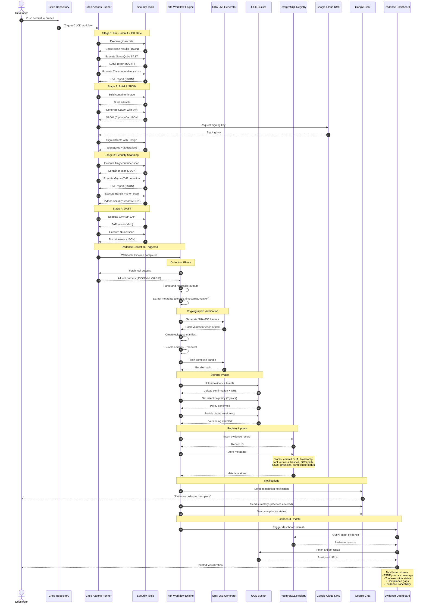
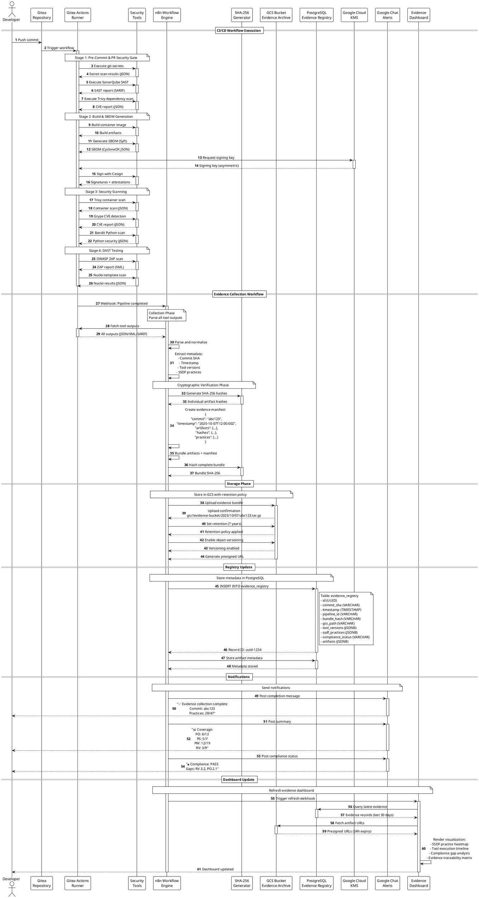

# Evidence Collection Data Flow

## Overview
This diagram illustrates the end-to-end evidence collection workflow, from CI/CD execution through tool output processing, cryptographic verification, storage, and dashboard visualization.

## Mermaid Sequence Diagram



## PlantUML Sequence Diagram



## ASCII Flow Diagram

```
┌─────────────────────────────────────────────────────────────────────────────────────────────────┐
│                              EVIDENCE COLLECTION DATA FLOW                                      │
│                          From CI/CD Execution to Dashboard Visualization                        │
└─────────────────────────────────────────────────────────────────────────────────────────────────┘

┌──────────┐
│Developer │
└────┬─────┘
     │ 1. Push commit
     ▼
┌─────────────────┐
│ Gitea Repository│
└────┬────────────┘
     │ 2. Trigger workflow
     ▼
┌─────────────────────────────────────────────────────────────────────────────────────────────────┐
│                              CI/CD WORKFLOW EXECUTION                                           │
│                            Gitea Actions Runner                                                 │
├─────────────────────────────────────────────────────────────────────────────────────────────────┤
│                                                                                                 │
│  STAGE 1: PRE-COMMIT & PR GATE                                                                 │
│  ┌─────────────┐    ┌─────────────┐    ┌─────────────┐                                       │
│  │ git-secrets │───▶│ SonarQube   │───▶│   Trivy     │                                       │
│  │   Secret    │    │    SAST     │    │ Dependency  │                                       │
│  │  Detection  │    │             │    │     CVE     │                                       │
│  └─────┬───────┘    └─────┬───────┘    └─────┬───────┘                                       │
│        │ results.json     │ report.sarif     │ cve.json                                       │
│        ▼                  ▼                  ▼                                                 │
│  ┌─────────────────────────────────────────────────────┐                                      │
│  │          Tool Output Collection Buffer              │                                      │
│  └─────────────────────────────────────────────────────┘                                      │
│                                                                                                 │
│  STAGE 2: BUILD & SBOM                                                                         │
│  ┌─────────────┐    ┌─────────────┐    ┌─────────────┐    ┌─────────────┐                   │
│  │   Docker    │───▶│    Syft     │───▶│ Google KMS  │───▶│   Cosign    │                   │
│  │    Build    │    │    SBOM     │    │   Signing   │    │  Artifact   │                   │
│  │  Container  │    │ Generation  │    │     Key     │    │   Signing   │                   │
│  └─────┬───────┘    └─────┬───────┘    └─────────────┘    └─────┬───────┘                   │
│        │ image.tar        │ sbom.json                            │ signatures                 │
│        ▼                  ▼                                      ▼                             │
│  ┌─────────────────────────────────────────────────────────────────────────┐                 │
│  │              Tool Output Collection Buffer                               │                 │
│  └─────────────────────────────────────────────────────────────────────────┘                 │
│                                                                                                 │
│  STAGE 3: SECURITY SCANNING                                                                    │
│  ┌─────────────┐    ┌─────────────┐    ┌─────────────┐                                       │
│  │    Trivy    │───▶│    Grype    │───▶│   Bandit    │                                       │
│  │  Container  │    │     CVE     │    │   Python    │                                       │
│  │    Scan     │    │  Detection  │    │  Security   │                                       │
│  └─────┬───────┘    └─────┬───────┘    └─────┬───────┘                                       │
│        │ scan.json        │ cve.json         │ bandit.json                                    │
│        ▼                  ▼                  ▼                                                 │
│  ┌─────────────────────────────────────────────────────┐                                      │
│  │          Tool Output Collection Buffer              │                                      │
│  └─────────────────────────────────────────────────────┘                                      │
│                                                                                                 │
│  STAGE 4: DAST                                                                                 │
│  ┌─────────────┐    ┌─────────────┐                                                           │
│  │  OWASP ZAP  │───▶│   Nuclei    │                                                           │
│  │  Web Scan   │    │  Template   │                                                           │
│  │             │    │    Scan     │                                                           │
│  └─────┬───────┘    └─────┬───────┘                                                           │
│        │ zap.xml          │ nuclei.json                                                        │
│        ▼                  ▼                                                                     │
│  ┌─────────────────────────────────────────────────────┐                                      │
│  │          Tool Output Collection Buffer              │                                      │
│  │   [All outputs: JSON, XML, SARIF formats]           │                                      │
│  └──────────────────────────┬──────────────────────────┘                                      │
│                             │                                                                  │
└─────────────────────────────┼──────────────────────────────────────────────────────────────────┘
                              │
                              │ 3. Webhook: Pipeline completed
                              ▼
┌─────────────────────────────────────────────────────────────────────────────────────────────────┐
│                          N8N WORKFLOW ENGINE - EVIDENCE COLLECTION                             │
├─────────────────────────────────────────────────────────────────────────────────────────────────┤
│                                                                                                 │
│  STEP 4: FETCH TOOL OUTPUTS                                                                    │
│  ┌───────────────────────────────────────────────────────────────────────────────────┐        │
│  │  HTTP Request Node: Fetch all outputs from CI runner                              │        │
│  │  - git-secrets results (JSON)                                                      │        │
│  │  - SonarQube SAST report (SARIF)                                                   │        │
│  │  - Trivy scans (JSON)                                                              │        │
│  │  - Grype CVE reports (JSON)                                                        │        │
│  │  - SBOM (CycloneDX JSON)                                                           │        │
│  │  - Cosign signatures                                                               │        │
│  │  - ZAP report (XML)                                                                │        │
│  │  - All other tool outputs                                                          │        │
│  └───────────────────────────┬───────────────────────────────────────────────────────┘        │
│                              │                                                                  │
│  STEP 5: PARSE & NORMALIZE                                                                     │
│  ┌───────────────────────────▼───────────────────────────────────────────────────────┐        │
│  │  Function Node: Parse all formats                                                  │        │
│  │  - Parse JSON (90% of outputs)                                                     │        │
│  │  - Parse XML (ZAP reports)                                                         │        │
│  │  - Parse SARIF (SonarQube)                                                         │        │
│  │  - Normalize to common schema                                                      │        │
│  └───────────────────────────┬───────────────────────────────────────────────────────┘        │
│                              │                                                                  │
│  STEP 6: EXTRACT METADATA                                                                      │
│  ┌───────────────────────────▼───────────────────────────────────────────────────────┐        │
│  │  Set Node: Extract key metadata                                                    │        │
│  │  {                                                                                  │        │
│  │    "commit_sha": "abc123...",                                                      │        │
│  │    "timestamp": "2025-10-07T12:00:00Z",                                           │        │
│  │    "branch": "feature/ssdf-cicd-pipeline",                                        │        │
│  │    "pipeline_id": "run-4567",                                                     │        │
│  │    "tool_versions": {                                                              │        │
│  │      "trivy": "0.48.0",                                                            │        │
│  │      "syft": "0.100.0",                                                            │        │
│  │      ...                                                                            │        │
│  │    },                                                                               │        │
│  │    "ssdf_practices": ["PO.1.1", "PS.1.1", "PW.2.1", ...]                          │        │
│  │  }                                                                                  │        │
│  └───────────────────────────┬───────────────────────────────────────────────────────┘        │
│                              │                                                                  │
│  STEP 7-8: GENERATE HASHES                                                                     │
│  ┌───────────────────────────▼───────────────────────────────────────────────────────┐        │
│  │  Code Node: SHA-256 cryptographic hashing                                          │        │
│  │                                                                                     │        │
│  │  For each artifact:                                                                │        │
│  │    hash = SHA256(artifact_content)                                                 │        │
│  │                                                                                     │        │
│  │  Output:                                                                            │        │
│  │  {                                                                                  │        │
│  │    "sbom.json": "e3b0c44298fc1c149afbf4c8996fb92427ae41e4649b934ca495991b7852b855",│        │
│  │    "trivy.json": "a591a6d40bf420404a011733cfb7b190d62c65bf0bcda32b57b277d9ad9f146e",│        │
│  │    ...                                                                              │        │
│  │  }                                                                                  │        │
│  └───────────────────────────┬───────────────────────────────────────────────────────┘        │
│                              │                                                                  │
│  STEP 9: CREATE MANIFEST                                                                       │
│  ┌───────────────────────────▼───────────────────────────────────────────────────────┐        │
│  │  Function Node: Evidence manifest creation                                         │        │
│  │                                                                                     │        │
│  │  manifest.json:                                                                     │        │
│  │  {                                                                                  │        │
│  │    "version": "1.0",                                                               │        │
│  │    "commit": "abc123...",                                                          │        │
│  │    "timestamp": "2025-10-07T12:00:00Z",                                           │        │
│  │    "artifacts": [                                                                   │        │
│  │      {"name": "sbom.json", "hash": "e3b0c44...", "type": "sbom"},                 │        │
│  │      {"name": "trivy.json", "hash": "a591a6d...", "type": "scan"},               │        │
│  │      ...                                                                            │        │
│  │    ],                                                                               │        │
│  │    "ssdf_practices": ["PO.1.1", "PS.1.1", ...],                                   │        │
│  │    "compliance_status": "PASS"                                                     │        │
│  │  }                                                                                  │        │
│  └───────────────────────────┬───────────────────────────────────────────────────────┘        │
│                              │                                                                  │
│  STEP 10: BUNDLE ARTIFACTS                                                                     │
│  ┌───────────────────────────▼───────────────────────────────────────────────────────┐        │
│  │  Execute Command Node: Create tarball                                              │        │
│  │                                                                                     │        │
│  │  $ tar -czf evidence-bundle-abc123.tar.gz \                                        │        │
│  │      manifest.json \                                                               │        │
│  │      sbom.json \                                                                    │        │
│  │      trivy.json \                                                                   │        │
│  │      grype.json \                                                                   │        │
│  │      zap.xml \                                                                      │        │
│  │      ...                                                                            │        │
│  │                                                                                     │        │
│  └───────────────────────────┬───────────────────────────────────────────────────────┘        │
│                              │                                                                  │
│  STEP 11: HASH BUNDLE                                                                          │
│  ┌───────────────────────────▼───────────────────────────────────────────────────────┐        │
│  │  Code Node: Hash complete bundle                                                   │        │
│  │                                                                                     │        │
│  │  bundle_hash = SHA256(evidence-bundle-abc123.tar.gz)                               │        │
│  │  bundle_hash = "f7fbba6e0636f890e56fbbf3283e524c6fa3204ae298382d624741d0dc6638326"│        │
│  └───────────────────────────┬───────────────────────────────────────────────────────┘        │
│                              │                                                                  │
└──────────────────────────────┼──────────────────────────────────────────────────────────────────┘
                               │
                               │ 12. Upload bundle
                               ▼
┌─────────────────────────────────────────────────────────────────────────────────────────────────┐
│                              STORAGE PHASE                                                      │
├─────────────────────────────────────────────────────────────────────────────────────────────────┤
│                                                                                                 │
│  GCS BUCKET: evidence-archive-bucket                                                           │
│  ┌─────────────────────────────────────────────────────────────────────────────────┐          │
│  │  Path: gs://evidence-archive/2025/10/07/abc123/evidence-bundle.tar.gz          │          │
│  │                                                                                  │          │
│  │  Properties:                                                                     │          │
│  │  - Object versioning: ENABLED                                                   │          │
│  │  - Retention policy: 7 years (2555 days)                                       │          │
│  │  - Immutable: TRUE (cannot delete before retention)                            │          │
│  │  - Storage class: STANDARD                                                      │          │
│  │  - Encryption: Google-managed                                                   │          │
│  │  - SHA-256 checksum: f7fbba6e0636f890e56fbbf3283e524c...                       │          │
│  │                                                                                  │          │
│  │  Metadata:                                                                       │          │
│  │    commit: abc123                                                               │          │
│  │    timestamp: 2025-10-07T12:00:00Z                                             │          │
│  │    pipeline_id: run-4567                                                        │          │
│  │    practices: PO.1.1,PS.1.1,PW.2.1,...                                         │          │
│  └──────────────────────────────────────────────────────────────────────────────────┘          │
│                                                                                                 │
│                              13. Upload confirmation                                            │
│                              14. Set retention policy                                           │
│                              15. Enable versioning                                              │
│                                                                                                 │
└─────────────────────────────────────────────────────────────────────────────────────────────────┘
                               │
                               │ 16. Insert record
                               ▼
┌─────────────────────────────────────────────────────────────────────────────────────────────────┐
│                          POSTGRESQL EVIDENCE REGISTRY                                           │
├─────────────────────────────────────────────────────────────────────────────────────────────────┤
│                                                                                                 │
│  TABLE: evidence_registry                                                                      │
│  ┌─────────────────────────────────────────────────────────────────────────────────────────┐  │
│  │ id                | UUID (PK)            | uuid-1234-5678-9abc-def0                     │  │
│  │ commit_sha        | VARCHAR(64)          | abc123...                                    │  │
│  │ timestamp         | TIMESTAMP            | 2025-10-07 12:00:00+00                      │  │
│  │ branch            | VARCHAR(255)         | feature/ssdf-cicd-pipeline                  │  │
│  │ pipeline_id       | VARCHAR(64)          | run-4567                                    │  │
│  │ bundle_hash       | VARCHAR(64)          | f7fbba6e0636f890e56fbbf3283e524c...         │  │
│  │ gcs_path          | VARCHAR(512)         | gs://evidence-archive/2025/10/07/abc123/... │  │
│  │ gcs_url           | TEXT                 | https://storage.googleapis.com/...          │  │
│  │ tool_versions     | JSONB                | {"trivy": "0.48.0", "syft": "0.100.0", ...} │  │
│  │ ssdf_practices    | JSONB                | ["PO.1.1", "PS.1.1", "PW.2.1", ...]         │  │
│  │ compliance_status | VARCHAR(20)          | PASS                                        │  │
│  │ artifacts         | JSONB                | [{"name": "sbom.json", ...}, ...]           │  │
│  │ created_at        | TIMESTAMP            | 2025-10-07 12:00:15+00                      │  │
│  └─────────────────────────────────────────────────────────────────────────────────────────┘  │
│                                                                                                 │
│  INDEXES:                                                                                       │
│  - idx_commit_sha ON commit_sha                                                                │
│  - idx_timestamp ON timestamp DESC                                                             │
│  - idx_practices ON ssdf_practices USING GIN                                                   │
│  - idx_compliance ON compliance_status                                                         │
│                                                                                                 │
│                              17. Record stored                                                  │
│                              18. Store metadata                                                 │
│                                                                                                 │
└─────────────────────────────────────────────────────────────────────────────────────────────────┘
                               │
                               │ 19-21. Send notifications
                               ▼
┌─────────────────────────────────────────────────────────────────────────────────────────────────┐
│                              GOOGLE CHAT NOTIFICATIONS                                          │
├─────────────────────────────────────────────────────────────────────────────────────────────────┤
│                                                                                                 │
│  Message 1: Completion Notification                                                            │
│  ┌─────────────────────────────────────────────────────────────────────────────────────────┐  │
│  │ ✅ Evidence Collection Complete                                                          │  │
│  │                                                                                          │  │
│  │ Commit: abc123...                                                                        │  │
│  │ Branch: feature/ssdf-cicd-pipeline                                                      │  │
│  │ Pipeline: run-4567                                                                       │  │
│  │ Timestamp: 2025-10-07 12:00:00 UTC                                                      │  │
│  │                                                                                          │  │
│  │ Evidence bundle: gs://evidence-archive/2025/10/07/abc123/evidence-bundle.tar.gz        │  │
│  │ SHA-256: f7fbba6e0636f890e56fbbf3283e524c...                                           │  │
│  └─────────────────────────────────────────────────────────────────────────────────────────┘  │
│                                                                                                 │
│  Message 2: SSDF Practice Summary                                                              │
│  ┌─────────────────────────────────────────────────────────────────────────────────────────┐  │
│  │ 📊 SSDF Practice Coverage: 28/47 (60%)                                                  │  │
│  │                                                                                          │  │
│  │ PO (Prepare Organization):    8/12 (67%)                                               │  │
│  │ PS (Protect Software):        5/7  (71%)                                               │  │
│  │ PW (Produce Well-Secured):   12/19 (63%)                                               │  │
│  │ RV (Respond to Vulns):        3/9  (33%)                                               │  │
│  └─────────────────────────────────────────────────────────────────────────────────────────┘  │
│                                                                                                 │
│  Message 3: Compliance Status                                                                  │
│  ┌─────────────────────────────────────────────────────────────────────────────────────────┐  │
│  │ 🔒 Compliance Status: PASS                                                               │  │
│  │                                                                                          │  │
│  │ ⚠️  Gaps Identified:                                                                     │  │
│  │   - RV.3.2: Vulnerability remediation tracking                                          │  │
│  │   - PO.2.1: Formal security training program                                            │  │
│  │                                                                                          │  │
│  │ 🔗 View Dashboard: https://dashboard.example.com/evidence/abc123                        │  │
│  └─────────────────────────────────────────────────────────────────────────────────────────┘  │
│                                                                                                 │
└─────────────────────────────────────────────────────────────────────────────────────────────────┘
                               │
                               │ 22. Trigger dashboard refresh
                               ▼
┌─────────────────────────────────────────────────────────────────────────────────────────────────┐
│                              EVIDENCE DASHBOARD UPDATE                                          │
├─────────────────────────────────────────────────────────────────────────────────────────────────┤
│                                                                                                 │
│  STEP 23: Query Latest Evidence                                                                │
│  ┌─────────────────────────────────────────────────────────────────────────────────────────┐  │
│  │ SELECT * FROM evidence_registry                                                          │  │
│  │ WHERE timestamp >= NOW() - INTERVAL '30 days'                                            │  │
│  │ ORDER BY timestamp DESC;                                                                  │  │
│  └─────────────────────────────────────────────────────────────────────────────────────────┘  │
│                                                                                                 │
│  STEP 24: Fetch Artifact URLs                                                                  │
│  ┌─────────────────────────────────────────────────────────────────────────────────────────┐  │
│  │ Generate presigned URLs for artifacts (24h expiry)                                       │  │
│  └─────────────────────────────────────────────────────────────────────────────────────────┘  │
│                                                                                                 │
│  STEP 25: Render Visualization                                                                 │
│  ┌─────────────────────────────────────────────────────────────────────────────────────────┐  │
│  │                                                                                          │  │
│  │  Dashboard Sections:                                                                     │  │
│  │                                                                                          │  │
│  │  1. SSDF Practice Coverage Heatmap                                                      │  │
│  │     - 47 practices across 4 groups                                                      │  │
│  │     - Color coded: Green (covered), Yellow (partial), Red (missing)                    │  │
│  │                                                                                          │  │
│  │  2. Tool Execution Timeline                                                             │  │
│  │     - Gantt chart of tool execution                                                     │  │
│  │     - Shows duration and status                                                         │  │
│  │                                                                                          │  │
│  │  3. Compliance Gap Analysis                                                             │  │
│  │     - List of missing practices                                                         │  │
│  │     - Recommendations for closure                                                       │  │
│  │                                                                                          │  │
│  │  4. Evidence Traceability Matrix                                                        │  │
│  │     - Commit → Tools → Artifacts → Practices                                            │  │
│  │     - Full audit trail with hashes                                                      │  │
│  │                                                                                          │  │
│  │  5. Download Links                                                                       │  │
│  │     - Individual artifacts (presigned URLs)                                             │  │
│  │     - Complete bundle                                                                    │  │
│  │     - Evidence manifest                                                                  │  │
│  │                                                                                          │  │
│  └─────────────────────────────────────────────────────────────────────────────────────────┘  │
│                                                                                                 │
└─────────────────────────────────────────────────────────────────────────────────────────────────┘
```

## Data Flow Details

### 1. Tool Output Formats

| Tool | Format | Size (avg) | Key Fields |
|------|--------|------------|------------|
| git-secrets | JSON | 5 KB | findings, line_numbers, patterns |
| SonarQube | SARIF | 50 KB | issues, rules, severity, locations |
| Trivy | JSON | 100 KB | vulnerabilities, cvss_score, fixed_version |
| Syft | CycloneDX JSON | 200 KB | components, licenses, dependencies |
| Cosign | Signature | 2 KB | signature, certificate, bundle |
| Grype | JSON | 80 KB | matches, artifact, source |
| Bandit | JSON | 30 KB | results, metrics, test_id |
| OWASP ZAP | XML | 500 KB | alerts, risk, confidence, uri |
| Nuclei | JSON | 20 KB | template-id, matcher-name, severity |

### 2. Evidence Manifest Schema

```json
{
  "version": "1.0",
  "metadata": {
    "commit_sha": "abc123def456...",
    "branch": "feature/ssdf-cicd-pipeline",
    "timestamp": "2025-10-07T12:00:00Z",
    "pipeline_id": "run-4567",
    "pipeline_url": "https://gitea.example.com/org/repo/actions/runs/4567",
    "author": "developer@example.com",
    "repository": "org/devsecops-platform"
  },
  "artifacts": [
    {
      "name": "sbom.json",
      "type": "sbom",
      "format": "cyclonedx",
      "version": "1.5",
      "sha256": "e3b0c44298fc1c149afbf4c8996fb92427ae41e4649b934ca495991b7852b855",
      "size_bytes": 204800,
      "tool": "syft",
      "tool_version": "0.100.0",
      "ssdf_practices": ["PW.4.1", "PW.9.1"]
    },
    {
      "name": "trivy-scan.json",
      "type": "vulnerability_scan",
      "format": "json",
      "sha256": "a591a6d40bf420404a011733cfb7b190d62c65bf0bcda32b57b277d9ad9f146e",
      "size_bytes": 102400,
      "tool": "trivy",
      "tool_version": "0.48.0",
      "ssdf_practices": ["PW.7.1", "RV.1.1"]
    }
  ],
  "tool_versions": {
    "git-secrets": "1.3.0",
    "sonarqube": "10.3",
    "trivy": "0.48.0",
    "syft": "0.100.0",
    "cosign": "2.2.1",
    "grype": "0.74.0",
    "bandit": "1.7.5",
    "owasp-zap": "2.14.0",
    "nuclei": "3.1.0"
  },
  "ssdf_practices": [
    {"practice": "PO.1.1", "status": "IMPLEMENTED", "evidence": ["git-secrets.json"]},
    {"practice": "PS.1.1", "status": "IMPLEMENTED", "evidence": ["git-commit-log.json"]},
    {"practice": "PW.2.1", "status": "IMPLEMENTED", "evidence": ["sonarqube.sarif"]},
    {"practice": "PW.4.1", "status": "IMPLEMENTED", "evidence": ["sbom.json"]},
    {"practice": "PW.7.1", "status": "IMPLEMENTED", "evidence": ["trivy-scan.json", "grype-scan.json"]},
    {"practice": "PW.9.1", "status": "IMPLEMENTED", "evidence": ["cosign-signatures.json"]},
    {"practice": "RV.1.1", "status": "IMPLEMENTED", "evidence": ["trivy-scan.json"]}
  ],
  "compliance": {
    "status": "PASS",
    "total_practices": 47,
    "implemented": 28,
    "coverage_percentage": 59.6,
    "gaps": ["RV.3.2", "PO.2.1"]
  },
  "cryptography": {
    "bundle_hash": "f7fbba6e0636f890e56fbbf3283e524c6fa3204ae298382d624741d0dc6638326",
    "hash_algorithm": "SHA-256",
    "signature": "MEUCIQDx...",
    "certificate": "-----BEGIN CERTIFICATE-----..."
  }
}
```

### 3. GCS Bucket Structure

```
evidence-archive-bucket/
├── 2025/
│   ├── 10/
│   │   ├── 07/
│   │   │   ├── abc123/
│   │   │   │   ├── evidence-bundle.tar.gz
│   │   │   │   ├── manifest.json
│   │   │   │   └── artifacts/
│   │   │   │       ├── sbom.json
│   │   │   │       ├── trivy-scan.json
│   │   │   │       ├── grype-scan.json
│   │   │   │       └── ...
│   │   │   ├── def456/
│   │   │   └── ...
│   │   ├── 08/
│   │   └── ...
│   ├── 11/
│   └── ...
└── retention-policy.json (7 years)
```

### 4. PostgreSQL Schema

```sql
CREATE TABLE evidence_registry (
    id UUID PRIMARY KEY DEFAULT gen_random_uuid(),
    commit_sha VARCHAR(64) NOT NULL,
    timestamp TIMESTAMP WITH TIME ZONE NOT NULL,
    branch VARCHAR(255),
    pipeline_id VARCHAR(64) NOT NULL,
    pipeline_url TEXT,
    author VARCHAR(255),
    repository VARCHAR(255),
    bundle_hash VARCHAR(64) NOT NULL,
    gcs_path VARCHAR(512) NOT NULL,
    gcs_url TEXT,
    tool_versions JSONB,
    ssdf_practices JSONB,
    compliance_status VARCHAR(20),
    compliance_percentage DECIMAL(5,2),
    artifacts JSONB,
    metadata JSONB,
    created_at TIMESTAMP WITH TIME ZONE DEFAULT NOW(),
    updated_at TIMESTAMP WITH TIME ZONE DEFAULT NOW()
);

CREATE INDEX idx_commit_sha ON evidence_registry(commit_sha);
CREATE INDEX idx_timestamp ON evidence_registry(timestamp DESC);
CREATE INDEX idx_practices ON evidence_registry USING GIN(ssdf_practices);
CREATE INDEX idx_compliance ON evidence_registry(compliance_status);
CREATE INDEX idx_pipeline ON evidence_registry(pipeline_id);

CREATE TABLE artifact_metadata (
    id UUID PRIMARY KEY DEFAULT gen_random_uuid(),
    evidence_id UUID REFERENCES evidence_registry(id) ON DELETE CASCADE,
    artifact_name VARCHAR(255) NOT NULL,
    artifact_type VARCHAR(50),
    format VARCHAR(50),
    sha256 VARCHAR(64) NOT NULL,
    size_bytes BIGINT,
    tool VARCHAR(100),
    tool_version VARCHAR(50),
    ssdf_practices VARCHAR(255)[],
    gcs_path VARCHAR(512),
    created_at TIMESTAMP WITH TIME ZONE DEFAULT NOW()
);

CREATE INDEX idx_artifact_evidence ON artifact_metadata(evidence_id);
CREATE INDEX idx_artifact_hash ON artifact_metadata(sha256);
```

### 5. n8n Workflow Nodes

| Node | Type | Purpose |
|------|------|---------|
| Webhook | Trigger | Receives pipeline completion event |
| HTTP Request | Action | Fetches tool outputs from CI runner |
| Function | Transform | Parses JSON/XML/SARIF formats |
| Set | Transform | Extracts and normalizes metadata |
| Code | Crypto | Generates SHA-256 hashes |
| Function | Transform | Creates evidence manifest |
| Execute Command | Action | Creates tarball bundle |
| Code | Crypto | Hashes complete bundle |
| Google Cloud Storage | Action | Uploads to GCS |
| Postgres | Action | Inserts evidence record |
| Google Chat | Notification | Sends completion message |
| HTTP Request | Action | Triggers dashboard refresh |

### 6. Evidence Collection Triggers

| Trigger | Event | Action |
|---------|-------|--------|
| Pipeline Complete | CI/CD workflow finishes | Start evidence collection |
| Upload Success | GCS upload confirmed | Update registry |
| Registry Insert | Database record created | Send notifications |
| Notification Sent | Chat message delivered | Refresh dashboard |
| Dashboard Update | Dashboard refreshed | Mark complete |

### 7. Security Controls

| Control | Implementation | NIST Reference |
|---------|----------------|----------------|
| Cryptographic hashing | SHA-256 on all artifacts | NIST SP 800-53 Rev. 5 SC-13 |
| Immutable storage | GCS retention policy (7 years) | NIST SP 800-53 Rev. 5 AU-11 |
| Access control | IAM policies for GCS and DB | NIST SP 800-53 Rev. 5 AC-3 |
| Audit logging | All access logged | NIST SP 800-53 Rev. 5 AU-2 |
| Data integrity | Hash verification on retrieval | NIST SP 800-53 Rev. 5 SI-7 |
| Encryption at rest | Google-managed encryption | NIST SP 800-53 Rev. 5 SC-28 |
| Encryption in transit | TLS 1.3 for all transfers | NIST SP 800-53 Rev. 5 SC-8 |

## Rendering Instructions

### Mermaid
```bash
mmdc -i EVIDENCE_COLLECTION_FLOW.md -o evidence-flow.png -t dark -b transparent -w 2000 -h 4000
```

### PlantUML
```bash
docker run -v $(pwd):/data plantuml/plantuml -tpng -DPLANTUML_LIMIT_SIZE=16384 /data/EVIDENCE_COLLECTION_FLOW.md
```

## References

- **NIST SP 800-53 Rev. 5**: Security and Privacy Controls (AU-*, SC-*, SI-*)
- **NIST SP 800-218**: SSDF practice evidence requirements
- **CycloneDX**: SBOM specification
- **SARIF**: Static Analysis Results Interchange Format
- **Google Cloud Storage**: Retention policy documentation
