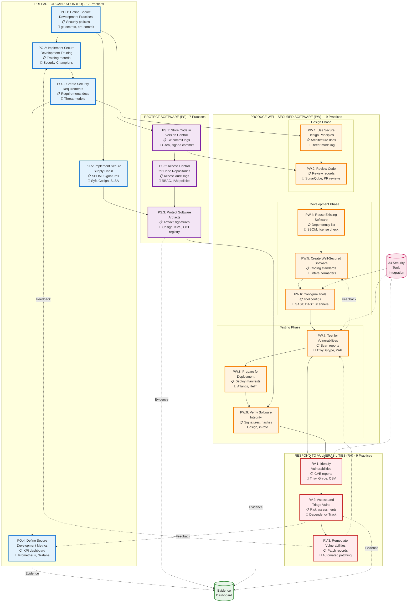
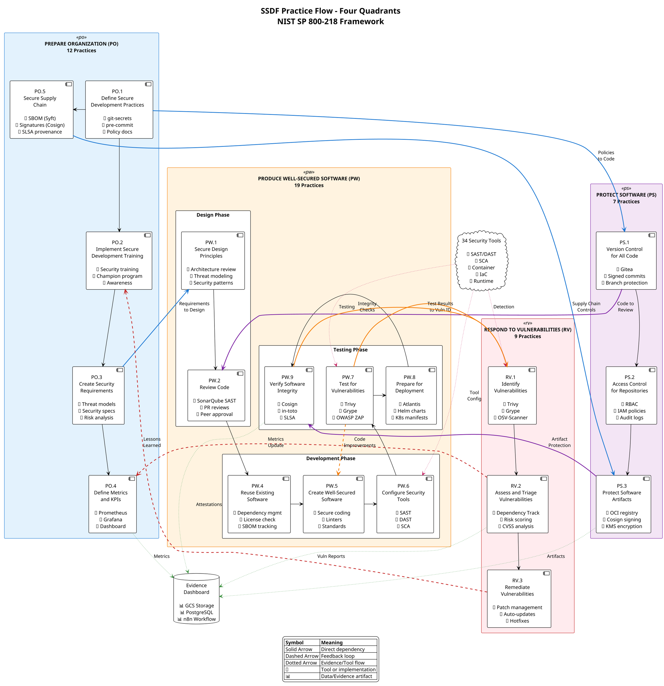

# SSDF Practice Flow Diagram

## Overview
This diagram maps all 47 NIST SSDF practices across four quadrants (Prepare Organization, Protect Software, Produce Well-Secured Software, Respond to Vulnerabilities), showing practice dependencies, evidence flows, tool integration points, and feedback loops.

## Mermaid Diagram



## PlantUML Four-Quadrant Diagram



## ASCII Four-Quadrant Diagram

```
┌─────────────────────────────────────────────────────────────────────────────────────────────────┐
│                                    SSDF PRACTICE FLOW                                           │
│                           NIST SP 800-218 - Four Quadrants                                      │
└─────────────────────────────────────────────────────────────────────────────────────────────────┘

┌─────────────────────────────────────────────┬───────────────────────────────────────────────────┐
│  QUADRANT 1: PREPARE ORGANIZATION (PO)      │  QUADRANT 2: PROTECT SOFTWARE (PS)               │
│  12 Practices - Foundation & Governance     │  7 Practices - Repository & Artifact Security    │
├─────────────────────────────────────────────┼───────────────────────────────────────────────────┤
│                                             │                                                   │
│  ┌────────────────────────────────────┐    │    ┌────────────────────────────────────┐        │
│  │ PO.1: Define Secure Development    │    │    │ PS.1: Version Control for Code     │        │
│  │       Practices                    │────┼───▶│       - Gitea repository           │        │
│  │ 🔧 git-secrets, pre-commit         │    │    │       - Signed commits             │        │
│  │ 📋 Security policies               │    │    │       - Branch protection          │        │
│  └────────────┬───────────────────────┘    │    └─────────────┬──────────────────────┘        │
│               │                             │                  │                                │
│               ▼                             │                  ▼                                │
│  ┌────────────────────────────────────┐    │    ┌────────────────────────────────────┐        │
│  │ PO.2: Implement Security Training  │    │    │ PS.2: Access Control for Repos     │        │
│  │ 🔧 Security Champions program      │    │    │       - RBAC policies              │        │
│  │ 📋 Training records                │    │    │       - IAM integration            │        │
│  └────────────┬───────────────────────┘    │    │       - Audit logging              │        │
│               │                             │    └─────────────┬──────────────────────┘        │
│               ▼                             │                  │                                │
│  ┌────────────────────────────────────┐    │                  ▼                                │
│  │ PO.3: Create Security Requirements │────┼───┐  ┌────────────────────────────────────┐      │
│  │ 🔧 Threat modeling                 │    │   │  │ PS.3: Protect Software Artifacts   │      │
│  │ 📋 Requirements docs               │    │   └─▶│       - OCI registry signing       │      │
│  └────────────┬───────────────────────┘    │      │       - Cosign + KMS               │      │
│               │                             │      │       - Immutable storage          │      │
│               ▼                             │      └────────────────────────────────────┘      │
│  ┌────────────────────────────────────┐    │                                                   │
│  │ PO.4: Define Metrics & KPIs        │◀───┼─────────────────┐                                │
│  │ 🔧 Prometheus, Grafana             │    │                 │ Feedback: Metrics              │
│  │ 📋 KPI dashboard                   │    │                 │                                │
│  └────────────┬───────────────────────┘    │                 │                                │
│               │                             │                 │                                │
│  ┌────────────▼───────────────────────┐    │                 │                                │
│  │ PO.5: Secure Supply Chain          │────┼───┐             │                                │
│  │ 🔧 SBOM (Syft)                     │    │   │             │                                │
│  │ 🔧 Signatures (Cosign)             │    │   │             │                                │
│  │ 🔧 SLSA provenance                 │    │   │             │                                │
│  └────────────────────────────────────┘    │   │             │                                │
│                                             │   │             │                                │
└─────────────────────────────────────────────┼───┼─────────────┼────────────────────────────────┘
                                              │   │             │
┌─────────────────────────────────────────────┼───┼─────────────┼────────────────────────────────┐
│  QUADRANT 3: PRODUCE WELL-SECURED SOFTWARE  │   │             │                                │
│  (PW) - 19 Practices                        │   │             │                                │
│  Design → Development → Testing → Deploy    │   │             │                                │
├─────────────────────────────────────────────┼───┼─────────────┼────────────────────────────────┤
│                                             │   │             │                                │
│  ┌─────────── DESIGN PHASE ─────────────┐  │   │             │                                │
│  │                                       │  │   │             │                                │
│  │  ┌──────────────────────────────┐    │◀─┘   │             │                                │
│  │  │ PW.1: Secure Design          │    │      │             │                                │
│  │  │       Principles              │    │      │             │                                │
│  │  │ 🔧 Architecture review        │    │      │             │
│  │  └────────────┬─────────────────┘    │      │             │                                │
│  │               ▼                       │      │             │                                │
│  │  ┌──────────────────────────────┐    │      │             │                                │
│  │  │ PW.2: Review Code            │◀───┼──────┘             │                                │
│  │  │ 🔧 SonarQube SAST            │    │                    │                                │
│  │  │ 🔧 PR reviews                │    │                    │                                │
│  │  └────────────┬─────────────────┘    │                    │                                │
│  └───────────────┼───────────────────────┘                    │                                │
│                  ▼                                             │                                │
│  ┌─────────── DEVELOPMENT PHASE ─────────┐                    │                                │
│  │                                        │                    │                                │
│  │  ┌──────────────────────────────┐     │                    │                                │
│  │  │ PW.4: Reuse Existing         │     │                    │                                │
│  │  │       Software               │     │                    │                                │
│  │  │ 🔧 Dependency management     │     │                    │                                │
│  │  └────────────┬─────────────────┘     │                    │                                │
│  │               ▼                        │                    │                                │
│  │  ┌──────────────────────────────┐     │                    │                                │
│  │  │ PW.5: Create Well-Secured    │◀────┼────────────────────┘ Feedback from testing         │
│  │  │       Software               │     │                                                     │
│  │  │ 🔧 Secure coding standards   │     │                                                     │
│  │  └────────────┬─────────────────┘     │                                                     │
│  │               ▼                        │                                                     │
│  │  ┌──────────────────────────────┐     │                                                     │
│  │  │ PW.6: Configure Security     │     │    ┌────────────────────────────────┐              │
│  │  │       Tools                  │◀────┼────│  34 Security Tools Hub         │              │
│  │  │ 🔧 SAST, DAST, SCA          │     │    │  - SAST: SonarQube, Semgrep    │              │
│  │  └────────────┬─────────────────┘     │    │  - SCA: Trivy, Grype           │              │
│  └───────────────┼────────────────────────┘    │  - Container: Syft, Cosign     │              │
│                  ▼                             │  - IaC: Checkov, tfsec         │              │
│  ┌─────────── TESTING PHASE ──────────┐       │  - DAST: ZAP, Nuclei           │              │
│  │                                     │       │  - Runtime: Falco, Wazuh       │              │
│  │  ┌──────────────────────────────┐  │       └────────────────────────────────┘              │
│  │  │ PW.7: Test for               │◀─┼─────────────────┐                                     │
│  │  │       Vulnerabilities        │  │                 │                                     │
│  │  │ 🔧 Trivy, Grype, ZAP        │  │                 │                                     │
│  │  └────────────┬─────────────────┘  │                 │                                     │
│  │               ▼                     │                 │                                     │
│  │  ┌──────────────────────────────┐  │                 │                                     │
│  │  │ PW.8: Prepare for            │  │                 │                                     │
│  │  │       Deployment             │  │                 │                                     │
│  │  │ 🔧 Atlantis, Helm            │  │                 │                                     │
│  │  └────────────┬─────────────────┘  │                 │                                     │
│  │               ▼                     │                 │                                     │
│  │  ┌──────────────────────────────┐  │                 │                                     │
│  │  │ PW.9: Verify Software        │◀─┼───┐             │                                     │
│  │  │       Integrity              │  │   │             │                                     │
│  │  │ 🔧 Cosign, in-toto, SLSA    │  │   │             │                                     │
│  │  └────────────┬─────────────────┘  │   │             │                                     │
│  └───────────────┼─────────────────────┘   │             │                                     │
│                  │                         │             │                                     │
└──────────────────┼─────────────────────────┼─────────────┼─────────────────────────────────────┘
                   │                         │             │
┌──────────────────┼─────────────────────────┼─────────────┼─────────────────────────────────────┐
│  QUADRANT 4: RESPOND TO VULNERABILITIES     │             │                                     │
│  (RV) - 9 Practices                         │             │                                     │
├─────────────────────────────────────────────┼─────────────┼─────────────────────────────────────┤
│                                             │             │                                     │
│                  ┌──────────────────────────▼─────────────▼────┐                               │
│                  │ RV.1: Identify Vulnerabilities              │                               │
│                  │ 🔧 Trivy, Grype, OSV-Scanner                │                               │
│                  │ 📋 CVE database, NVD feeds                  │                               │
│                  └──────────────┬──────────────────────────────┘                               │
│                                 ▼                                                               │
│                  ┌──────────────────────────────────────────────┐                              │
│                  │ RV.2: Assess and Triage Vulnerabilities      │                              │
│                  │ 🔧 Dependency Track                          │                              │
│                  │ 🔧 Risk scoring (CVSS)                       │───────────────┐              │
│                  │ 📋 Risk assessments                          │               │              │
│                  └──────────────┬───────────────────────────────┘               │              │
│                                 ▼                                                │              │
│                  ┌──────────────────────────────────────────────┐               │              │
│                  │ RV.3: Remediate Vulnerabilities              │               │              │
│                  │ 🔧 Patch management                          │               │              │
│                  │ 🔧 Automated updates                         │               │              │
│                  │ 📋 Remediation records                       │               │              │
│                  └──────────────┬───────────────────────────────┘               │              │
│                                 │                                                │              │
│                                 └───────────────────┐                            │              │
│                                        Feedback     │                            │              │
│                                                     │                            │              │
└─────────────────────────────────────────────────────┼────────────────────────────┼──────────────┘
                                                      │                            │
                                                      ▼                            │
                                         Lessons Learned (PO.2)                    │
                                                                                   │
                                                                                   ▼
                                                                          Metrics Update (PO.4)

┌─────────────────────────────────────────────────────────────────────────────────────────────────┐
│                              EVIDENCE COLLECTION & STORAGE                                      │
├─────────────────────────────────────────────────────────────────────────────────────────────────┤
│                                                                                                 │
│   ┌─────────────────────────────────────────────────────────────────────────────────────┐     │
│   │                           Evidence Dashboard & Registry                              │     │
│   │                                                                                       │     │
│   │  📊 GCS Bucket (7-year retention)    📊 PostgreSQL (metadata)                       │     │
│   │  📊 n8n Workflow (automation)        📊 Grafana (visualization)                     │     │
│   │                                                                                       │     │
│   │  Evidence Sources:                                                                   │     │
│   │    ├─ PO.4 ──▶ Metrics and KPIs                                                     │     │
│   │    ├─ PS.3 ──▶ Artifact signatures and manifests                                    │     │
│   │    ├─ PW.9 ──▶ Attestations (SLSA, in-toto)                                        │     │
│   │    └─ RV.2 ──▶ Vulnerability reports and risk assessments                          │     │
│   │                                                                                       │     │
│   └───────────────────────────────────────────────────────────────────────────────────── ┘     │
│                                                                                                 │
└─────────────────────────────────────────────────────────────────────────────────────────────────┘

Legend:
─────▶  Direct dependency
- - -▶  Feedback loop
······▶ Evidence/tool flow
🔧      Tool or implementation
📋      Evidence artifact
```

## Practice Details by Quadrant

### QUADRANT 1: PREPARE ORGANIZATION (PO) - 12 Practices

#### PO.1: Define Secure Development Practices
- **Sub-practices**: PO.1.1, PO.1.2, PO.1.3
- **Tools**: git-secrets, pre-commit hooks, policy documentation
- **Evidence**: Security policies, SDLC documentation, standards
- **Dependencies**: Foundation for all other practices

#### PO.2: Implement Secure Development Training
- **Sub-practices**: PO.2.1, PO.2.2
- **Tools**: Security Champions program, training platforms
- **Evidence**: Training records, certifications, awareness metrics
- **Dependencies**: PO.1 → PO.2

#### PO.3: Create Security Requirements
- **Sub-practices**: PO.3.1, PO.3.2, PO.3.3
- **Tools**: Threat modeling, requirements management
- **Evidence**: Requirements documents, threat models, risk analysis
- **Dependencies**: PO.2 → PO.3; PO.3 → PW.1

#### PO.4: Define Metrics and KPIs
- **Sub-practices**: PO.4.1, PO.4.2
- **Tools**: Prometheus, Grafana, custom dashboards
- **Evidence**: KPI dashboard, trend analysis, compliance reports
- **Dependencies**: PO.3 → PO.4; receives feedback from RV.2

#### PO.5: Secure Supply Chain
- **Sub-practices**: PO.5.1, PO.5.2
- **Tools**: Syft (SBOM), Cosign (signing), SLSA (provenance)
- **Evidence**: SBOM files, signatures, provenance attestations
- **Dependencies**: PO.1 → PO.5; PO.5 → PS.3

---

### QUADRANT 2: PROTECT SOFTWARE (PS) - 7 Practices

#### PS.1: Store Code in Version Control
- **Sub-practices**: PS.1.1
- **Tools**: Gitea, Git signed commits, branch protection
- **Evidence**: Commit logs, branch policies, access records
- **Dependencies**: PO.1 → PS.1; PS.1 → PW.2

#### PS.2: Access Control for Repositories
- **Sub-practices**: PS.2.1
- **Tools**: RBAC, IAM policies, audit logging
- **Evidence**: Access audit logs, permission matrices, policy documents
- **Dependencies**: PS.1 → PS.2

#### PS.3: Protect Software Artifacts
- **Sub-practices**: PS.3.1, PS.3.2
- **Tools**: OCI registry, Cosign, KMS, immutable storage
- **Evidence**: Artifact signatures, access logs, encryption records
- **Dependencies**: PS.2 → PS.3; PO.5 → PS.3; PS.3 → PW.9

---

### QUADRANT 3: PRODUCE WELL-SECURED SOFTWARE (PW) - 19 Practices

#### Design Phase

##### PW.1: Use Secure Design Principles
- **Sub-practices**: PW.1.1, PW.1.2, PW.1.3
- **Tools**: Architecture review, threat modeling
- **Evidence**: Design documents, threat models, security patterns
- **Dependencies**: PO.3 → PW.1; PW.1 → PW.2

##### PW.2: Review Code
- **Sub-practices**: PW.2.1
- **Tools**: SonarQube, PR reviews, manual review
- **Evidence**: Review records, SAST reports, approval logs
- **Dependencies**: PS.1 → PW.2; PW.2 → PW.4

#### Development Phase

##### PW.4: Reuse Existing Software
- **Sub-practices**: PW.4.1, PW.4.4
- **Tools**: Dependency management, license checking
- **Evidence**: Dependency lists, SBOM, license compliance
- **Dependencies**: PW.2 → PW.4; PW.4 → PW.5

##### PW.5: Create Well-Secured Software
- **Sub-practices**: PW.5.1
- **Tools**: Secure coding standards, linters, formatters
- **Evidence**: Code quality reports, standards compliance
- **Dependencies**: PW.4 → PW.5; receives feedback from PW.7

##### PW.6: Configure Security Tools
- **Sub-practices**: PW.6.1, PW.6.2
- **Tools**: SAST, DAST, SCA configuration
- **Evidence**: Tool configurations, scan results
- **Dependencies**: PW.5 → PW.6; integrates with 34 security tools

#### Testing Phase

##### PW.7: Test for Vulnerabilities
- **Sub-practices**: PW.7.1, PW.7.2
- **Tools**: Trivy, Grype, OWASP ZAP, Nuclei
- **Evidence**: Scan reports, DAST results, CVE lists
- **Dependencies**: PW.6 → PW.7; PW.7 → RV.1; provides feedback to PW.5

##### PW.8: Prepare for Deployment
- **Sub-practices**: PW.8.1, PW.8.2
- **Tools**: Atlantis, Helm, Kubernetes manifests
- **Evidence**: Deployment configurations, release notes
- **Dependencies**: PW.7 → PW.8; PW.8 → PW.9

##### PW.9: Verify Software Integrity
- **Sub-practices**: PW.9.1, PW.9.2
- **Tools**: Cosign, in-toto, SLSA provenance
- **Evidence**: Signatures, attestations, hashes
- **Dependencies**: PS.3 → PW.9; PW.9 → RV.1

---

### QUADRANT 4: RESPOND TO VULNERABILITIES (RV) - 9 Practices

#### RV.1: Identify Vulnerabilities
- **Sub-practices**: RV.1.1, RV.1.2, RV.1.3
- **Tools**: Trivy, Grype, OSV-Scanner, NVD feeds
- **Evidence**: CVE reports, vulnerability lists, scan results
- **Dependencies**: PW.7 → RV.1; PW.9 → RV.1; RV.1 → RV.2

#### RV.2: Assess and Triage Vulnerabilities
- **Sub-practices**: RV.2.1, RV.2.2
- **Tools**: Dependency Track, CVSS scoring, risk analysis
- **Evidence**: Risk assessments, triage decisions, priority lists
- **Dependencies**: RV.1 → RV.2; provides feedback to PO.4

#### RV.3: Remediate Vulnerabilities
- **Sub-practices**: RV.3.1, RV.3.2, RV.3.3, RV.3.4
- **Tools**: Patch management, automated updates, hotfix deployment
- **Evidence**: Patch records, remediation logs, verification results
- **Dependencies**: RV.2 → RV.3; provides feedback to PO.2 and PW.7

---

## Practice Dependencies

### Primary Flows
1. **Policy to Implementation**: PO.1 → PS.1 → PW.2
2. **Requirements to Design**: PO.3 → PW.1 → PW.2
3. **Supply Chain**: PO.5 → PS.3 → PW.9
4. **Testing to Response**: PW.7 → RV.1 → RV.2 → RV.3

### Feedback Loops
1. **Vulnerability Lessons**: RV.3 → PO.2 (training updates)
2. **Metrics Update**: RV.2 → PO.4 (KPI refinement)
3. **Code Improvements**: PW.7 → PW.5 (secure coding)

---

## Evidence Flows

All practices generate evidence that flows to the central Evidence Dashboard:

### Evidence Sources
- **PO.4**: Metrics, KPIs, compliance reports
- **PS.3**: Artifact signatures, manifests, access logs
- **PW.9**: Attestations (SLSA, in-toto), integrity proofs
- **RV.2**: Vulnerability reports, risk assessments

### Evidence Storage
- **GCS Bucket**: Long-term immutable storage (7-year retention)
- **PostgreSQL**: Metadata, indexes, query interface
- **n8n Workflow**: Automated collection and processing
- **Grafana**: Visualization and dashboards

---

## Tool Integration Points

### Central Integration Hub
34 security tools integrate at multiple points:

- **PW.6**: Tool configuration and initialization
- **PW.7**: Active testing and scanning
- **RV.1**: Vulnerability detection and identification

### Tool Categories
1. **SAST**: SonarQube, Semgrep, Bandit
2. **SCA**: Trivy, Grype, OSV-Scanner
3. **Container**: Syft, Cosign, Docker Bench
4. **IaC**: Checkov, tfsec, Terrascan
5. **DAST**: OWASP ZAP, Nuclei
6. **Runtime**: Falco, Wazuh, osquery
7. **Monitoring**: Prometheus, Grafana, Loki

---

## Rendering Instructions

### Mermaid
```bash
mmdc -i SSDF_PRACTICE_FLOW.md -o ssdf-practice-flow.png -t dark -b transparent -w 2400 -h 2400
```

### PlantUML
```bash
docker run -v $(pwd):/data plantuml/plantuml -tpng /data/SSDF_PRACTICE_FLOW.md
```

---

## References

- **NIST SP 800-218**: Secure Software Development Framework Version 1.1
- **SSDF Practice Catalog**: All 47 tasks across 4 practice groups
- **CISA Attestation Form**: Alignment with federal requirements
