# Tool Integration Architecture

## Overview
This diagram visualizes the network architecture of 34 security tools integrated into the SSDF-compliant CI/CD pipeline, showing data flows, integration methods, and communication patterns.

## Mermaid Network Diagram

```mermaid
graph TB
    subgraph Central["CENTRAL HUB"]
        Runner[("Gitea Actions<br/>Runner<br/><br/>🔧 Orchestration<br/>📦 Plugin system<br/>🔄 Event bus")]
    end

    subgraph SAST["STATIC ANALYSIS (SAST)"]
        SQ["SonarQube<br/>🔧 Code quality<br/>📊 SARIF output<br/>🔗 API"]
        Semgrep["Semgrep<br/>🔧 Pattern matching<br/>📊 JSON output<br/>🔗 CLI"]
        Bandit["Bandit<br/>🔧 Python security<br/>📊 JSON output<br/>🔗 CLI"]
        GitSec["git-secrets<br/>🔧 Secret detection<br/>📊 Text output<br/>🔗 Git hook"]
    end

    subgraph Container["CONTAINER SECURITY"]
        Trivy["Trivy<br/>🔧 Image/FS scan<br/>📊 JSON output<br/>🔗 CLI"]
        Grype["Grype<br/>🔧 CVE detection<br/>📊 JSON output<br/>🔗 CLI"]
        Syft["Syft<br/>🔧 SBOM generation<br/>📊 CycloneDX<br/>🔗 CLI"]
        Cosign["Cosign<br/>🔧 Signing/verify<br/>📊 Signature<br/>🔗 CLI"]
        DockerBench["Docker Bench<br/>🔧 CIS benchmark<br/>📊 JSON output<br/>🔗 CLI"]
    end

    subgraph IaC["INFRASTRUCTURE as CODE"]
        Checkov["Checkov<br/>🔧 Multi-IaC scan<br/>📊 JSON/SARIF<br/>🔗 CLI"]
        TFSec["tfsec<br/>🔧 Terraform scan<br/>📊 JSON output<br/>🔗 CLI"]
        Terrascan["Terrascan<br/>🔧 Policy as code<br/>📊 JSON output<br/>🔗 CLI"]
        Atlantis["Atlantis<br/>🔧 GitOps Terraform<br/>📊 PR comments<br/>🔗 Webhook"]
        Terragrunt["Terragrunt<br/>🔧 TF wrapper<br/>📊 Logs<br/>🔗 CLI"]
    end

    subgraph DAST["DYNAMIC ANALYSIS (DAST)"]
        ZAP["OWASP ZAP<br/>🔧 Web app scan<br/>📊 XML/JSON<br/>🔗 API"]
        Nuclei["Nuclei<br/>🔧 Template scan<br/>📊 JSON output<br/>🔗 CLI"]
        SSLyze["SSLyze<br/>🔧 TLS/SSL scan<br/>📊 JSON output<br/>🔗 CLI"]
    end

    subgraph SCA["SOFTWARE COMPOSITION"]
        OSV["OSV-Scanner<br/>🔧 Vuln DB<br/>📊 JSON output<br/>🔗 CLI"]
        DepTrack["Dependency Track<br/>🔧 Risk analysis<br/>📊 REST API<br/>🔗 API"]
        LicenseFinder["License Finder<br/>🔧 License check<br/>📊 JSON output<br/>🔗 CLI"]
    end

    subgraph Runtime["RUNTIME SECURITY"]
        Falco["Falco<br/>🔧 Runtime threat<br/>📊 JSON logs<br/>🔗 gRPC"]
        Wazuh["Wazuh<br/>🔧 HIDS/SIEM<br/>📊 JSON logs<br/>🔗 Agent"]
        Osquery["osquery<br/>🔧 OS analytics<br/>📊 JSON output<br/>🔗 CLI"]
    end

    subgraph GCP["GCP SECURITY SERVICES"]
        SCC["Security Command<br/>Center<br/>🔧 Asset discovery<br/>📊 REST API<br/>🔗 API"]
        KMS["Cloud KMS<br/>🔧 Key management<br/>📊 Crypto API<br/>🔗 API"]
        Logging["Cloud Logging<br/>🔧 Centralized logs<br/>📊 JSON logs<br/>🔗 API"]
        Armor["Cloud Armor<br/>🔧 WAF/DDoS<br/>📊 Metrics<br/>🔗 API"]
    end

    subgraph Monitor["MONITORING & OBSERVABILITY"]
        Prom["Prometheus<br/>🔧 Metrics<br/>📊 Time series<br/>🔗 HTTP"]
        Grafana["Grafana<br/>🔧 Visualization<br/>📊 Dashboards<br/>🔗 HTTP"]
        Loki["Loki<br/>🔧 Log aggregation<br/>📊 LogQL<br/>🔗 HTTP"]
        AlertMgr["Alertmanager<br/>🔧 Alerts<br/>📊 Notifications<br/>🔗 Webhook"]
    end

    subgraph Automation["AUTOMATION & WORKFLOW"]
        N8N["n8n<br/>🔧 Workflow engine<br/>📊 JSON data<br/>🔗 Webhook/API"]
        Vault["HashiCorp Vault<br/>🔧 Secret mgmt<br/>📊 REST API<br/>🔗 API"]
    end

    subgraph Storage["EVIDENCE STORAGE"]
        GCS[("GCS Bucket<br/>🗄️ Artifacts<br/>🔒 Encrypted<br/>⏰ 7-year retention")]
        DB[("PostgreSQL<br/>🗄️ Metadata<br/>🔍 Query interface<br/>📊 JSONB")]
    end

    %% Runner to SAST
    Runner -->|"CLI exec"| SQ
    Runner -->|"CLI exec"| Semgrep
    Runner -->|"CLI exec"| Bandit
    Runner -->|"Git hook"| GitSec

    %% SAST to Runner
    SQ -->|"SARIF"| Runner
    Semgrep -->|"JSON"| Runner
    Bandit -->|"JSON"| Runner
    GitSec -->|"Text"| Runner

    %% Runner to Container
    Runner -->|"CLI exec"| Trivy
    Runner -->|"CLI exec"| Grype
    Runner -->|"CLI exec"| Syft
    Runner -->|"CLI exec + KMS"| Cosign
    Runner -->|"CLI exec"| DockerBench

    %% Container to Runner
    Trivy -->|"JSON"| Runner
    Grype -->|"JSON"| Runner
    Syft -->|"CycloneDX"| Runner
    Cosign -->|"Signature"| Runner
    DockerBench -->|"JSON"| Runner

    %% Runner to IaC
    Runner -->|"CLI exec"| Checkov
    Runner -->|"CLI exec"| TFSec
    Runner -->|"CLI exec"| Terrascan
    Runner -->|"Webhook"| Atlantis
    Runner -->|"CLI exec"| Terragrunt

    %% IaC to Runner
    Checkov -->|"JSON/SARIF"| Runner
    TFSec -->|"JSON"| Runner
    Terrascan -->|"JSON"| Runner
    Atlantis -->|"PR Comment"| Runner
    Terragrunt -->|"Logs"| Runner

    %% Runner to DAST
    Runner -->|"API call"| ZAP
    Runner -->|"CLI exec"| Nuclei
    Runner -->|"CLI exec"| SSLyze

    %% DAST to Runner
    ZAP -->|"XML/JSON"| Runner
    Nuclei -->|"JSON"| Runner
    SSLyze -->|"JSON"| Runner

    %% Runner to SCA
    Runner -->|"CLI exec"| OSV
    Runner -->|"API call"| DepTrack
    Runner -->|"CLI exec"| LicenseFinder

    %% SCA to Runner
    OSV -->|"JSON"| Runner
    DepTrack -->|"JSON"| Runner
    LicenseFinder -->|"JSON"| Runner

    %% Runner to Runtime
    Runner -->|"Config"| Falco
    Runner -->|"Config"| Wazuh
    Runner -->|"CLI exec"| Osquery

    %% Runtime to Monitoring
    Falco -->|"JSON logs"| Loki
    Wazuh -->|"JSON logs"| Loki
    Osquery -->|"JSON"| Runner

    %% Runner to GCP
    Runner -->|"API call"| SCC
    Runner -->|"API call"| KMS
    Runner -->|"API call"| Logging
    Runner -->|"API call"| Armor

    %% GCP to Runner
    SCC -->|"JSON"| Runner
    KMS -->|"Keys"| Runner
    Logging -->|"Logs"| Runner
    Armor -->|"Status"| Runner

    %% Monitoring
    Runner -->|"Metrics"| Prom
    Prom -->|"Scrape"| Grafana
    Prom -->|"Alerts"| AlertMgr
    Runner -->|"Logs"| Loki
    Loki -->|"Query"| Grafana

    %% Automation
    Runner -->|"Webhook"| N8N
    Runner -->|"API call"| Vault
    Vault -->|"Secrets"| Runner

    %% Evidence collection
    Runner -->|"Tool outputs"| N8N
    N8N -->|"Upload"| GCS
    N8N -->|"Insert"| DB

    %% Styling
    classDef runner fill:#673ab7,stroke:#311b92,stroke-width:4px,color:#fff
    classDef sast fill:#e3f2fd,stroke:#1976d2,stroke-width:2px
    classDef container fill:#f3e5f5,stroke:#7b1fa2,stroke-width:2px
    classDef iac fill:#fff3e0,stroke:#f57c00,stroke-width:2px
    classDef dast fill:#e8f5e9,stroke:#388e3c,stroke-width:2px
    classDef sca fill:#fff9c4,stroke:#f57f17,stroke-width:2px
    classDef runtime fill:#ffebee,stroke:#c62828,stroke-width:2px
    classDef gcp fill:#e0f2f1,stroke:#00695c,stroke-width:2px
    classDef monitor fill:#ede7f6,stroke:#512da8,stroke-width:2px
    classDef auto fill:#fce4ec,stroke:#c2185b,stroke-width:2px
    classDef storage fill:#eceff1,stroke:#455a64,stroke-width:2px

    class Runner runner
    class SQ,Semgrep,Bandit,GitSec sast
    class Trivy,Grype,Syft,Cosign,DockerBench container
    class Checkov,TFSec,Terrascan,Atlantis,Terragrunt iac
    class ZAP,Nuclei,SSLyze dast
    class OSV,DepTrack,LicenseFinder sca
    class Falco,Wazuh,Osquery runtime
    class SCC,KMS,Logging,Armor gcp
    class Prom,Grafana,Loki,AlertMgr monitor
    class N8N,Vault auto
    class GCS,DB storage
```



## PlantUML Component Diagram

```plantuml
@startuml Tool_Integration_Architecture
!theme plain
scale 1.2

skinparam backgroundColor #FFFFFF
skinparam componentStyle rectangle
skinparam shadowing false

title Tool Integration Architecture\n34 Security Tools + SSDF CI/CD Pipeline

' Central hub
package "CENTRAL ORCHESTRATION" {
  [Gitea Actions Runner] as Runner <<orchestrator>>
  note right of Runner
    Integration Methods:
    - CLI execution
    - API calls
    - Webhooks
    - File I/O
  end note
}

' SAST tools
package "STATIC ANALYSIS (SAST)" <<sast>> {
  [SonarQube] as SQ
  [Semgrep]
  [Bandit]
  [git-secrets] as GitSec

  note bottom of SQ
    Output: SARIF
    Integration: API
    SSDF: PW.2.1, PW.6.1
  end note
}

' Container tools
package "CONTAINER SECURITY" <<container>> {
  [Trivy]
  [Grype]
  [Syft]
  [Cosign]
  [Docker Bench] as DockerBench

  note bottom of Syft
    Output: CycloneDX JSON
    Integration: CLI
    SSDF: PW.4.1, PW.9.1
  end note
}

' IaC tools
package "INFRASTRUCTURE as CODE" <<iac>> {
  [Checkov]
  [tfsec]
  [Terrascan]
  [Atlantis]
  [Terragrunt]

  note bottom of Checkov
    Output: JSON/SARIF
    Integration: CLI
    SSDF: PW.7.1
  end note
}

' DAST tools
package "DYNAMIC ANALYSIS (DAST)" <<dast>> {
  [OWASP ZAP] as ZAP
  [Nuclei]
  [SSLyze]

  note bottom of ZAP
    Output: XML/JSON
    Integration: API
    SSDF: PW.7.2, PW.8.1
  end note
}

' SCA tools
package "SOFTWARE COMPOSITION" <<sca>> {
  [OSV-Scanner] as OSV
  [Dependency Track] as DepTrack
  [License Finder] as LicenseFinder

  note bottom of DepTrack
    Output: JSON (REST)
    Integration: API
    SSDF: RV.1.1, RV.2.1
  end note
}

' Runtime security
package "RUNTIME SECURITY" <<runtime>> {
  [Falco]
  [Wazuh]
  [osquery]

  note bottom of Falco
    Output: JSON logs
    Integration: gRPC
    SSDF: RV.1.2, RV.2.2
  end note
}

' GCP services
cloud "GCP SECURITY SERVICES" <<gcp>> {
  [Security Command Center] as SCC
  [Cloud KMS] as KMS
  [Cloud Logging] as Logging
  [Cloud Armor] as Armor

  note bottom of KMS
    Integration: REST API
    Purpose: Signing keys
    SSDF: PS.3.1
  end note
}

' Monitoring
package "MONITORING & OBSERVABILITY" <<monitor>> {
  [Prometheus] as Prom
  [Grafana]
  [Loki]
  [Alertmanager] as AlertMgr

  note bottom of Prom
    Integration: HTTP scrape
    Metrics: Tool execution
    SSDF: PO.4.1
  end note
}

' Automation
package "AUTOMATION" <<automation>> {
  [n8n Workflow Engine] as N8N
  [HashiCorp Vault] as Vault

  note bottom of N8N
    Integration: Webhook/API
    Purpose: Evidence collection
    SSDF: PO.3.1
  end note
}

' Storage
database "EVIDENCE STORAGE" <<storage>> {
  [GCS Bucket] as GCS
  [PostgreSQL Registry] as DB

  note bottom of GCS
    Retention: 7 years
    Encryption: Google-managed
    SSDF: PO.2.1, PO.3.2
  end note
}

' Connections: Runner to SAST
Runner -down-> SQ : "API: /api/issues/search"
Runner -down-> Semgrep : "CLI: semgrep scan"
Runner -down-> Bandit : "CLI: bandit -r"
Runner -down-> GitSec : "Git hook"

SQ -up-> Runner : "SARIF report"
Semgrep -up-> Runner : "JSON findings"
Bandit -up-> Runner : "JSON results"
GitSec -up-> Runner : "Text output"

' Connections: Runner to Container
Runner -down-> Trivy : "CLI: trivy image"
Runner -down-> Grype : "CLI: grype"
Runner -down-> Syft : "CLI: syft packages"
Runner -down-> Cosign : "CLI: cosign sign"
Runner -down-> DockerBench : "CLI: docker-bench"

Trivy -up-> Runner : "JSON scan"
Grype -up-> Runner : "JSON CVE"
Syft -up-> Runner : "CycloneDX"
Cosign -up-> Runner : "Signature"
DockerBench -up-> Runner : "JSON benchmark"

' Connections: Runner to IaC
Runner -down-> Checkov : "CLI: checkov -d"
Runner -down-> tfsec : "CLI: tfsec"
Runner -down-> Terrascan : "CLI: terrascan scan"
Runner -down-> Atlantis : "Webhook: PR event"
Runner -down-> Terragrunt : "CLI: terragrunt plan"

Checkov -up-> Runner : "JSON/SARIF"
tfsec -up-> Runner : "JSON results"
Terrascan -up-> Runner : "JSON violations"
Atlantis -up-> Runner : "PR comment"
Terragrunt -up-> Runner : "Logs"

' Connections: Runner to DAST
Runner -down-> ZAP : "API: /JSON/ascan"
Runner -down-> Nuclei : "CLI: nuclei -l"
Runner -down-> SSLyze : "CLI: sslyze --json"

ZAP -up-> Runner : "XML/JSON report"
Nuclei -up-> Runner : "JSON findings"
SSLyze -up-> Runner : "JSON results"

' Connections: Runner to SCA
Runner -down-> OSV : "CLI: osv-scanner"
Runner -down-> DepTrack : "API: /api/v1/bom"
Runner -down-> LicenseFinder : "CLI: license_finder"

OSV -up-> Runner : "JSON vulnerabilities"
DepTrack -up-> Runner : "JSON analysis"
LicenseFinder -up-> Runner : "JSON licenses"

' Connections: Runner to Runtime
Runner -down-> Falco : "Config: rules"
Runner -down-> Wazuh : "Config: agent"
Runner -down-> osquery : "CLI: osqueryi"

Falco -down-> Loki : "JSON logs"
Wazuh -down-> Loki : "JSON logs"
osquery -up-> Runner : "JSON tables"

' Connections: Runner to GCP
Runner -down-> SCC : "API: /v1/assets"
Runner -down-> KMS : "API: /v1/keys"
Runner -down-> Logging : "API: entries:write"
Runner -down-> Armor : "API: securityPolicies"

SCC -up-> Runner : "JSON assets"
KMS -up-> Runner : "Signing keys"
Logging -up-> Runner : "Log entries"
Armor -up-> Runner : "WAF status"

' Connections: Monitoring
Runner -down-> Prom : "Metrics: /metrics"
Runner -down-> Loki : "HTTP: /loki/api/v1/push"
Prom -right-> Grafana : "Datasource"
Prom -down-> AlertMgr : "Alerts"
Loki -right-> Grafana : "Datasource"

' Connections: Automation
Runner -down-> N8N : "Webhook: pipeline complete"
Runner -down-> Vault : "API: /v1/secret/data"
Vault -up-> Runner : "Secrets"

' Connections: Evidence
Runner -down-> N8N : "Tool outputs"
N8N -down-> GCS : "Upload artifacts"
N8N -down-> DB : "Insert metadata"

@enduml
```



## ASCII Network Diagram

```
┌─────────────────────────────────────────────────────────────────────────────────────────────────┐
│                              TOOL INTEGRATION ARCHITECTURE                                      │
│                         34 Security Tools + Central Orchestration                               │
└─────────────────────────────────────────────────────────────────────────────────────────────────┘

                                  ┌─────────────────────────────────┐
                                  │   GITEA ACTIONS RUNNER          │
                                  │   (Central Orchestration Hub)   │
                                  │                                 │
                                  │  Integration Methods:           │
                                  │  • CLI execution                │
                                  │  • API calls (REST/gRPC)        │
                                  │  • Webhooks                     │
                                  │  • File I/O                     │
                                  └─────────────┬───────────────────┘
                                                │
                    ┌───────────────────────────┼───────────────────────────┐
                    │                           │                           │
                    ▼                           ▼                           ▼
    ┌───────────────────────────┐  ┌──────────────────────────┐  ┌────────────────────────────┐
    │  STATIC ANALYSIS (SAST)   │  │  CONTAINER SECURITY      │  │  INFRASTRUCTURE as CODE    │
    ├───────────────────────────┤  ├──────────────────────────┤  ├────────────────────────────┤
    │                           │  │                          │  │                            │
    │  ┌─────────────────────┐ │  │  ┌────────────────────┐ │  │  ┌──────────────────────┐ │
    │  │ SonarQube           │ │  │  │ Trivy              │ │  │  │ Checkov              │ │
    │  │ • API integration   │ │  │  │ • CLI exec         │ │  │  │ • CLI exec           │ │
    │  │ • SARIF output      │ │  │  │ • JSON output      │ │  │  │ • JSON/SARIF output  │ │
    │  │ • PW.2.1, PW.6.1    │ │  │  │ • PW.7.1, RV.1.1   │ │  │  │ • PW.7.1             │ │
    │  └─────────────────────┘ │  │  └────────────────────┘ │  │  └──────────────────────┘ │
    │                           │  │                          │  │                            │
    │  ┌─────────────────────┐ │  │  ┌────────────────────┐ │  │  ┌──────────────────────┐ │
    │  │ Semgrep             │ │  │  │ Grype              │ │  │  │ tfsec                │ │
    │  │ • CLI exec          │ │  │  │ • CLI exec         │ │  │  │ • CLI exec           │ │
    │  │ • JSON output       │ │  │  │ • JSON output      │ │  │  │ • JSON output        │ │
    │  │ • PW.6.2            │ │  │  │ • RV.1.1           │ │  │  │ • PW.7.1             │ │
    │  └─────────────────────┘ │  │  └────────────────────┘ │  │  └──────────────────────┘ │
    │                           │  │                          │  │                            │
    │  ┌─────────────────────┐ │  │  ┌────────────────────┐ │  │  ┌──────────────────────┐ │
    │  │ Bandit              │ │  │  │ Syft               │ │  │  │ Terrascan            │ │
    │  │ • CLI exec          │ │  │  │ • CLI exec         │ │  │  │ • CLI exec           │ │
    │  │ • JSON output       │ │  │  │ • CycloneDX output │ │  │  │ • JSON output        │ │
    │  │ • PW.7.1            │ │  │  │ • PW.4.1, PW.9.1   │ │  │  │ • PW.7.1             │ │
    │  └─────────────────────┘ │  │  └────────────────────┘ │  │  └──────────────────────┘ │
    │                           │  │                          │  │                            │
    │  ┌─────────────────────┐ │  │  ┌────────────────────┐ │  │  ┌──────────────────────┐ │
    │  │ git-secrets         │ │  │  │ Cosign             │ │  │  │ Atlantis             │ │
    │  │ • Git hook          │ │  │  │ • CLI exec + KMS   │ │  │  │ • Webhook            │ │
    │  │ • Text output       │ │  │  │ • Signature output │ │  │  │ • PR comments        │ │
    │  │ • PO.1.1            │ │  │  │ • PW.9.1, PS.3.1   │ │  │  │ • PW.8.2             │ │
    │  └─────────────────────┘ │  │  └────────────────────┘ │  │  └──────────────────────┘ │
    │                           │  │                          │  │                            │
    │                           │  │  ┌────────────────────┐ │  │  ┌──────────────────────┐ │
    │                           │  │  │ Docker Bench       │ │  │  │ Terragrunt           │ │
    │                           │  │  │ • CLI exec         │ │  │  │ • CLI exec           │ │
    │                           │  │  │ • JSON output      │ │  │  │ • Log output         │ │
    │                           │  │  │ • PW.7.1           │ │  │  │ • PW.8.1             │ │
    │                           │  │  └────────────────────┘ │  │  └──────────────────────┘ │
    └───────────────────────────┘  └──────────────────────────┘  └────────────────────────────┘
                    │                           │                           │
                    └───────────────────────────┼───────────────────────────┘
                                                │
                    ┌───────────────────────────┼───────────────────────────┐
                    │                           │                           │
                    ▼                           ▼                           ▼
    ┌───────────────────────────┐  ┌──────────────────────────┐  ┌────────────────────────────┐
    │  DYNAMIC ANALYSIS (DAST)  │  │  SOFTWARE COMPOSITION    │  │  RUNTIME SECURITY          │
    ├───────────────────────────┤  ├──────────────────────────┤  ├────────────────────────────┤
    │                           │  │                          │  │                            │
    │  ┌─────────────────────┐ │  │  ┌────────────────────┐ │  │  ┌──────────────────────┐ │
    │  │ OWASP ZAP           │ │  │  │ OSV-Scanner        │ │  │  │ Falco                │ │
    │  │ • API integration   │ │  │  │ • CLI exec         │ │  │  │ • gRPC integration   │ │
    │  │ • XML/JSON output   │ │  │  │ • JSON output      │ │  │  │ • JSON logs          │ │
    │  │ • PW.7.2, PW.8.1    │ │  │  │ • RV.1.1           │ │  │  │ • RV.1.2, RV.2.2     │ │
    │  └─────────────────────┘ │  │  └────────────────────┘ │  │  └──────────────────────┘ │
    │                           │  │                          │  │                            │
    │  ┌─────────────────────┐ │  │  ┌────────────────────┐ │  │  ┌──────────────────────┐ │
    │  │ Nuclei              │ │  │  │ Dependency Track   │ │  │  │ Wazuh                │ │
    │  │ • CLI exec          │ │  │  │ • REST API         │ │  │  │ • Agent-based        │ │
    │  │ • JSON output       │ │  │  │ • JSON output      │ │  │  │ • JSON logs          │ │
    │  │ • PW.7.2            │ │  │  │ • RV.1.1, RV.2.1   │ │  │  │ • RV.1.2             │ │
    │  └─────────────────────┘ │  │  └────────────────────┘ │  │  └──────────────────────┘ │
    │                           │  │                          │  │                            │
    │  ┌─────────────────────┐ │  │  ┌────────────────────┐ │  │  ┌──────────────────────┐ │
    │  │ SSLyze              │ │  │  │ License Finder     │ │  │  │ osquery              │ │
    │  │ • CLI exec          │ │  │  │ • CLI exec         │ │  │  │ • CLI exec           │ │
    │  │ • JSON output       │ │  │  │ • JSON output      │ │  │  │ • JSON output        │ │
    │  │ • PW.8.1            │ │  │  │ • PW.4.4           │ │  │  │ • RV.1.2             │ │
    │  └─────────────────────┘ │  │  └────────────────────┘ │  │  └──────────────────────┘ │
    │                           │  │                          │  │                            │
    └───────────────────────────┘  └──────────────────────────┘  └────────────────────────────┘
                    │                           │                           │
                    └───────────────────────────┼───────────────────────────┘
                                                │
                    ┌───────────────────────────┼───────────────────────────┐
                    │                           │                           │
                    ▼                           ▼                           ▼
    ┌───────────────────────────┐  ┌──────────────────────────┐  ┌────────────────────────────┐
    │  GCP SECURITY SERVICES    │  │  MONITORING              │  │  AUTOMATION                │
    ├───────────────────────────┤  ├──────────────────────────┤  ├────────────────────────────┤
    │                           │  │                          │  │                            │
    │  ┌─────────────────────┐ │  │  ┌────────────────────┐ │  │  ┌──────────────────────┐ │
    │  │ Security Command    │ │  │  │ Prometheus         │ │  │  │ n8n Workflow Engine  │ │
    │  │ Center              │ │  │  │ • HTTP scrape      │ │  │  │ • Webhook/API        │ │
    │  │ • REST API          │ │  │  │ • Time series      │ │  │  │ • Evidence collect   │ │
    │  │ • JSON output       │ │  │  │ • PO.4.1           │ │  │  │ • PO.3.1             │ │
    │  └─────────────────────┘ │  │  └────────────────────┘ │  │  └──────────────────────┘ │
    │                           │  │           │              │  │                            │
    │  ┌─────────────────────┐ │  │           ▼              │  │  ┌──────────────────────┐ │
    │  │ Cloud KMS           │ │  │  ┌────────────────────┐ │  │  │ HashiCorp Vault      │ │
    │  │ • REST API          │ │  │  │ Grafana            │ │  │  │ • REST API           │ │
    │  │ • Signing keys      │ │  │  │ • HTTP API         │ │  │  │ • Secret management  │ │
    │  │ • PS.3.1            │ │  │  │ • Dashboards       │ │  │  │ • PS.2.1             │ │
    │  └─────────────────────┘ │  │  └────────────────────┘ │  │  └──────────────────────┘ │
    │                           │  │           ▲              │  │                            │
    │  ┌─────────────────────┐ │  │  ┌────────────────────┐ │  │                            │
    │  │ Cloud Logging       │ │  │  │ Loki               │ │  │                            │
    │  │ • REST API          │ │  │  │ • HTTP push/query  │ │  │                            │
    │  │ • JSON logs         │ │  │  │ • Log aggregation  │ │  │                            │
    │  │ • PO.4.2            │ │  │  └────────────────────┘ │  │                            │
    │  └─────────────────────┘ │  │           ▲              │  │                            │
    │                           │  │  ┌────────────────────┐ │  │                            │
    │  ┌─────────────────────┐ │  │  │ Alertmanager       │ │  │                            │
    │  │ Cloud Armor         │ │  │  │ • Webhook          │ │  │                            │
    │  │ • REST API          │ │  │  │ • Notifications    │ │  │                            │
    │  │ • WAF/DDoS          │ │  │  └────────────────────┘ │  │                            │
    │  │ • PW.8.2            │ │  │                          │  │                            │
    │  └─────────────────────┘ │  │                          │  │                            │
    └───────────────────────────┘  └──────────────────────────┘  └────────────────────────────┘
                    │                           │                           │
                    └───────────────────────────┼───────────────────────────┘
                                                │
                                                ▼
                              ┌──────────────────────────────────┐
                              │    EVIDENCE STORAGE              │
                              ├──────────────────────────────────┤
                              │                                  │
                              │  ┌────────────────────────────┐ │
                              │  │ GCS Bucket                 │ │
                              │  │ • Artifacts (tar.gz)       │ │
                              │  │ • 7-year retention         │ │
                              │  │ • Immutable storage        │ │
                              │  │ • Google-managed encryption│ │
                              │  │ • PO.2.1, PO.3.2           │ │
                              │  └────────────────────────────┘ │
                              │                                  │
                              │  ┌────────────────────────────┐ │
                              │  │ PostgreSQL Registry        │ │
                              │  │ • Metadata (JSONB)         │ │
                              │  │ • Query interface          │ │
                              │  │ • Evidence traceability    │ │
                              │  │ • PO.3.2                   │ │
                              │  └────────────────────────────┘ │
                              │                                  │
                              └──────────────────────────────────┘

DATA FLOWS:
──────────▶  CLI execution (stdout/stderr)
═══════════▶  API call (REST/gRPC)
- - - - - ▶  Webhook (HTTP POST)
· · · · · ▶  File I/O (read/write)
```

## Tool Integration Details

### Integration Methods

| Method | Tools | Protocol | Data Flow |
|--------|-------|----------|-----------|
| **CLI Execution** | Semgrep, Trivy, Grype, Syft, Bandit, Checkov, tfsec, Terrascan, Nuclei, SSLyze, OSV-Scanner, License Finder, Docker Bench, osquery, Terragrunt | stdin/stdout | Runner → Tool (args) → Tool → Runner (output) |
| **REST API** | SonarQube, Dependency Track, Security Command Center, Cloud KMS, Cloud Logging, Cloud Armor, Vault, Grafana | HTTPS | Runner ↔ Tool (JSON) |
| **gRPC** | Falco | gRPC/TLS | Runner ↔ Tool (protobuf) |
| **Webhook** | Atlantis, n8n, Alertmanager | HTTPS POST | Tool → Runner (JSON payload) |
| **Git Hook** | git-secrets | Git process | Git → Tool → Git (exit code) |
| **Agent** | Wazuh | TLS | Agent → Server (JSON logs) |
| **File I/O** | All CLI tools | Filesystem | Tool → File → Runner (parse) |

### Output Formats

| Format | Tools | Schema | Parser |
|--------|-------|--------|--------|
| **JSON** | Trivy, Grype, Syft (partial), Bandit, Checkov, tfsec, Terrascan, Nuclei, OSV-Scanner, License Finder, Docker Bench, osquery, Dependency Track, SCC, Falco, Wazuh | Tool-specific | n8n Function node |
| **SARIF** | SonarQube, Checkov (optional), Semgrep (optional) | OASIS SARIF 2.1 | n8n SARIF parser |
| **XML** | OWASP ZAP | ZAP schema | n8n XML parser |
| **CycloneDX** | Syft | CycloneDX 1.5 | n8n JSON parser |
| **Text** | git-secrets | Unstructured | n8n regex parser |
| **Signature** | Cosign | OpenSSL/PEM | Verification only |

### SSDF Practice Coverage by Tool

| Tool | Primary Practices | Secondary Practices |
|------|-------------------|---------------------|
| **SonarQube** | PW.2.1 (code review), PW.6.1 (tool config) | PW.5.1, PW.7.1 |
| **Semgrep** | PW.6.2 (vulnerability scanning) | PW.2.1, PW.7.1 |
| **Trivy** | PW.7.1 (vulnerability testing), RV.1.1 (identify vulns) | PW.4.1, RV.2.1 |
| **Syft** | PW.4.1 (software reuse), PW.9.1 (integrity) | PO.5.1, PS.3.1 |
| **Cosign** | PW.9.1 (integrity verification), PS.3.1 (artifact protection) | PW.9.2, PS.3.2 |
| **Checkov** | PW.7.1 (vulnerability testing) | PW.1.1, PW.8.2 |
| **OWASP ZAP** | PW.7.2 (dynamic analysis), PW.8.1 (test common vulns) | PW.7.1 |
| **Dependency Track** | RV.1.1 (identify vulns), RV.2.1 (assess vulns) | RV.2.2, RV.3.1 |
| **Falco** | RV.1.2 (runtime monitoring), RV.2.2 (triage) | PW.8.2 |
| **n8n** | PO.3.1 (evidence collection), PO.3.2 (artifact storage) | PO.4.1, PO.4.2 |
| **Prometheus** | PO.4.1 (metrics collection) | PO.4.2 |
| **Cloud KMS** | PS.3.1 (cryptographic signing) | PW.9.1, PS.3.2 |

### Data Flow Patterns

#### Pattern 1: Synchronous CLI Execution
```
Runner → Execute tool with args → Tool processes → Tool writes to stdout → Runner captures output → Parse JSON → Store
```
**Tools**: Trivy, Grype, Syft, Bandit, Checkov, tfsec, Terrascan, Nuclei, SSLyze, OSV-Scanner, License Finder, Docker Bench, osquery

#### Pattern 2: API Request/Response
```
Runner → HTTP POST/GET → Tool API → Process → HTTP response (JSON) → Runner parses → Store
```
**Tools**: SonarQube, Dependency Track, SCC, KMS, Logging, Armor, Vault

#### Pattern 3: Webhook Event
```
External event → Tool sends webhook → Runner receives POST → Parse payload → Trigger workflow → Store
```
**Tools**: Atlantis, n8n, Alertmanager

#### Pattern 4: Streaming/Continuous
```
Tool continuously generates events → Stream to aggregator → Query interface → Runner retrieves → Store
```
**Tools**: Falco, Wazuh (via Loki/Elasticsearch)

### Network Requirements

| Tool | Network Access | Ports | Protocols |
|------|----------------|-------|-----------|
| **SonarQube** | Inbound/Outbound | 9000 (HTTP), 9001 (ES) | HTTP, HTTPS |
| **Dependency Track** | Inbound/Outbound | 8080 (HTTP) | HTTP, HTTPS |
| **OWASP ZAP** | Outbound (scan targets) | 8080 (API), 8090 (proxy) | HTTP, HTTPS |
| **Falco** | Inbound (gRPC) | 5060 (gRPC) | gRPC/TLS |
| **Wazuh** | Inbound/Outbound | 1514 (agent), 1515 (enrollment), 55000 (API) | TCP/TLS |
| **Prometheus** | Inbound (scrape) | 9090 (HTTP) | HTTP |
| **Grafana** | Inbound | 3000 (HTTP) | HTTP, HTTPS |
| **Loki** | Inbound | 3100 (HTTP) | HTTP |
| **n8n** | Inbound/Outbound | 5678 (HTTP) | HTTP, HTTPS |
| **Vault** | Inbound/Outbound | 8200 (API) | HTTPS |
| **GCS** | Outbound | 443 (HTTPS) | HTTPS |
| **PostgreSQL** | Inbound | 5432 (TCP) | TCP/TLS |

### Authentication & Authorization

| Tool | Auth Method | Credential Storage | SSDF Practice |
|------|-------------|-------------------|---------------|
| **SonarQube** | API token | Vault | PS.2.1 |
| **Dependency Track** | API key | Vault | PS.2.1 |
| **Cloud KMS** | Service account | GCP IAM | PS.2.1, PS.3.1 |
| **Cloud SCC** | Service account | GCP IAM | PS.2.1 |
| **GCS** | Service account | GCP IAM | PS.2.1, PS.3.1 |
| **PostgreSQL** | Username/password | Vault | PS.2.1 |
| **Vault** | Token/AppRole | Environment | PS.2.1 |
| **Atlantis** | GitHub token | Vault | PS.2.1 |
| **n8n** | Webhook signature | Environment | PS.2.1 |
| **Grafana** | API key | Vault | PS.2.1 |

### Error Handling

| Scenario | Tool Behavior | Runner Behavior | Evidence |
|----------|---------------|-----------------|----------|
| **Tool execution fails** | Non-zero exit code | Retry once, then fail job | Error log |
| **No vulnerabilities found** | Zero findings | Continue | Empty report |
| **Critical CVE found** | Report with severity | Block deployment | Full report |
| **API rate limit** | HTTP 429 | Retry with backoff | Rate limit log |
| **Network timeout** | Connection error | Retry 3 times | Timeout log |
| **Invalid output format** | Malformed JSON/XML | Log warning, skip tool | Parse error |
| **Tool not installed** | Command not found | Fail immediately | Installation error |
| **Insufficient permissions** | Permission denied | Fail immediately | Permission error |

### Performance Characteristics

| Tool | Avg Duration | Max Duration | Resource Usage | Parallelizable |
|------|--------------|--------------|----------------|----------------|
| **git-secrets** | 5s | 30s | Low CPU | Yes |
| **Semgrep** | 30s | 5min | Medium CPU | Yes |
| **SonarQube** | 2min | 15min | High CPU/Memory | No |
| **Trivy** | 20s | 2min | Medium CPU | Yes |
| **Grype** | 15s | 1min | Medium CPU | Yes |
| **Syft** | 10s | 1min | Low CPU | Yes |
| **Cosign** | 5s | 30s | Low CPU | Yes |
| **Checkov** | 15s | 2min | Medium CPU | Yes |
| **tfsec** | 10s | 1min | Low CPU | Yes |
| **OWASP ZAP** | 5min | 30min | High CPU/Network | No |
| **Nuclei** | 1min | 10min | Medium CPU/Network | Partial |
| **Bandit** | 10s | 1min | Low CPU | Yes |
| **Dependency Track** | 30s | 5min | Medium API | No |
| **OSV-Scanner** | 15s | 2min | Low CPU/Network | Yes |

### Tool Dependencies

```
Runner
├── Docker (for container tools)
│   ├── Trivy
│   ├── Grype
│   ├── Syft
│   └── Docker Bench
├── Python (for Python tools)
│   ├── Bandit
│   └── Checkov
├── Node.js (for JS tools)
│   └── Semgrep
├── Go (for Go tools)
│   ├── Cosign
│   ├── tfsec
│   ├── Terrascan
│   └── OSV-Scanner
├── Java (for Java tools)
│   ├── Dependency Track
│   └── OWASP ZAP
├── Ruby (for Ruby tools)
│   └── License Finder
└── Native binaries
    ├── git-secrets
    ├── Nuclei
    ├── SSLyze
    └── osquery
```

## Rendering Instructions

### Mermaid
```bash
mmdc -i TOOL_INTEGRATION.md -o tool-integration.png -t dark -b transparent -w 3000 -h 2400
```

### PlantUML
```bash
docker run -v $(pwd):/data plantuml/plantuml -tpng -DPLANTUML_LIMIT_SIZE=16384 /data/TOOL_INTEGRATION.md
```

## References

- **NIST SP 800-218**: SSDF tool integration guidance
- **Tool documentation**: Individual tool integration guides
- **Gitea Actions**: Runner plugin architecture
- **n8n**: Workflow automation patterns
